# 第一章 计算机网络和因特网

## 网络边缘

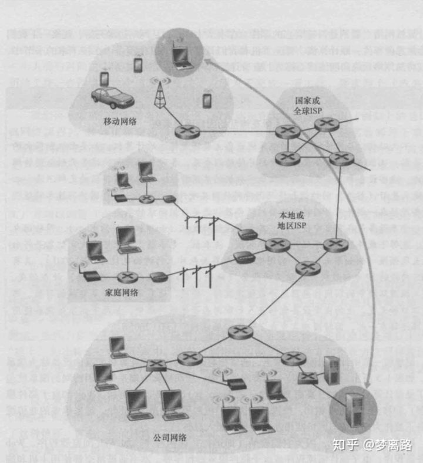

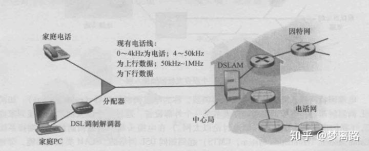

- Digital Subscriber Line：数字用户线，简称DSL

- DSLAM：位于电话公司本地中心局（CO）中的数字用户线接入复用器

- Hybird Fiber Coax：混合光纤同轴，简称HFC

- Fiber To The Home：光纤到户，简称FTTH
- 物理媒介：双绞铜线，同轴电缆，光纤，陆地无限电信道，卫星无线电信道

## 网络核心

### 分组交换

端系统之前交换报文，为了从源端系统向目的端系统发送报文，源将长报文划分为较小的数据块，称之为分组交换。每个分组都通过通信链和分组交换机（packet switch）。交换机主要有两类，路由器（router）和链路层交换机（link-layer switch）。

每台分组交换机有多条链路与之相连，每个链路上，该交换机具有一个输出缓存，也称为输出队列，所以分组要承受输出缓存的排队时延。

源端系统发送报文到目的端系统，就像边开车边问路一样，通过ip协议转发。

### 电路交换

电路交换和分组交换不同，在源端系统和目的端系统通信期间，会预留所需要的资源，即时双方没有报文传输（静默）的时候也需要占用通信链路。目前常用的方式是分组交换。

## 网络的网络

https://blog.csdn.net/binge_kong/article/details/100108836

## 时延的类型

节点处理时延，排队时延，传输时延，传播时延。

### 排队时延

节点时延中最复杂的是排队时延，也就是分组到达交换机后等待前面分组发送的时间。如果La是到达队列的平均速率，R是传输速率。则La/R是流量强度，设计系统时流量强度不能大于1。

### 丢包

分组交换中，交换机中的分组会进行排队。但是交换机能容纳的排队的分组不能无限增加，所以当到达的分组已经无法容纳时，会出现丢包。
### 吞吐量
## 协议分层
- 应用层：如HTTP、SMTP、FTP等属于应用层的协议。我们把位于应用层的信息分组称为报文（message）
- 运输层：有两种运输协议，即TCP和UDP。TCP向它的应用程序提供了面向连接的服务，TCP也将长报文分为短报文，并提供拥塞控制机制。UDP协议向它的应用程序提供无连接服务，没有可靠性，没有流量控制，没有拥塞控制。我们把运输层的分组称为报文段（segment）
- 网络层：网络层负责将成为数据报（datagram）的网络层分组从一台主机移动到另一台主机。网络层包括一个著名的网络协议，即IP协议
- 链路层：网络层通过源和目的地之间的一系列路由器路由数据报。为了将分组从一个节点（主机或路由器）移动到路径上的下一个节点，网络层必须依靠该链路层的服务。在下一个节点，链路层将数据报上传给网络层。链路层的例子包括以太网、WiFi和电缆接入网的DOCSIS协议。我们把链路层的分组称为帧（frame）
- 物理层：物理层的任务时将该帧中的一个个比特从一个节点移动到下一个节点。以太网具有许多物理层协议：一个是关于双绞铜线的，另一个是关于同轴电缆的，还有一个是关于光纤的。
## OSI模型
20世纪70年代后，国际标准组织ISO提出计算机网络围绕7层来组织，称为开放系统互联（OSI）模型【ISO 2016】。OSI参考模型的7层时：应用层、表示层、会话层、运输层、网络层、数据链路层和物理层。
- 表示层：使通信的应用程序能够解释交换数据的含义，包括数据压缩和数据加密以及数据描述
- 会话层：提供了数据交换的定界和同步功能，包括了建立检查和恢复方案的方法
## 封装
在发送主机端，一个应用层报文被传输给运输层，运输层接收到报文并附上附加信息，该首部被接受端的运输层使用。应用层保温和运输层首部信息一道构成了运输层报文段。同理，从发送主机端协议栈向下继续生成网络层的数据报、链路层的链路层帧。所以在每一层，一个分组具有两种类型的字段：首部字段和有效荷载字段（payload field）。
## 面对攻击的网络
- 病毒和蠕虫：随网络传播的恶意的东西统称为恶意软件（malware）。被攻击的网络称为僵尸网络（botnet）。多数的恶意软件是自我复制的（self-replication）。一旦它感染了一台主机，会在网络上寻找其他主机进行自我复制。其中病毒（virus）是一种需要某种形式的用户交互来感染的恶意软件。蠕虫（worm）是一种无须任何明显用户交互就能进入设备的恶意软件。
- Dos和DDos：Dos全称Denial-of-Service attack，即拒绝服务攻击。它属于下列三种类型之一：<br/>
弱点攻击：像应用程序或操作系统发送报文，是的服务器停止运行甚至主机崩溃<br/>
贷款洪范：攻击者向主机发送大量分组，使目的的介入链接变得拥塞，合法分组无法到达服务器<br/>
连接洪泛：攻击者在目标主机中创建大量的半开或全开TCP连接，该主机因为伪造的连接停止接受合法的连接。
- 嗅探分组：攻击者复制网络中传输的分组副本
- 伪装信任：将具有虚假源地址的分组注入到因特网称为IP哄骗

# 第二章 应用层

## 进程通信

多个端系统上的程序进行通信的实际上是进程（process），两个不同端系统上的进程，通过跨越计算机网络交换报文而相互通信。

### 套接字

进程通过一个成为套接字（socket）的软件接口向另一个进程发送和从网络接收报文。由于该套接字是建立网络应用程序的可编程接口，因此套接字也成为应用程序和网络之间的应用程序编程接口（Application Programming Interface,API）。应用程序开发者可以控制套接字在应用层端的一切，但是对该套接字的运输层几乎没有控制权。

### 进程寻址

在一台主机上运行的进程为了向另一台主机上运行的进程发送分组，接收进程需要有一个地址。为了标识该接收进程，需要定义两个信息：1.主机地址（IP地址：IP address）；2.在目的主机中指定接收进程的标识符（端口号：port number）。

- 可靠数据传输：如果一个协议提供了确保数据交付的服务，就认为提供了可靠数据传输。当运输层协议不提供可靠数据传输时，会被容忍丢失的应用（loss-tolerant application）所接收，如音频视频等
- 吞吐量：具有吞吐量要求的应用程序被称为带宽敏感的应用（bandwidth-sensitive application）。反之称为弹性应用（elastic application）。当然吞吐量肯定越大越好
- 定时保证，即时延
- 安全性，即加密

## TCP服务

- 面向连接的服务：在应用层报文开始流动前，TCP让客户和服务器互相交换运输层信息，也就是握手。在此之后，一个TCP连接（TCP connection）就在两个进程的套接字之间建立了。这条连接是全双工的，当应用程序结束报文发送时，必须拆除该连接

- 可靠的数据传送服务：依靠TCP，可以无差错、按适当顺序交付所有发送的数据。

- TCP协议还具有拥塞控制机制。当发送方和接收方之间的网络出现拥塞时，TCP的拥塞控制会抑制发送进程（客户或服务器）

## UDP服务

UDP是一种提供不必要服务的的轻量级运输协议，它仅提供做小服务。UDP是无连接的，因此没有握手过程。它提供一种不可靠数据传送服务，不保证该报文将到达接收进程。不仅如此，到达接收进程的报文也可能是乱序到达的。UDP也没有拥塞机制，可以以任何速率向下层注入数据。

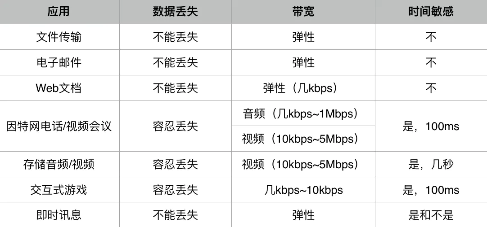

## 应用层协议

应用层协议（application-layer protocol）定义了运行在不同端系统上的应用程序进程如何相互传递报文。特别是应用层协议定义了 ：

- 交换的报文类型，例如请求报文和响应报文。
- 各种报文类型的语法，如报文中的各个字段及这些字段是如何描述的。
- 字段的语义，即这些字段中的信息的含义。
- 确定一个进程何时以及如何发送报文，对报文进行响应的规则。

### HTTP

#### 概况

HTTP使用TCP作为他的支撑运输协议

HTTP是一个无状态协议（stateless protocol）

#### 非持续连接和持续连接

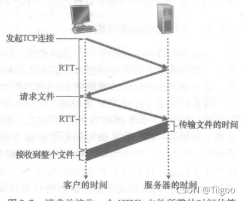

##### 非持续连接

- HTTP客户端发起一个TCP连接（默认向80端口发送）
- 客户端向套接字发送报文
- 服务器经过处理发送响应报文
- HTTP服务器进程通知TCP断开该TCP连接（知道TCP确认客户端已经完整地收到响应报文为止，才会实际中断连接）
- HTTP客户端接收响应报文，TCP连接关闭
- 如果返回报文中有其他对象，重复前4个步骤

RTT：Round-Trip Time，即客户端从发送请求到接收响应的往返时间。

客户端和服务器之间需要进行一个“三次握手”。客户端向服务器发送一个小TCP报文段，服务器用一个小TCP报文段做出确认和响应。最后客户端向服务器返回确认。其中前两次占用了一个RTT，客户端结合三次握手的第三部分（确认）向该TCP连接发送一个HTTP请求报文，服务器返回响应文件，这个过程占用一个RTT。

##### 持续连接

非持续连接有一个缺点，必须为每一个请求的对象建立和维护一个全新的连接，这给服务器带来严重的负担。其次，每一个对象经受两次RTT的交付时延。

HTTP1.1持续连接的情况下，服务器在发送响应后保持该TCP连接打开。在相同的客户与服务器之间，后续的请求和响应报文能够通过相同的连接进行传送。

#### HTTP报文格式

##### HTTP请求报文

GET /somedir/page.html HTTP/1.1

Host:www.someschool.edu

Connection:close

User-agent:Mozilla/5.0

Accept-language:fr

一个请求报文能够具有更多的行或者至少具有一行。

其中第一行叫做请求行（request line），后继的行叫做首部行（header line）。

- 请求行有三个字段：方法字段、URL字段和HTTP版本字段。其中方法字段包括GET、POST、HEAD、PUT和DELETE。URL字段带有请求对象的标识。

- 首部行HOST：指明了对象所在的主机
- 首部行Connection：close标识不使用持续连接
- 首部行User-agent：指明用户代理，这里Mozilla/5.0标识是firefox浏览器
- 首部行Accept-language：用户想得到该对象的语法版本，否则服务器将发送默认版本

当用户使用POST方法时才使用下图中的实体体（entity body），GET方法不会使用。

HEAD类似于GET

当用户提交对象到服务器的指定路径（目录）时使用PUT

当用户删除服务器对象是使用DELETE

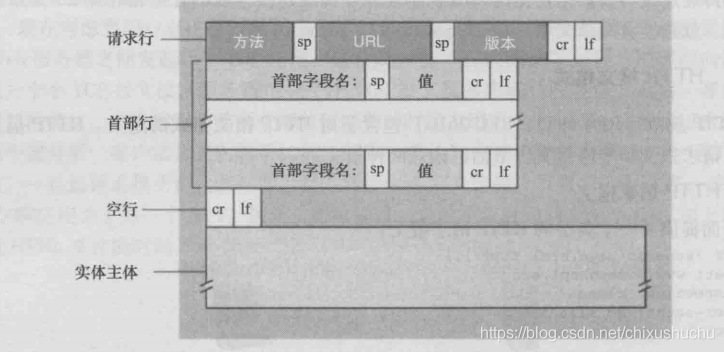

##### HTTP响应报文

HTTP/1.1 200 OK

Connection：close

Date:Thu,18 Aug 2015 15:44:04 GMT

Server: Apache/2.2.3(CentOS)

Last-Modified: Thu,18 Aug 2015 15:11:03 GMT

Content-Length:6821

Content-Type:text/html

(data data data ...)

响应报文它分为三个部分：

一个初始状态行（status line），6个首部行（header line），然后是实体体（entity body）。

- 状态行：有3个字段。协议版本字段、状态码和响应状态信息。
- Connection：close首部行告诉客户，发送完报文后将关闭TCP连接
- Date：指示服务器产生并发送该响应报文的日期和时间。该时间是组织响应报文的时间，不是对象修改时间
- Server：指示该报文是有一台Apache Web服务器产生的
- Last-Modified：指示了该对象创建或最后修改的日期和时间
- Content-Length：指示了被发送对象中的字节数
- Content-Type：指示了该实体对象是HTML文本


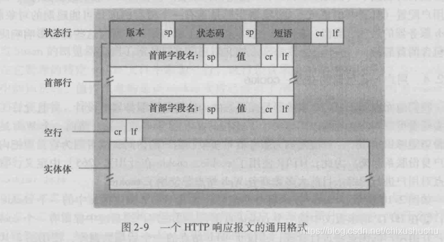

状态码及其相应的短语指示了请求的结果：

200 Ok:请求成功，信息包含在返回的报文中

301 Moved permanently:请求的对象已经被永久转移了，新的URL定义在响应报文的Location

400 Bad Request：一个通常差错代码，指请求不能被服务器理解。

404 Not Found: 被请求的文档不在服务器上。

505 Http version Not Supported：服务器不支持请求的报文使用的HTTP协议版本。

#### cookie

cookie有4个组件：

- 在HTTP响应报文中的一个cookie首部行
- 在HTTP请求报文中的一个cookie首部行
- 在用户端系统中保留有一个cookie文件，并由浏览器进行管理
- 维护Web站点的一个后端数据库

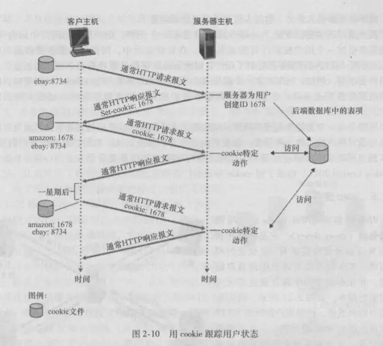

#### Web缓存器

Web缓存器（Web cache）也叫代理服务器（proxy server）。Web缓存器有自己的磁盘存储空间，并在存储空间中保存最近请求过的对象的副本。

假定浏览器正在访问http://www.someschool.edu/campus.gif

1）浏览器创建一个到Web缓存器的TCP连接，并向Web缓存器中的对象发送一个HTTP请求

2）Web缓存器进行检查，我的本地是不是存储过你要请求的对象的副本，如果有的话就不用再向origin server申请了，直接将副本通过HTTP响应报文返回该对象

3）如果没有这个对象的话，它就打开一个与origin server的TCP连接。此时Web缓存器就成为了客户了，向origin server发送报文请求，然后origin server将对象发送给Web缓存器

4）当Web缓存器接受到对象之后，就会在本地存储空间存储一份副本，然后向客户的浏览器用 HTTP响应报文发送这个副本

```html
如何搭建一个缓存服务器：https://blog.csdn.net/kaifangzhilu/article/details/6556505
```

#### 条件GET方法

如何检查Web缓存器上的对象是否过期？HTTP协议有一种机制——条件GET（conditional GET）。它有以下两个条件：

1）请求报文使用GET方法

2）请求报文中包含一个"If-Modified-Since:"的首部行

首先客户端向服务器进行第一次HTTP请求，服务器向客户进行响应，从上文中的HTTP响应报文的格式可知，响应报文中会带有一个Date的首部行。当客户端再一次请求服务器时，可以增加If-Modified-Since首部行来表示这是一个条件GET方法，其中If-Modified-Since首部行的值是第一次响应报文中的Date首部行的值，如下所示：

GET /fruit/kiwi.gif HTTP/1.1

Host: www.exotiquecuisine.com

If-Modified-Since: Wed, 9 Sep 2015 09:23:24

Web缓存服务器会请求origin server，如果对象没有被修改过，origin server会返回Web服务器如下报文

HTTP / 1.1 304 Not Modified

Date: Sat, 10 Oct 2015 15:39:29

Server: Apache / 1.3.0 (Unix)

(empty entity body)

### 电子邮件

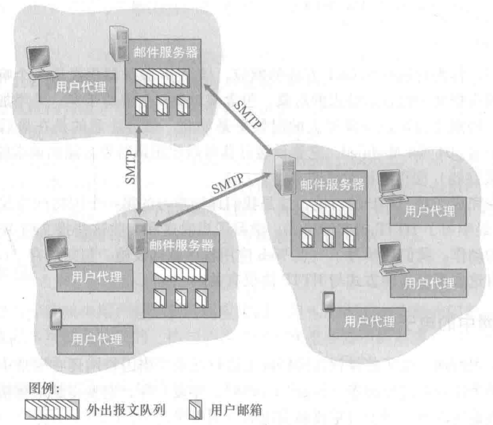


电子邮件系统有3个主要组成部分：用户代理（user agent）、邮件服务器（mail server）、简单邮件传输协议（Simple Mail Transfer Protocol, SMTP）。

用户代理允许用户阅读、回复、转发、保存报文。如Outlook和Apple Mail等。

如张三发邮件给李四，张三需要先在用户代理上撰写报文，然后邮件代理向邮件服务器发送邮件，此时邮件放在邮件服务器的外出报文队列（message queue）中。当李四要阅读报文时，他的用户代理在其邮件服务器的邮箱中获得该报文。每个接收方在其中的某个邮件服务器上有一个邮箱（mailbox），邮箱管理和维护发送给他的报文。

SMTP是邮件中主要的应用层协议。它使用TCP可靠数据传输服务。

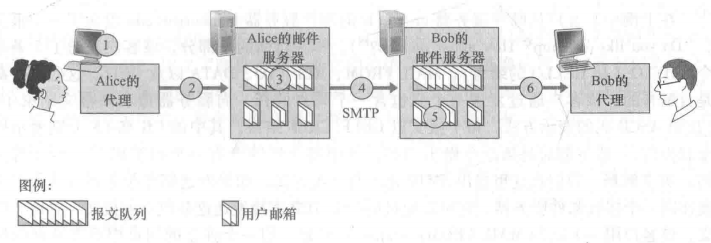

- Alice 调用她的邮件代理程序并提供 Bob 的邮件地址，撰写报文，然后指示用户代理发送该报文。
- Alice 的用户代理把报文发给她的邮件服务器，在那里该报文被放在报文队列中。
- 运行在 Alice 的邮件服务器上的 SMTP 客户端发现了报文队列中的这个报文，它就创建一个到运行在 Bob 的邮件服务器上的 SMTP 服务器的 TCP 连接。
- 在经过一些初始 SMTP 握手后，SMTP 客户通过该 TCP 连接发送 Alice 的报文。
  在 Bob 的邮件服务器上，SMTP 的服务器端接收该报文。Bob 的邮件服务器然后将该报文放入 Bob 的邮箱中。
- 在 Bob 方便的时候，他调用用户代理阅读该报文。

#### 邮件报文格式

一个From:首部行，一个To:首部行，可能包含Subject:首部行或其他可选首部行。紧接着一个空白行，然后是以ACSII格式表示的报文体。

From: alice@crepes.fr

To: bob@hamburger.edu 

Subject: Searching for the meaning of life. 

#### 邮件访问协议

SMTP是一个推协议，用户需要需要一种特殊的协议进行拉取操作，包括第三版的邮局协议（Post Office Ptotocol-Version 3，POP3）、因特网邮件访问协议（Internet Mail Access Protocol, IMAP）以及HTTP。

### DNS: 因特网的目录服务

一般可以通过主机名（如www.facebook.com）或IP地址（如121.7.106.83）对主机进行标识。人们习惯用主机名的标识方式，而路由器擅长分析定长、有层次结构的IP地址。为了折中这些不同的偏好，需要一种能进行主机名到IP地址转换的目录服务。这就是域名系统（Domain Name System, DNS）的主要任务。

DNS是一个由分层的DNS服务器（DNS server）实现的分布式数据库，也是一个使得主机能够查询分布式数据库的应用层协议。DNS协议运行在UDP之上，使用53端口号。如用户访问URL www.someschool.edu/index.html的例子，必须需要获取用户主机名对应的IP地址，其做法如下：

1）同一台用户主机上运行着DNS应用的客户端。

2）浏览器从上述 URL中抽取出主机名 www.someschool.edu，并将这台主机名传给DNS应用的客户端。

3）DNS客户向DNS服务器发送一个包含主机名的请求。

4）DNS客户最终会收到一份回答报文，其中含有对应于该主机名的 IP地址。

5）一旦浏览器接收到来自 DNS 的该IP地址，它能够向位于该IP 地址 80 端口的HTTP服务器进程发起一个TCP连接。

从这个例子中可以看出，DNS给访问互联网带来了额外的时延（会在“附近的”DNS服务器缓存）。DNS除了进行主机名到IP地址的转换外，还提供了一些重要服务：

- 主机别名（host aliasing）：复杂主机名的主机可以有多个复杂的主机别名。
- 邮件服务器别名（mail server aliasing）
- 负载分配（load distribution）：用于在冗余的服务器之间进行负载分配。

#### DNS工作机理概述

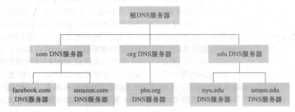


##### 分布式、层次数据库

- 根 DNS服务器。有400 多个根名字服务器遍及全世界。

- 顶级域DNS服务器（Top-Level Domain, TLD）。顶级域（DNS）服务器。对于每个顶级域（如 com、org、net、edu 和 gov）和所有 国家的顶级域（如 uk、fr、ca 和 jp），都有 TLD服务器（或服务器集群）。

- 权威 DNS 服务器。在因特网上具有公共可访问主机（如 Web 服务器和邮件服务器） 的每个组织机构必须提供公共可访问的 DNS记录。这些记录将这些主机的名字映射为IP地址。
- 本地DNS服务器。一个本地 DNS 服务器并不属于该服务器的层次结构。

##### DNS缓存

为了改善时延性能并减少在因特网上导出传输的DNS报文数量，DNS广泛使用了缓存技术。当本地DNS服务器从某哥DNS服务接收到一个回答，它能够缓存包含在改回答中的任何信息。由于主机和主机名与IP地址间的映射并不是一成不变的，所以DNS服务器在一段时间后（通常设置为两天）将丢弃缓存的信息。

#### DNS记录和报文

略

### P2P文件分发

P2P体系结构对总是打开的基础设施服务有最小的（或者没有）依赖。截止到2016年，最为流行的P2P文件分发协议是BitTorrent协议。

### 视频流和内容分发网

略

# 第三章 运输层

运输层协议为运行在不同主机上的应用进程之间提供了逻辑通信（logic communication）。运输层协议是在端系统中而不是在路由器中实现的。

UDP和TCP最基本的责任是：将两个端系统间IP的交付服务扩展为运行在端系统上的两个进程之间的交付服务。将主机间交付扩展到进程间交付被称为运输层的多路复用（transport-layer multiplexing）与多路分解（demultiplexing）。UDP和TCP还可以通过在其报文段首部中包括差错检查字段而提供完整性检查。进程到进程的数据交付和差错检查是两种最低限度的运输层服务，也是UDP所能提供的仅有的两种服务。

TCP还提供了几种附加服务：

- 首先是它提供可靠数据传输（reliable data transfer）
- TCP还提供拥塞控制（congestion control）：TCP拥塞控制防止任何一条TCP连接用过多流量来淹没通信主机之间的链路和交换设备。UDP流量是不可调节的

## 多路复用与多路分解

多路复用与多路分解，解决的是有网络层提供的主机到主机的交付服务延伸到为运行在主机上的应用程序提供进程到进程的交付服务。在接收主机的运输层实际上并没有直接将数据交付给进程，而是将数据交给了一个中间的套接字。由于在任一时刻，在接收主机上可能有不止一个套接字，所以每个套接字都有唯一的标识符，其格式取决于他是UDP还是TCP套接字。

在接收端，运输层检查到达报文段中的几个字段，标识出接收套接字，进而将报文段定向到该套接字。将运输层报文段中的数据交付到正确的套接字的工作成为多路分解（demultiplexing）。在源主机从不同套接字中收集数据块，并为每个数据块封装上首部信息从而生成报文段，然后将报文段传递到网络层，所有这些工作成为多路复用（multiplexing）。

套接字有唯一标识符，每个报文段有特殊字段来指示该报文段所要交付到的套接字。这些特殊字段是源端口号（source port number field）和目的端口号字段（destination port numbner field）。端口号是一个16比特的数，其大小在0~65535之间。0~1023范围的端口号成为周知端口号（well-known port number）。

### 无连接的多路复用与多路分解（UDP）

通常，应用程序的客户端让运输层自动地（并且是透明地）分配端口号，而服务端则分配一个特定的端口号。

源端口号用作“返回地址”的一部分。

一个UDP套接字是由一个二元组全面标识的，该二元组包含一个目的IP地址和一个目的端口号。因此，如果两个UDP报文段中有不同的源IP地址和/或源端口号，但是具有相同的目的IP地址和目的端口号，那么这两个报文段将通过相同的目的套接字被定向到相同的目的进程

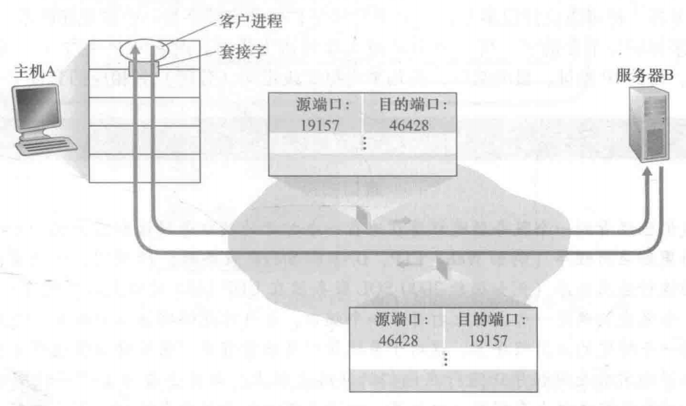

### 面相连接的多路复用与多路分解（TCP）

TCP套接字是有一个四元组（源IP地址，源端口号，目的IP地址，目的端口号）来标识的。当一个TCP报文段从网络到达一台主机时，该主机使用全部4个值来讲报文段定向（分解）到相应的套接字。特别与UDP不同的是，两个具有不同源IP地址或源端口号的到达TCP报文段将被定向到两个不同的套接字，除非TCP报文段携带了初始创建连接的请求。

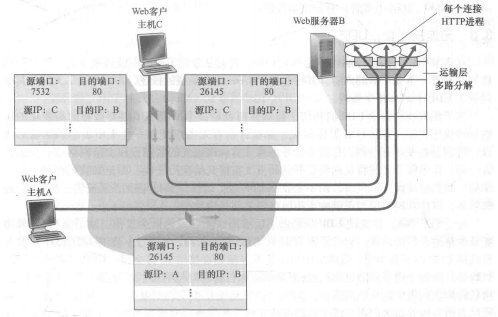

## 无连接运输：UDP

运输层最低限度必须提供一种复用/分解服务，以便在网络层与正确的应用级进程之间传递数据。UDP只是做了运输层协议能够做的最少的工作。除了复用/分解功能及少量的差错检测外，它几乎没有对IP增加别的东西。使用在UDP时，在发送报文段之前，发送方和接收方的运输层实体之间没有握手。正因为如此，UDP被称为是无连接的。DNS是一个通常使用UDP的应用层协议的例子。UDP有以下一些特点：

- 对于发送什么数据以及何时发送数据的应用层，其控制更为精细
- 无须连接建立
- 无连接状态
- 分组首部开销小

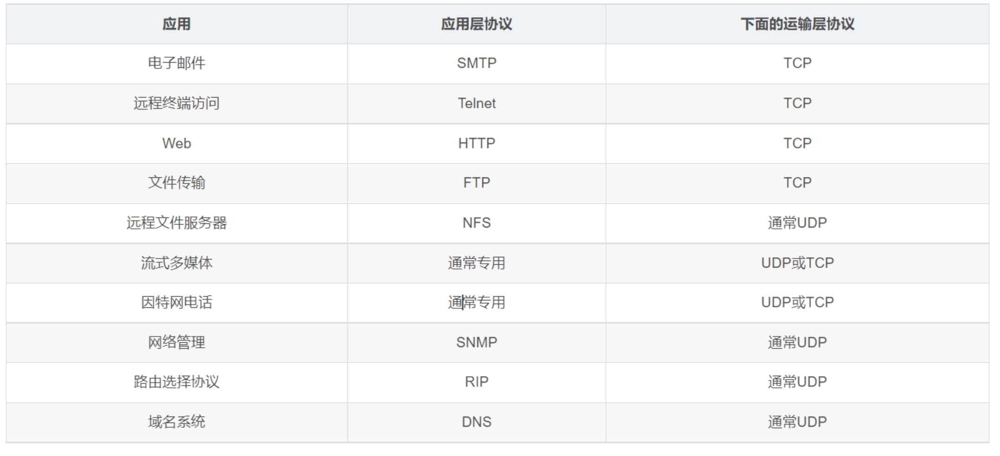

### UDP报文段结构

 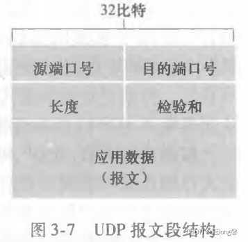

### UDP检验和

发送方的UDP报文对所有16比特字求和再取反，求和过程中的溢出将被回卷（我理解就是截断）。这个结果就是UDP的检验和字段。在UDP的接收方，将全部的16比特求和再加上检验和，显然结果应该是16个1（因为检验和取反了），如果任何一位不是1，则认为该分组中已经出现了差错。

由于在UDP或者说运输层提供了差错检测，说明其下的某一层协议可能没有提供差错处理。这也是端到端原则（end-end principle）：与在较高级别提供这些功能的代价相比，在较低级别上设置的功能可能是冗余的或者几乎没有价值的。

虽然UDP提供了差错检测，但它对差错恢复无能为力，UDP的某种实现只是丢弃受损的报文段，其他实现是将受损的报文段交给应用程序并给给出告警。

## 可靠数据传输原理

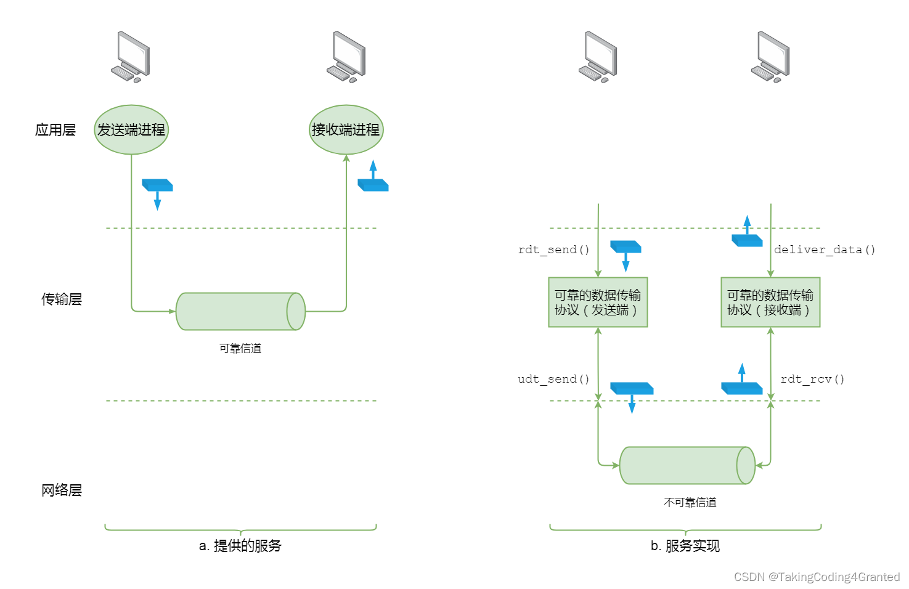

实现这种服务抽象是可靠数据协议（reliable data transfer protocol）的责任。我们将较低层直接视为不可靠的点对点信道。我们将考虑当底层信道能够损坏比特或丢失整个分组是，需要什么样的协议机制。并且我们假设底层信道不会对分组重新排序。

### 构造可靠数据传输协议

##### 经完全可靠信道的可靠数据传输：rdt1.0

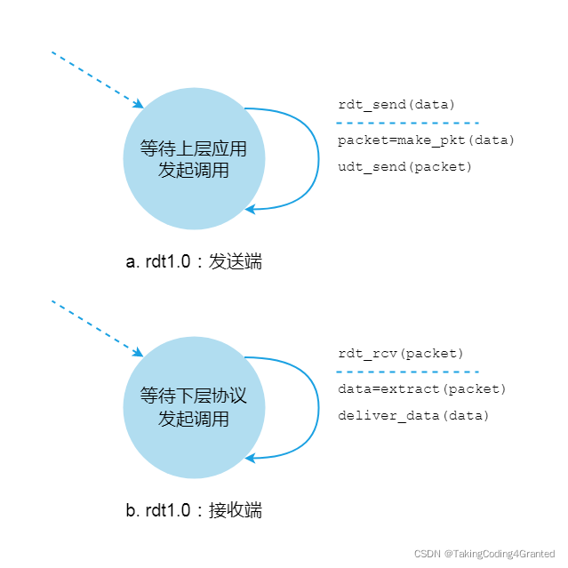

- 有限状态机：Finite-State Machine，简称FSM
- 发送方和接收方有各自的FSM
- 箭头指示了协议从一个状态变迁到另一个状态（本图中就是自身变迁到自身）
- 引起变迁的事件显示在表示变迁的横线上方
- 事件发送时所采取的动作显示在横线下方
- 如果一个事件没有动作，或者说没有事件触发就采取了某个动作，我们将在横线上方或下方使用符号∧表示

rdt发送端通过rdt_send(data)事件接受来自较高层的数据（然后产生后面的动作）。

在接收端rdt通过rdt_rev(package)事件从底层信道接受一个分组（然后产生后面的动作）。

##### 经具有比特差错信道的可靠数据传输：rdt2.0

底层信道更为实际的模型是分组中的比特可能受损的模型。当前还继续假定所有发送的分组将按照发送的顺序被接收。

在计算机网络中，基于重传机制的可靠数据传输协议称为自动重传请求（Automatic Repeat reQuest, ARQ）。该协议使得接收方可以让发送方知道哪些内容被正确接收，哪些内容接收有误并因此需要重复。ARQ协议还需要另外三种协议功能来处理存在比特差错的情况：

- 差错检测：前面提到的UDP的差错检测
- 接收方反馈：rdt2.0协议将从接收方给发送方回送ACK(“肯定确认”)与NAK(“否定确认”)分组
- 重传：接收方收到有差错的分组时，发送方将重传该分组

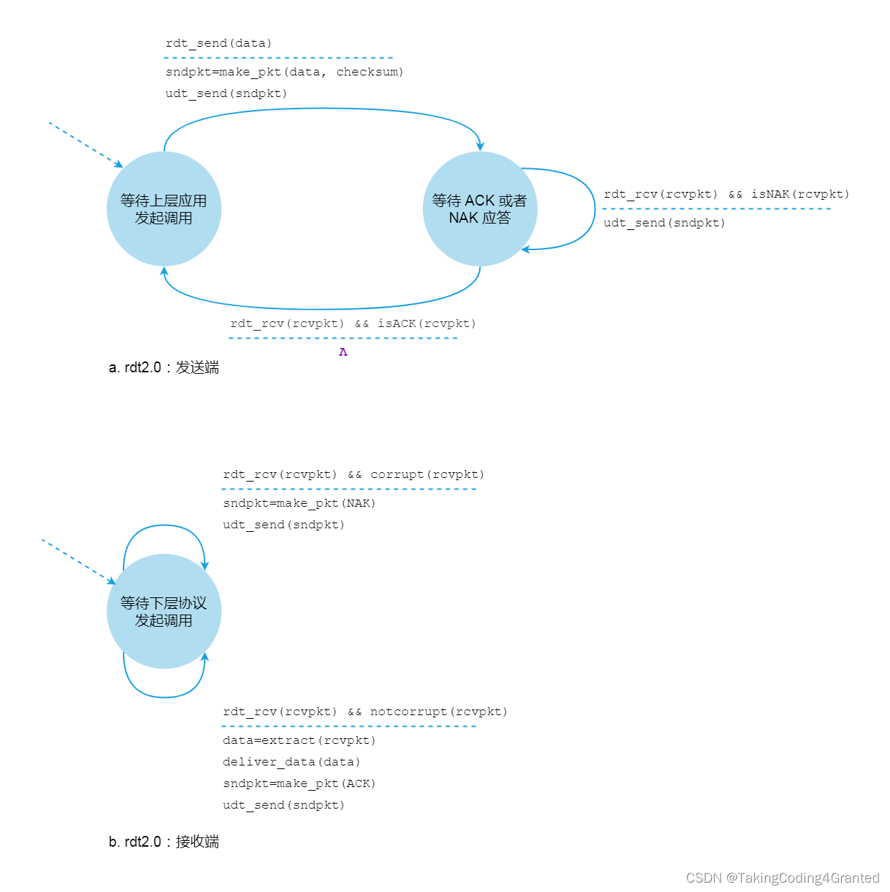

rdt2.0的发送端有两个状态。最左边的状态和rdt1.0类似。在最右边的状态中，发送方协议等待来自接收方的ACK或NAL分组。如果收到一个ACK分组，则发送方知道最忌您发送的分组被正确接收，协议返回到等待来自上层的数据状态。如果收到一个NAK分组，该协议重传一个分组并等待一个ACK或NAK。当发送方处于等待ACK或NAK的状态时，它不能从上层获得更多的数据，除非发送方确信接收方已正确接收到当前分组。因此rdt2.0协议被储位停等（stop-and-wait）协议。

rdt2.0接收方的FSM仍然只有单一的状态，当分组到达时候，要么回答一个ACK，要么回答一个NAK，这取决于收到的分组是否受损。

但是rdt2.0还存在一些问题，尤其是没有考虑到ACK或NAK分组受损的可能性。如果一个ACK或NAK分组受损，发送方无法知道接收方是否正确接收了上一块发送的数据。解决这个问题的一个简单方法是在数据分组中添加一个新字段，让发送方对其数据分组编号，即发送数据分组的序号（sequence number）放在该字段。于是接收方只需要检查需要即可确定收到的分组是否一次重传。


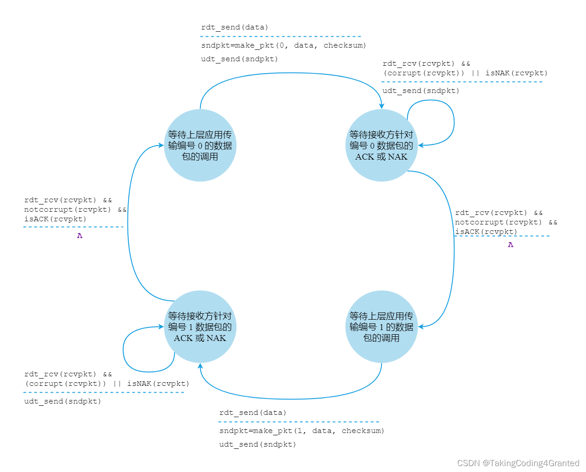

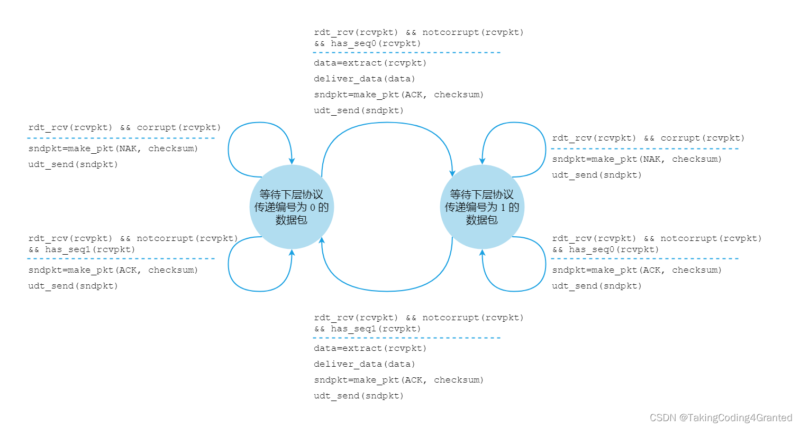


个人感觉《计算机网络 自顶向下》这本书对rdt2.1的解释莫名其妙，在网上找了另一张图来说明。下图解释了在ACK或NAK发生比特翻转（rdt2.1就是要解决这个问题）时是如何处理的。假设情景发送方向接收方发送0号数据包，如果接收方接收到0号数据包，返回ACK，但是ACK出现翻转，接收方处于等待1号数据状态，发送方重复发送0号数据，接收方会拒绝0号数据，避免重复。如果接收方接收到0号数据包出现错误，返回NAK，但是NAK出现翻转，接收方处于等待0号数据状态，发送方继续发送1号数据，接收方会拒绝1号数据，避免错序。

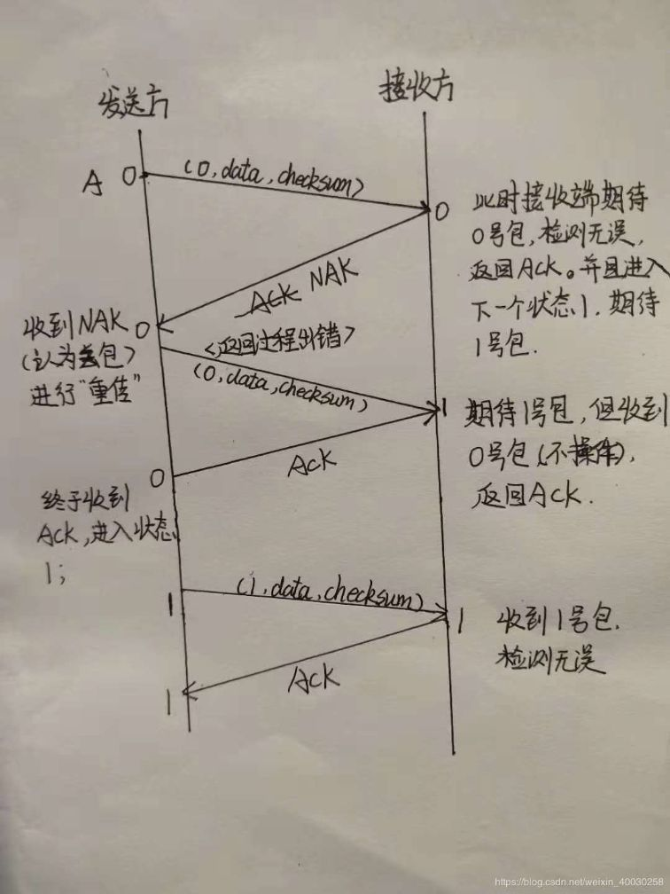


rdt2.2和2.1的区别在于：接收端收到包，无论正确与否，都返回 ACK ，同时附上序号，这个序号嘞，就是数据包发送过来时的序号。

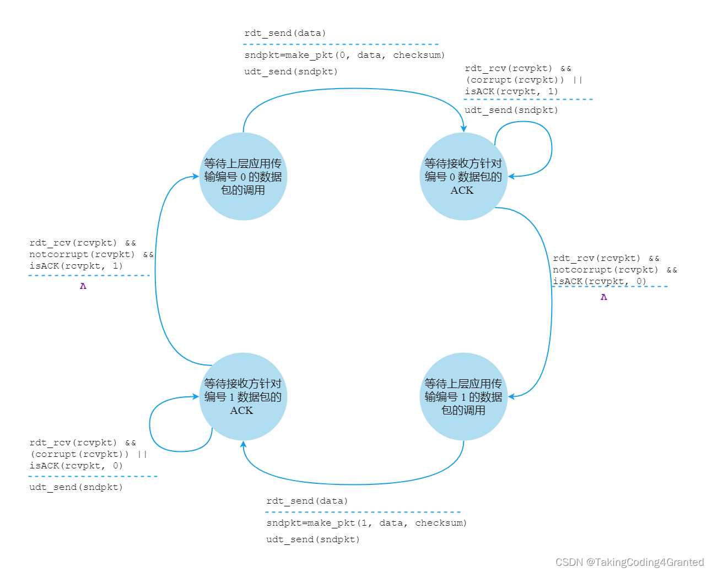

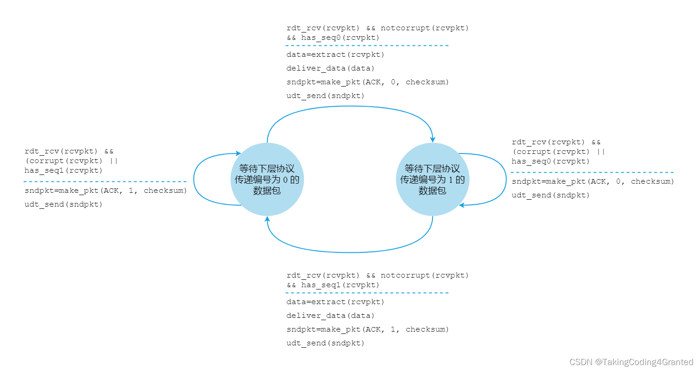

##### 经具又比特差错的丢包信道的可靠数据传输：rdt3.0

在此之前，我们都假设底层信道不会丢包，但丢包在今天的计算机网络中并不罕见。所以我们要关注两个问题：怎样检测丢包以及发生丢包后如何处理？ 如果发送方愿意等待足够长的时间以便确定分组已丢失，则它只需要重传该数据分组即可。问题是发送方需要等待多久呢？实践中采取的方法是发送方选择一个时间值，以判断可能发生了丢包（尽管不能确保）。这就在发送方和接收方的信道中引入了冗余数据分组（duplicate data packet）。为了实现基于时间的重传机制，需要一个倒计时定时器（countdown timer），在一个给定的时间量过期后，可中断发送方。因此发送方需要能做到：1.每次发送一个分组时，便启动一个定时器；2.响应定时器终端；3.终止定时器。

rdt3.0有时被称作比特交替协议（alter-nating-hit protocol）.

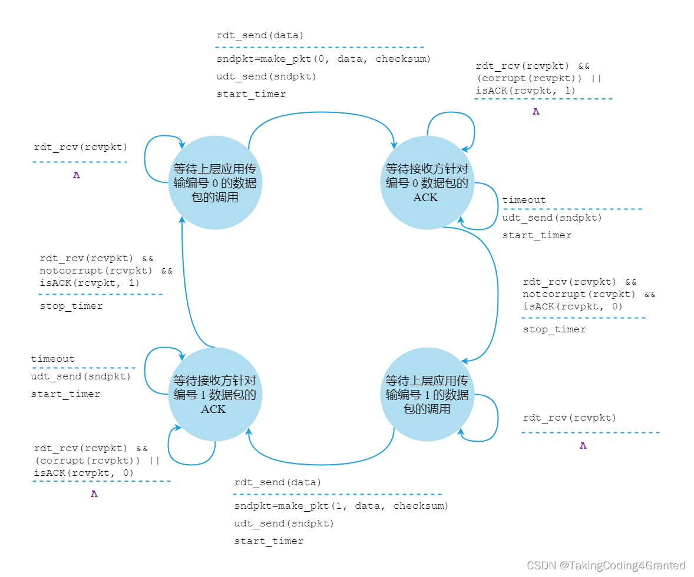

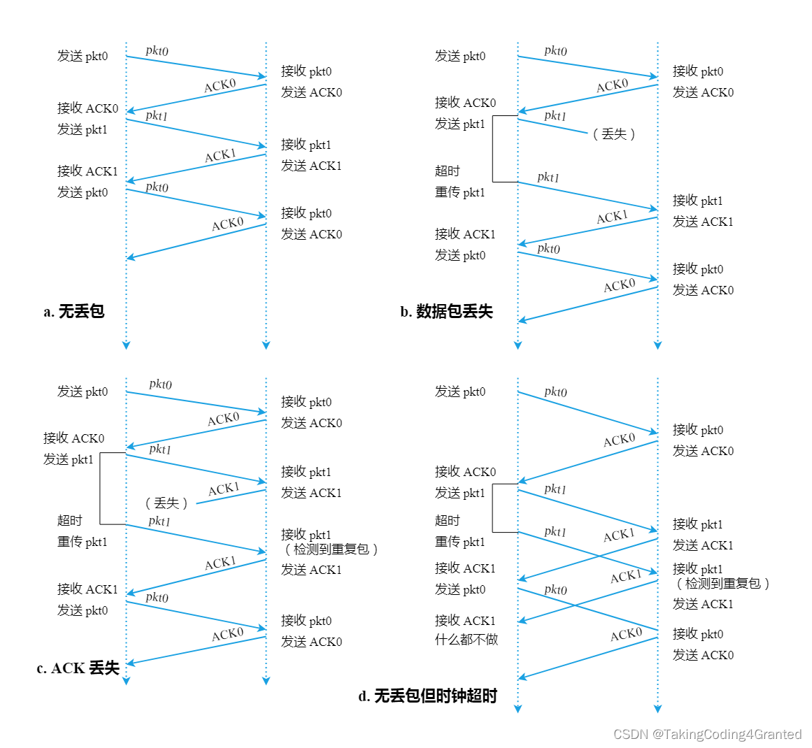

### 流水线可靠数据传输协议

因为rdt3.0是一个停等协议，所以它的性能不强。

我们定义发送方（或信道）的利用率（unilization）为：发送方实际忙于将发送比特送进信道的那部分时间与发送时间之比。停等协议的发送绿非常低，从最好的情况来看发送旅是0.00027。也就是所1Gbps的链路的有效吞吐量是267kbps。

停等协议的一种简单解决方案是：允许发送方发送多个分组而无需等待确认。因为许多从发送方向接受方输送的分组可以被看成是填充到一条流水线冲，故这种技术被称为流水线（pipelining）。

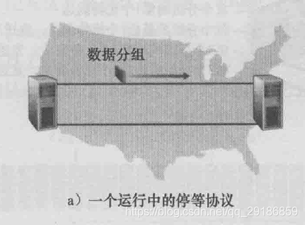

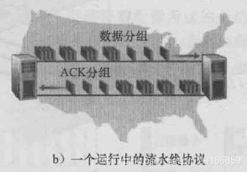

流水线技术可对可靠传输数据协议带来如下影响：

- 必须增加序号范围，因为每个输送中的分组必须有一个唯一的序号

- 协议的发送方和接收放两端业务不得不缓存多个分组。如发送方最低限度应当能缓存那些已经发送但没有确认的分组。

- 所需序号范围和对缓冲的要求取决于数据如何处理丢失、损坏以及延时过大的分组。两个基本方法是：回退N步（Go-Back-N，GBN）和选择重传（Selective Repeat，SR）

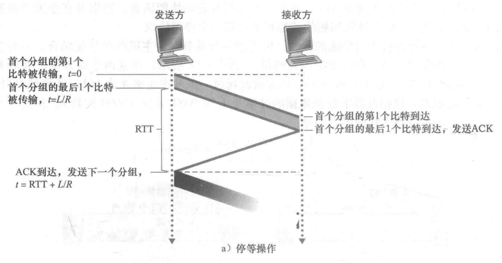


### 回退N步

在回退N步协议中，允许发送方发送多个分组（当前有多个分组可用时）而不需要等待确认，但它也受限于在流水线中未确认的分组不能超过某个最大允许数N。

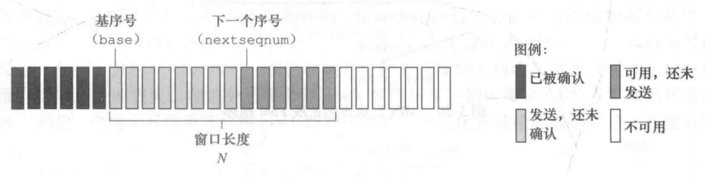

那些已被发送单还未被确认的分组的许可序号范围可以被看成是一个在序号范围内长度为N的窗口。随着协议的运行，该窗口在序号空间向前滑动。因此，N常被称为窗口长度（window size），GBN协议也常被称为滑动窗口协议（siliding-window protocol）。 

GBN发送方的扩展FSM描述：

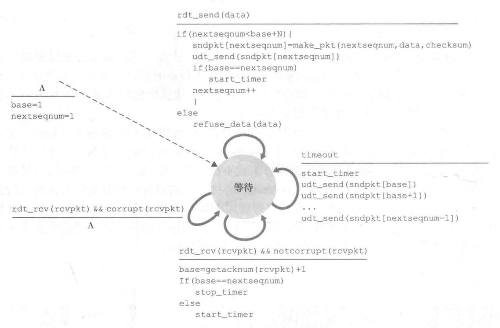

GBN接收方的扩展FSM描述：

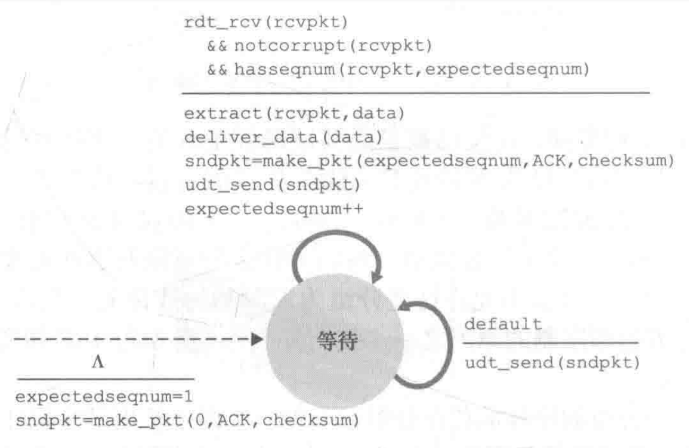

GBN发送方必须响应的三种类型的事件：1.上层的调用。2.受到一个ACK。3.超时时间，协议的名字“回退N步”来源于出现丢失和延长分组时发送方的行为。

在GBN中，接收方的动作也很简单。如果一个序号为n的分组被正确接收到，并且按序（即上次交付给上层的数据是序号为n-1的分组），则接收方为分组n发送一个ACK，并将该分组中的数据部分交付到上层。在所有其他情况下，接收方丢弃该分组，并未为最近按序接收的分组重新发送ACK。在GBN协议中，接收方丢弃所有失序分组，是为了保证将数据按序交付给上层。如下图所示，给出了4个分组的GBN协议的运行情况。

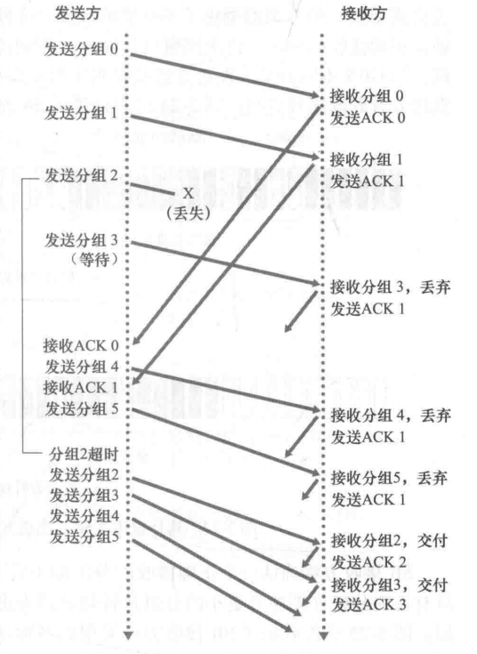

### 选择重传

GBN协议虽然避免了停等协议中所提到的信道利用率问题。然而GBN也存在着性能问题，尤其是当窗口长度和带宽延迟都很大时，单个分组的差错就能够引起GBN重传大量分组。

选择重传（SR）协议通过让发送方仅重传那些让它怀疑在接收方出错（即丢失货受损）的分组而避免了不必要的重传。这种个别的、按需的重传要求接收方阻隔地确认正确接收的分组。

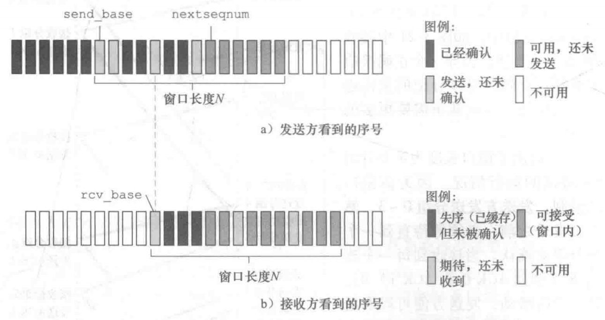

SR接收放将确认一个正确接收的分组而不管其是否按序。失序的分组将被缓存知道所有丢弃分组（即序号更小的分组）皆被收到为止，这时才可以将一批分组按序交付给上层。

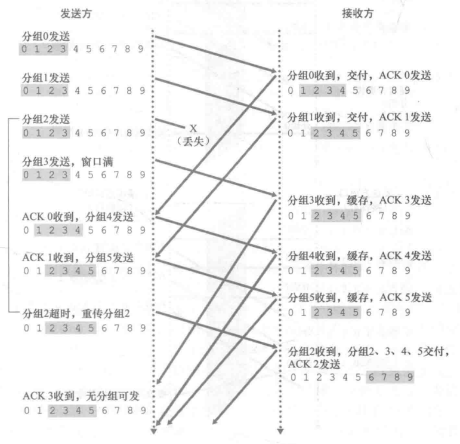

SR接收方窗口太大的困境：窗口长度必须小于或等于序号空间大小的一半。

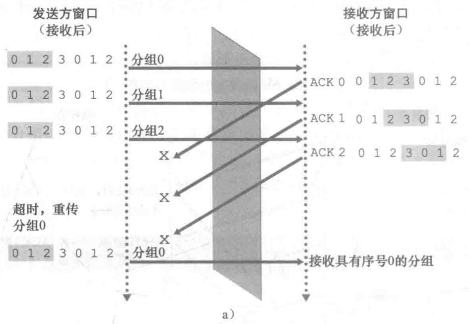

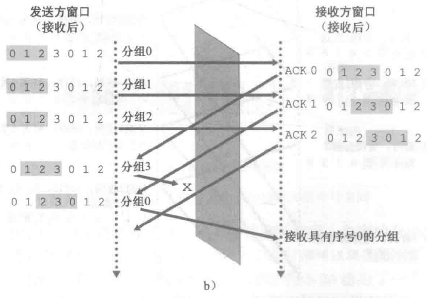

可靠数据传输机制及其用途的总结：

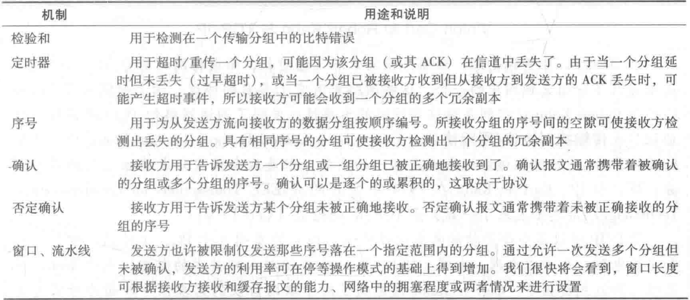


## 面向连接的运输：TCP


