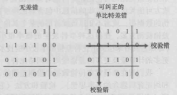

# 第一章 计算机网络和因特网

## 网络边缘


- Digital Subscriber Line：数字用户线，简称DSL

- DSLAM：位于电话公司本地中心局（CO）中的数字用户线接入复用器

- Hybird Fiber Coax：混合光纤同轴，简称HFC

- Fiber To The Home：光纤到户，简称FTTH
- 物理媒介：双绞铜线，同轴电缆，光纤，陆地无限电信道，卫星无线电信道

## 网络核心

### 分组交换

端系统之前交换报文，为了从源端系统向目的端系统发送报文，源将长报文划分为较小的数据块，称之为分组交换。每个分组都通过通信链和分组交换机（packet switch）。交换机主要有两类，路由器（router）和链路层交换机（link-layer switch）。

每台分组交换机有多条链路与之相连，每个链路上，该交换机具有一个输出缓存，也称为输出队列，所以分组要承受输出缓存的排队时延。

源端系统发送报文到目的端系统，就像边开车边问路一样，通过ip协议转发。

### 电路交换

电路交换和分组交换不同，在源端系统和目的端系统通信期间，会预留所需要的资源，即时双方没有报文传输（静默）的时候也需要占用通信链路。目前常用的方式是分组交换。

## 网络的网络

https://blog.csdn.net/binge_kong/article/details/100108836

## 时延的类型

节点处理时延，排队时延，传输时延，传播时延。

### 排队时延

节点时延中最复杂的是排队时延，也就是分组到达交换机后等待前面分组发送的时间。如果La是到达队列的平均速率，R是传输速率。则La/R是流量强度，设计系统时流量强度不能大于1。

### 丢包

分组交换中，交换机中的分组会进行排队。但是交换机能容纳的排队的分组不能无限增加，所以当到达的分组已经无法容纳时，会出现丢包。
### 吞吐量
## 协议分层
- 应用层：如HTTP、SMTP、FTP等属于应用层的协议。我们把位于应用层的信息分组称为报文（message）
- 运输层：有两种运输协议，即TCP和UDP。TCP向它的应用程序提供了面向连接的服务，TCP也将长报文分为短报文，并提供拥塞控制机制。UDP协议向它的应用程序提供无连接服务，没有可靠性，没有流量控制，没有拥塞控制。我们把运输层的分组称为报文段（segment）
- 网络层：网络层负责将成为数据报（datagram）的网络层分组从一台主机移动到另一台主机。网络层包括一个著名的网络协议，即IP协议
- 链路层：网络层通过源和目的地之间的一系列路由器路由数据报。为了将分组从一个节点（主机或路由器）移动到路径上的下一个节点，网络层必须依靠该链路层的服务。在下一个节点，链路层将数据报上传给网络层。链路层的例子包括以太网、WiFi和电缆接入网的DOCSIS协议。我们把链路层的分组称为帧（frame）
- 物理层：物理层的任务时将该帧中的一个个比特从一个节点移动到下一个节点。以太网具有许多物理层协议：一个是关于双绞铜线的，另一个是关于同轴电缆的，还有一个是关于光纤的。
## OSI模型
20世纪70年代后，国际标准组织ISO提出计算机网络围绕7层来组织，称为开放系统互联（OSI）模型【ISO 2016】。OSI参考模型的7层时：应用层、表示层、会话层、运输层、网络层、数据链路层和物理层。
- 表示层：使通信的应用程序能够解释交换数据的含义，包括数据压缩和数据加密以及数据描述
- 会话层：提供了数据交换的定界和同步功能，包括了建立检查和恢复方案的方法
## 封装
在发送主机端，一个应用层报文被传输给运输层，运输层接收到报文并附上附加信息，该首部被接受端的运输层使用。应用层保温和运输层首部信息一道构成了运输层报文段。同理，从发送主机端协议栈向下继续生成网络层的数据报、链路层的链路层帧。所以在每一层，一个分组具有两种类型的字段：首部字段和有效荷载字段（payload field）。
## 面对攻击的网络
- 病毒和蠕虫：随网络传播的恶意的东西统称为恶意软件（malware）。被攻击的网络称为僵尸网络（botnet）。多数的恶意软件是自我复制的（self-replication）。一旦它感染了一台主机，会在网络上寻找其他主机进行自我复制。其中病毒（virus）是一种需要某种形式的用户交互来感染的恶意软件。蠕虫（worm）是一种无须任何明显用户交互就能进入设备的恶意软件。
- Dos和DDos：Dos全称Denial-of-Service attack，即拒绝服务攻击。它属于下列三种类型之一：<br/>
弱点攻击：像应用程序或操作系统发送报文，是的服务器停止运行甚至主机崩溃<br/>
贷款洪范：攻击者向主机发送大量分组，使目的的介入链接变得拥塞，合法分组无法到达服务器<br/>
连接洪泛：攻击者在目标主机中创建大量的半开或全开TCP连接，该主机因为伪造的连接停止接受合法的连接。
- 嗅探分组：攻击者复制网络中传输的分组副本
- 伪装信任：将具有虚假源地址的分组注入到因特网称为IP哄骗

# 第二章 应用层

## 进程通信

多个端系统上的程序进行通信的实际上是进程（process），两个不同端系统上的进程，通过跨越计算机网络交换报文而相互通信。

### 套接字

进程通过一个成为套接字（socket）的软件接口向另一个进程发送和从网络接收报文。由于该套接字是建立网络应用程序的可编程接口，因此套接字也成为应用程序和网络之间的应用程序编程接口（Application Programming Interface,API）。应用程序开发者可以控制套接字在应用层端的一切，但是对该套接字的运输层几乎没有控制权。

### 进程寻址

在一台主机上运行的进程为了向另一台主机上运行的进程发送分组，接收进程需要有一个地址。为了标识该接收进程，需要定义两个信息：1.主机地址（IP地址：IP address）；2.在目的主机中指定接收进程的标识符（端口号：port number）。

- 可靠数据传输：如果一个协议提供了确保数据交付的服务，就认为提供了可靠数据传输。当运输层协议不提供可靠数据传输时，会被容忍丢失的应用（loss-tolerant application）所接收，如音频视频等
- 吞吐量：具有吞吐量要求的应用程序被称为带宽敏感的应用（bandwidth-sensitive application）。反之称为弹性应用（elastic application）。当然吞吐量肯定越大越好
- 定时保证，即时延
- 安全性，即加密

## TCP服务

- 面向连接的服务：在应用层报文开始流动前，TCP让客户和服务器互相交换运输层信息，也就是握手。在此之后，一个TCP连接（TCP connection）就在两个进程的套接字之间建立了。这条连接是全双工的，当应用程序结束报文发送时，必须拆除该连接

- 可靠的数据传送服务：依靠TCP，可以无差错、按适当顺序交付所有发送的数据。

- TCP协议还具有拥塞控制机制。当发送方和接收方之间的网络出现拥塞时，TCP的拥塞控制会抑制发送进程（客户或服务器）

## UDP服务

UDP是一种提供不必要服务的的轻量级运输协议，它仅提供做小服务。UDP是无连接的，因此没有握手过程。它提供一种不可靠数据传送服务，不保证该报文将到达接收进程。不仅如此，到达接收进程的报文也可能是乱序到达的。UDP也没有拥塞机制，可以以任何速率向下层注入数据。


## 应用层协议

应用层协议（application-layer protocol）定义了运行在不同端系统上的应用程序进程如何相互传递报文。特别是应用层协议定义了 ：

- 交换的报文类型，例如请求报文和响应报文。
- 各种报文类型的语法，如报文中的各个字段及这些字段是如何描述的。
- 字段的语义，即这些字段中的信息的含义。
- 确定一个进程何时以及如何发送报文，对报文进行响应的规则。

### HTTP

#### 概况

HTTP使用TCP作为他的支撑运输协议

HTTP是一个无状态协议（stateless protocol）

#### 非持续连接和持续连接


##### 非持续连接

- HTTP客户端发起一个TCP连接（默认向80端口发送）
- 客户端向套接字发送报文
- 服务器经过处理发送响应报文
- HTTP服务器进程通知TCP断开该TCP连接（知道TCP确认客户端已经完整地收到响应报文为止，才会实际中断连接）
- HTTP客户端接收响应报文，TCP连接关闭
- 如果返回报文中有其他对象，重复前4个步骤

RTT：Round-Trip Time，即客户端从发送请求到接收响应的往返时间。

客户端和服务器之间需要进行一个“三次握手”。客户端向服务器发送一个小TCP报文段，服务器用一个小TCP报文段做出确认和响应。最后客户端向服务器返回确认。其中前两次占用了一个RTT，客户端结合三次握手的第三部分（确认）向该TCP连接发送一个HTTP请求报文，服务器返回响应文件，这个过程占用一个RTT。

##### 持续连接

非持续连接有一个缺点，必须为每一个请求的对象建立和维护一个全新的连接，这给服务器带来严重的负担。其次，每一个对象经受两次RTT的交付时延。

HTTP1.1持续连接的情况下，服务器在发送响应后保持该TCP连接打开。在相同的客户与服务器之间，后续的请求和响应报文能够通过相同的连接进行传送。

#### HTTP报文格式

##### HTTP请求报文

GET /somedir/page.html HTTP/1.1

Host:www.someschool.edu

Connection:close

User-agent:Mozilla/5.0

Accept-language:fr

一个请求报文能够具有更多的行或者至少具有一行。

其中第一行叫做请求行（request line），后继的行叫做首部行（header line）。

- 请求行有三个字段：方法字段、URL字段和HTTP版本字段。其中方法字段包括GET、POST、HEAD、PUT和DELETE。URL字段带有请求对象的标识。

- 首部行HOST：指明了对象所在的主机
- 首部行Connection：close标识不使用持续连接
- 首部行User-agent：指明用户代理，这里Mozilla/5.0标识是firefox浏览器
- 首部行Accept-language：用户想得到该对象的语法版本，否则服务器将发送默认版本

当用户使用POST方法时才使用下图中的实体体（entity body），GET方法不会使用。

HEAD类似于GET

当用户提交对象到服务器的指定路径（目录）时使用PUT

当用户删除服务器对象是使用DELETE


##### HTTP响应报文

HTTP/1.1 200 OK

Connection：close

Date:Thu,18 Aug 2015 15:44:04 GMT

Server: Apache/2.2.3(CentOS)

Last-Modified: Thu,18 Aug 2015 15:11:03 GMT

Content-Length:6821

Content-Type:text/html

(data data data ...)

响应报文它分为三个部分：

一个初始状态行（status line），6个首部行（header line），然后是实体体（entity body）。

- 状态行：有3个字段。协议版本字段、状态码和响应状态信息。
- Connection：close首部行告诉客户，发送完报文后将关闭TCP连接
- Date：指示服务器产生并发送该响应报文的日期和时间。该时间是组织响应报文的时间，不是对象修改时间
- Server：指示该报文是有一台Apache Web服务器产生的
- Last-Modified：指示了该对象创建或最后修改的日期和时间
- Content-Length：指示了被发送对象中的字节数
- Content-Type：指示了该实体对象是HTML文本


状态码及其相应的短语指示了请求的结果：

200 Ok:请求成功，信息包含在返回的报文中

301 Moved permanently:请求的对象已经被永久转移了，新的URL定义在响应报文的Location

400 Bad Request：一个通常差错代码，指请求不能被服务器理解。

404 Not Found: 被请求的文档不在服务器上。

505 Http version Not Supported：服务器不支持请求的报文使用的HTTP协议版本。

#### cookie

cookie有4个组件：

- 在HTTP响应报文中的一个cookie首部行
- 在HTTP请求报文中的一个cookie首部行
- 在用户端系统中保留有一个cookie文件，并由浏览器进行管理
- 维护Web站点的一个后端数据库


#### Web缓存器

Web缓存器（Web cache）也叫代理服务器（proxy server）。Web缓存器有自己的磁盘存储空间，并在存储空间中保存最近请求过的对象的副本。

假定浏览器正在访问http://www.someschool.edu/campus.gif

1）浏览器创建一个到Web缓存器的TCP连接，并向Web缓存器中的对象发送一个HTTP请求

2）Web缓存器进行检查，我的本地是不是存储过你要请求的对象的副本，如果有的话就不用再向origin server申请了，直接将副本通过HTTP响应报文返回该对象

3）如果没有这个对象的话，它就打开一个与origin server的TCP连接。此时Web缓存器就成为了客户了，向origin server发送报文请求，然后origin server将对象发送给Web缓存器

4）当Web缓存器接受到对象之后，就会在本地存储空间存储一份副本，然后向客户的浏览器用 HTTP响应报文发送这个副本

```html
如何搭建一个缓存服务器：https://blog.csdn.net/kaifangzhilu/article/details/6556505
```

#### 条件GET方法

如何检查Web缓存器上的对象是否过期？HTTP协议有一种机制——条件GET（conditional GET）。它有以下两个条件：

1）请求报文使用GET方法

2）请求报文中包含一个"If-Modified-Since:"的首部行

首先客户端向服务器进行第一次HTTP请求，服务器向客户进行响应，从上文中的HTTP响应报文的格式可知，响应报文中会带有一个Date的首部行。当客户端再一次请求服务器时，可以增加If-Modified-Since首部行来表示这是一个条件GET方法，其中If-Modified-Since首部行的值是第一次响应报文中的Date首部行的值，如下所示：

GET /fruit/kiwi.gif HTTP/1.1

Host: www.exotiquecuisine.com

If-Modified-Since: Wed, 9 Sep 2015 09:23:24

Web缓存服务器会请求origin server，如果对象没有被修改过，origin server会返回Web服务器如下报文

HTTP / 1.1 304 Not Modified

Date: Sat, 10 Oct 2015 15:39:29

Server: Apache / 1.3.0 (Unix)

(empty entity body)

### 电子邮件


电子邮件系统有3个主要组成部分：用户代理（user agent）、邮件服务器（mail server）、简单邮件传输协议（Simple Mail Transfer Protocol, SMTP）。

用户代理允许用户阅读、回复、转发、保存报文。如Outlook和Apple Mail等。

如张三发邮件给李四，张三需要先在用户代理上撰写报文，然后邮件代理向邮件服务器发送邮件，此时邮件放在邮件服务器的外出报文队列（message queue）中。当李四要阅读报文时，他的用户代理在其邮件服务器的邮箱中获得该报文。每个接收方在其中的某个邮件服务器上有一个邮箱（mailbox），邮箱管理和维护发送给他的报文。

SMTP是邮件中主要的应用层协议。它使用TCP可靠数据传输服务。


- Alice 调用她的邮件代理程序并提供 Bob 的邮件地址，撰写报文，然后指示用户代理发送该报文。
- Alice 的用户代理把报文发给她的邮件服务器，在那里该报文被放在报文队列中。
- 运行在 Alice 的邮件服务器上的 SMTP 客户端发现了报文队列中的这个报文，它就创建一个到运行在 Bob 的邮件服务器上的 SMTP 服务器的 TCP 连接。
- 在经过一些初始 SMTP 握手后，SMTP 客户通过该 TCP 连接发送 Alice 的报文。
  在 Bob 的邮件服务器上，SMTP 的服务器端接收该报文。Bob 的邮件服务器然后将该报文放入 Bob 的邮箱中。
- 在 Bob 方便的时候，他调用用户代理阅读该报文。

#### 邮件报文格式

一个From:首部行，一个To:首部行，可能包含Subject:首部行或其他可选首部行。紧接着一个空白行，然后是以ACSII格式表示的报文体。

From: alice@crepes.fr

To: bob@hamburger.edu 

Subject: Searching for the meaning of life. 

#### 邮件访问协议

SMTP是一个推协议，用户需要需要一种特殊的协议进行拉取操作，包括第三版的邮局协议（Post Office Ptotocol-Version 3，POP3）、因特网邮件访问协议（Internet Mail Access Protocol, IMAP）以及HTTP。

### DNS: 因特网的目录服务

一般可以通过主机名（如www.facebook.com）或IP地址（如121.7.106.83）对主机进行标识。人们习惯用主机名的标识方式，而路由器擅长分析定长、有层次结构的IP地址。为了折中这些不同的偏好，需要一种能进行主机名到IP地址转换的目录服务。这就是域名系统（Domain Name System, DNS）的主要任务。

DNS是一个由分层的DNS服务器（DNS server）实现的分布式数据库，也是一个使得主机能够查询分布式数据库的应用层协议。DNS协议运行在UDP之上，使用53端口号。如用户访问URL www.someschool.edu/index.html的例子，必须需要获取用户主机名对应的IP地址，其做法如下：

1）同一台用户主机上运行着DNS应用的客户端。

2）浏览器从上述 URL中抽取出主机名 www.someschool.edu，并将这台主机名传给DNS应用的客户端。

3）DNS客户向DNS服务器发送一个包含主机名的请求。

4）DNS客户最终会收到一份回答报文，其中含有对应于该主机名的 IP地址。

5）一旦浏览器接收到来自 DNS 的该IP地址，它能够向位于该IP 地址 80 端口的HTTP服务器进程发起一个TCP连接。

从这个例子中可以看出，DNS给访问互联网带来了额外的时延（会在“附近的”DNS服务器缓存）。DNS除了进行主机名到IP地址的转换外，还提供了一些重要服务：

- 主机别名（host aliasing）：复杂主机名的主机可以有多个复杂的主机别名。
- 邮件服务器别名（mail server aliasing）
- 负载分配（load distribution）：用于在冗余的服务器之间进行负载分配。

#### DNS工作机理概述


##### 分布式、层次数据库

- 根 DNS服务器。有400 多个根名字服务器遍及全世界。

- 顶级域DNS服务器（Top-Level Domain, TLD）。顶级域（DNS）服务器。对于每个顶级域（如 com、org、net、edu 和 gov）和所有 国家的顶级域（如 uk、fr、ca 和 jp），都有 TLD服务器（或服务器集群）。

- 权威 DNS 服务器。在因特网上具有公共可访问主机（如 Web 服务器和邮件服务器） 的每个组织机构必须提供公共可访问的 DNS记录。这些记录将这些主机的名字映射为IP地址。
- 本地DNS服务器。一个本地 DNS 服务器并不属于该服务器的层次结构。

##### DNS缓存

为了改善时延性能并减少在因特网上导出传输的DNS报文数量，DNS广泛使用了缓存技术。当本地DNS服务器从某哥DNS服务接收到一个回答，它能够缓存包含在改回答中的任何信息。由于主机和主机名与IP地址间的映射并不是一成不变的，所以DNS服务器在一段时间后（通常设置为两天）将丢弃缓存的信息。

#### DNS记录和报文

略

### P2P文件分发

P2P体系结构对总是打开的基础设施服务有最小的（或者没有）依赖。截止到2016年，最为流行的P2P文件分发协议是BitTorrent协议。

### 视频流和内容分发网

略

# 第三章 运输层

运输层协议为运行在不同主机上的应用进程之间提供了逻辑通信（logic communication）。运输层协议是在端系统中而不是在路由器中实现的。

UDP和TCP最基本的责任是：将两个端系统间IP的交付服务扩展为运行在端系统上的两个进程之间的交付服务。将主机间交付扩展到进程间交付被称为运输层的多路复用（transport-layer multiplexing）与多路分解（demultiplexing）。UDP和TCP还可以通过在其报文段首部中包括差错检查字段而提供完整性检查。进程到进程的数据交付和差错检查是两种最低限度的运输层服务，也是UDP所能提供的仅有的两种服务。

TCP还提供了几种附加服务：

- 首先是它提供可靠数据传输（reliable data transfer）
- TCP还提供拥塞控制（congestion control）：TCP拥塞控制防止任何一条TCP连接用过多流量来淹没通信主机之间的链路和交换设备。UDP流量是不可调节的

## 多路复用与多路分解

多路复用与多路分解，解决的是有网络层提供的主机到主机的交付服务延伸到为运行在主机上的应用程序提供进程到进程的交付服务。在接收主机的运输层实际上并没有直接将数据交付给进程，而是将数据交给了一个中间的套接字。由于在任一时刻，在接收主机上可能有不止一个套接字，所以每个套接字都有唯一的标识符，其格式取决于他是UDP还是TCP套接字。

在接收端，运输层检查到达报文段中的几个字段，标识出接收套接字，进而将报文段定向到该套接字。将运输层报文段中的数据交付到正确的套接字的工作成为多路分解（demultiplexing）。在源主机从不同套接字中收集数据块，并为每个数据块封装上首部信息从而生成报文段，然后将报文段传递到网络层，所有这些工作成为多路复用（multiplexing）。

套接字有唯一标识符，每个报文段有特殊字段来指示该报文段所要交付到的套接字。这些特殊字段是源端口号（source port number field）和目的端口号字段（destination port numbner field）。端口号是一个16比特的数，其大小在0~65535之间。0~1023范围的端口号成为周知端口号（well-known port number）。

### 无连接的多路复用与多路分解（UDP）

通常，应用程序的客户端让运输层自动地（并且是透明地）分配端口号，而服务端则分配一个特定的端口号。

源端口号用作“返回地址”的一部分。

一个UDP套接字是由一个二元组全面标识的，该二元组包含一个目的IP地址和一个目的端口号。因此，如果两个UDP报文段中有不同的源IP地址和/或源端口号，但是具有相同的目的IP地址和目的端口号，那么这两个报文段将通过相同的目的套接字被定向到相同的目的进程


### 面相连接的多路复用与多路分解（TCP）

TCP套接字是有一个四元组（源IP地址，源端口号，目的IP地址，目的端口号）来标识的。当一个TCP报文段从网络到达一台主机时，该主机使用全部4个值来讲报文段定向（分解）到相应的套接字。特别与UDP不同的是，两个具有不同源IP地址或源端口号的到达TCP报文段将被定向到两个不同的套接字，除非TCP报文段携带了初始创建连接的请求。


## 无连接运输：UDP

运输层最低限度必须提供一种复用/分解服务，以便在网络层与正确的应用级进程之间传递数据。UDP只是做了运输层协议能够做的最少的工作。除了复用/分解功能及少量的差错检测外，它几乎没有对IP增加别的东西。使用在UDP时，在发送报文段之前，发送方和接收方的运输层实体之间没有握手。正因为如此，UDP被称为是无连接的。DNS是一个通常使用UDP的应用层协议的例子。UDP有以下一些特点：

- 对于发送什么数据以及何时发送数据的应用层，其控制更为精细
- 无须连接建立
- 无连接状态
- 分组首部开销小


### UDP报文段结构

 

### UDP检验和

发送方的UDP报文对所有16比特字求和再取反，求和过程中的溢出将被回卷（我理解就是截断）。这个结果就是UDP的检验和字段。在UDP的接收方，将全部的16比特求和再加上检验和，显然结果应该是16个1（因为检验和取反了），如果任何一位不是1，则认为该分组中已经出现了差错。

由于在UDP或者说运输层提供了差错检测，说明其下的某一层协议可能没有提供差错处理。这也是端到端原则（end-end principle）：与在较高级别提供这些功能的代价相比，在较低级别上设置的功能可能是冗余的或者几乎没有价值的。

虽然UDP提供了差错检测，但它对差错恢复无能为力，UDP的某种实现只是丢弃受损的报文段，其他实现是将受损的报文段交给应用程序并给给出告警。

## 可靠数据传输原理


实现这种服务抽象是可靠数据协议（reliable data transfer protocol）的责任。我们将较低层直接视为不可靠的点对点信道。我们将考虑当底层信道能够损坏比特或丢失整个分组是，需要什么样的协议机制。并且我们假设底层信道不会对分组重新排序。

### 构造可靠数据传输协议

##### 经完全可靠信道的可靠数据传输：rdt1.0


- 有限状态机：Finite-State Machine，简称FSM
- 发送方和接收方有各自的FSM
- 箭头指示了协议从一个状态变迁到另一个状态（本图中就是自身变迁到自身）
- 引起变迁的事件显示在表示变迁的横线上方
- 事件发送时所采取的动作显示在横线下方
- 如果一个事件没有动作，或者说没有事件触发就采取了某个动作，我们将在横线上方或下方使用符号∧表示

rdt发送端通过rdt_send(data)事件接受来自较高层的数据（然后产生后面的动作）。

在接收端rdt通过rdt_rev(package)事件从底层信道接受一个分组（然后产生后面的动作）。

##### 经具有比特差错信道的可靠数据传输：rdt2.0

底层信道更为实际的模型是分组中的比特可能受损的模型。当前还继续假定所有发送的分组将按照发送的顺序被接收。

在计算机网络中，基于重传机制的可靠数据传输协议称为自动重传请求（Automatic Repeat reQuest, ARQ）。该协议使得接收方可以让发送方知道哪些内容被正确接收，哪些内容接收有误并因此需要重复。ARQ协议还需要另外三种协议功能来处理存在比特差错的情况：

- 差错检测：前面提到的UDP的差错检测
- 接收方反馈：rdt2.0协议将从接收方给发送方回送ACK(“肯定确认”)与NAK(“否定确认”)分组
- 重传：接收方收到有差错的分组时，发送方将重传该分组


rdt2.0的发送端有两个状态。最左边的状态和rdt1.0类似。在最右边的状态中，发送方协议等待来自接收方的ACK或NAL分组。如果收到一个ACK分组，则发送方知道最忌您发送的分组被正确接收，协议返回到等待来自上层的数据状态。如果收到一个NAK分组，该协议重传一个分组并等待一个ACK或NAK。当发送方处于等待ACK或NAK的状态时，它不能从上层获得更多的数据，除非发送方确信接收方已正确接收到当前分组。因此rdt2.0协议被储位停等（stop-and-wait）协议。

rdt2.0接收方的FSM仍然只有单一的状态，当分组到达时候，要么回答一个ACK，要么回答一个NAK，这取决于收到的分组是否受损。

但是rdt2.0还存在一些问题，尤其是没有考虑到ACK或NAK分组受损的可能性。如果一个ACK或NAK分组受损，发送方无法知道接收方是否正确接收了上一块发送的数据。解决这个问题的一个简单方法是在数据分组中添加一个新字段，让发送方对其数据分组编号，即发送数据分组的序号（sequence number）放在该字段。于是接收方只需要检查需要即可确定收到的分组是否一次重传。


个人感觉《计算机网络 自顶向下》这本书对rdt2.1的解释莫名其妙，在网上找了另一张图来说明。下图解释了在ACK或NAK发生比特翻转（rdt2.1就是要解决这个问题）时是如何处理的。假设情景发送方向接收方发送0号数据包，如果接收方接收到0号数据包，返回ACK，但是ACK出现翻转，接收方处于等待1号数据状态，发送方重复发送0号数据，接收方会拒绝0号数据，避免重复。如果接收方接收到0号数据包出现错误，返回NAK，但是NAK出现翻转，接收方处于等待0号数据状态，发送方继续发送1号数据，接收方会拒绝1号数据，避免错序。


rdt2.2和2.1的区别在于：接收端收到包，无论正确与否，都返回 ACK ，同时附上序号，这个序号嘞，就是数据包发送过来时的序号。


##### 经具又比特差错的丢包信道的可靠数据传输：rdt3.0

在此之前，我们都假设底层信道不会丢包，但丢包在今天的计算机网络中并不罕见。所以我们要关注两个问题：怎样检测丢包以及发生丢包后如何处理？ 如果发送方愿意等待足够长的时间以便确定分组已丢失，则它只需要重传该数据分组即可。问题是发送方需要等待多久呢？实践中采取的方法是发送方选择一个时间值，以判断可能发生了丢包（尽管不能确保）。这就在发送方和接收方的信道中引入了冗余数据分组（duplicate data packet）。为了实现基于时间的重传机制，需要一个倒计时定时器（countdown timer），在一个给定的时间量过期后，可中断发送方。因此发送方需要能做到：1.每次发送一个分组时，便启动一个定时器；2.响应定时器终端；3.终止定时器。

rdt3.0有时被称作比特交替协议（alter-nating-hit protocol）.


### 流水线可靠数据传输协议

因为rdt3.0是一个停等协议，所以它的性能不强。

我们定义发送方（或信道）的利用率（unilization）为：发送方实际忙于将发送比特送进信道的那部分时间与发送时间之比。停等协议的发送绿非常低，从最好的情况来看发送旅是0.00027。也就是所1Gbps的链路的有效吞吐量是267kbps。

停等协议的一种简单解决方案是：允许发送方发送多个分组而无需等待确认。因为许多从发送方向接受方输送的分组可以被看成是填充到一条流水线冲，故这种技术被称为流水线（pipelining）。


流水线技术可对可靠传输数据协议带来如下影响：

- 必须增加序号范围，因为每个输送中的分组必须有一个唯一的序号

- 协议的发送方和接收放两端业务不得不缓存多个分组。如发送方最低限度应当能缓存那些已经发送但没有确认的分组。

- 所需序号范围和对缓冲的要求取决于数据如何处理丢失、损坏以及延时过大的分组。两个基本方法是：回退N步（Go-Back-N，GBN）和选择重传（Selective Repeat，SR）


### 回退N步

在回退N步协议中，允许发送方发送多个分组（当前有多个分组可用时）而不需要等待确认，但它也受限于在流水线中未确认的分组不能超过某个最大允许数N。


那些已被发送单还未被确认的分组的许可序号范围可以被看成是一个在序号范围内长度为N的窗口。随着协议的运行，该窗口在序号空间向前滑动。因此，N常被称为窗口长度（window size），GBN协议也常被称为滑动窗口协议（siliding-window protocol）。 

GBN发送方的扩展FSM描述：


GBN接收方的扩展FSM描述：


GBN发送方必须响应的三种类型的事件：1.上层的调用。2.受到一个ACK。3.超时时间，协议的名字“回退N步”来源于出现丢失和延长分组时发送方的行为。

在GBN中，接收方的动作也很简单。如果一个序号为n的分组被正确接收到，并且按序（即上次交付给上层的数据是序号为n-1的分组），则接收方为分组n发送一个ACK，并将该分组中的数据部分交付到上层。在所有其他情况下，接收方丢弃该分组，并未为最近按序接收的分组重新发送ACK。在GBN协议中，接收方丢弃所有失序分组，是为了保证将数据按序交付给上层。如下图所示，给出了4个分组的GBN协议的运行情况。


### 选择重传

GBN协议虽然避免了停等协议中所提到的信道利用率问题。然而GBN也存在着性能问题，尤其是当窗口长度和带宽延迟都很大时，单个分组的差错就能够引起GBN重传大量分组。

选择重传（SR）协议通过让发送方仅重传那些让它怀疑在接收方出错（即丢失货受损）的分组而避免了不必要的重传。这种个别的、按需的重传要求接收方阻隔地确认正确接收的分组。


SR接收放将确认一个正确接收的分组而不管其是否按序。失序的分组将被缓存知道所有丢弃分组（即序号更小的分组）皆被收到为止，这时才可以将一批分组按序交付给上层。


SR接收方窗口太大的困境：窗口长度必须小于或等于序号空间大小的一半。


可靠数据传输机制及其用途的总结：


## 面向连接的运输：TCP

### TCP连接

TCP被称为是面向连接的（connection-oriented），这是因为在一个应用进程开始向另一个应用进程发送数据之前，这两个进程必须先相互“握手”，即它们之间必须相互发送某些预备报文段，以建立确保数据传输的参数。

这TCP”连接“不是一条像在电路交换网络中的端到端的TDM或FDM电路，相反，该“连接”是一条逻辑连接，其共同状态仅保留在两个端系统的TCP程序中，而不是在中间的网络元素（路由器和链路层交换机）中运行，所以中间的网络元素不会维持TCP连接状态。事实上，中间路由器对TCP连接完全视而不见，它们看到的是数据报，而不是连接。

TCP连接提供的是全双工服务（full-duplex service）：如果一台主机的进程A与另一台主机的进程B存在一条TCP连接，那么应用层数据就可以在从进程B流向进程A的同时，也从进程A流向进程B。TCP连接也总是点对点（point-to-point）的，即在单个发送方与单个接收方之间的连接。

客户首先发送一个特殊的TCP报文段，服务器用另一个特殊的TCP报文段来响应，最后，客户在用第三个特殊报文段作为响应。前两个报文段不承载“有效载荷”，也就是不包含应用层数据；而第三个报文段可以承载有效载荷。由于在两台主机之间发送了3个报文段，所以这种连接建立过程常被称为三次握手（three-way handshake）。

一旦建立起一条TCP连接，两个应用进程之间就可以相互发送数据了。当客户进程想服务器发送数据时，通过套接字传递数据流，数据一旦通过了套接字，就有客户运行的TCP控制了。TCP将这些数据引导到该连接的发送缓存（send buffer）里，发送缓存是发起三次握手期间设置的缓存之一。接下来TCP就会不时从发送缓存里取出一块数据，并将数据传递到网络层。在TCP规范[RFC 793]中却没提及TCP应何时发送缓存里的数据，只是描述为“TCP应该在它方便的时候以报文段的形式发送数据”。TCP可以从缓存中取出并放入报文段中的数据受限于最大报文段长度（Maximum Sepment Size,MSS）。MSS的典型值为1460字节。

TCP为每块客户数据配上一个TCP首部，从而形成多个TCP报文段（TCP segment）。这些报文段被下传给网络层，网络层将其分别封装在网络层IP数据报中。然后这些IP数据报被发送到网络中。当TCP在另一端接收到一个报文段后，该报文段的数据就被放入该TCP连接的接收缓存中。

### TCP报文段结构

TCP报文段由首部字段和一个数据字段组成。数据字段包含一块应用数据。当TCP发送一个大文件，例如某Web页面上的一个图像时，TCP通常是将该文件划分为长度为MSS的若干块。然后，交互式应用通常传送长度小于MSS的数据块。


#### 序号和确认号

一个报文段的序号（sequence number for a segment）是该报文段首字节的字节流编号。假设主机A通过TCP连接向主机B传输数据，并且假定数据流由一个包含50000字节的文件组成，其中MSS为1000字节，数据流的首字节编号是0。该TCP将为该数据流构建500个报文段。给第一个报文段分配序号0，第二个报文段分配序号1000，地上那个报文段分配序号2000，以此类推。每一个序号被填入到相应的TCP报文段首部的序号字段中。

确认号比序号难处理一些。由于TCP是全双工的，因此主机A再向主机B发送数据的同时，也许也接收来自主机B的数据（都是同一条TCP连接的一部分）。从主机B到达的每个报文段中都有一个序号用于从B流向A的数据。主机A填充进报文段的确认号是主机A期望从主机B收到的下一字节的序号。

假设主机A已收到一个来自主机B的包含字节0535的报文段，以及另一个包含字节9001000的报文段。由于某种原因，主机A还没有收到字节536899的报文段。在这个例子中，主机A为了重新构建主机B的数据流，仍在等待字节536。因此，A到B的下一个报文段将在确认号字段中包含536。因为TCP只确认该流中至第一个丢失字节为止的的字节，所以TCP被称为提供累计确认（cumulative acknowledgment）。这个例子中，产生了失序问题，但是TCP RFC并没有为此明确规定任何规则，而是把这一问题留给实现TCP的编程人员去处理。这里有两个基本的选择：1.接收放立即丢弃失序报文；2.接收方保留失序的字节，并等待缺少的字节以填补该间隔。第二种是实践中采用的方法。

#### Telnet

Telnet由RFC 854定义，它现在是一个用于远程登录的流程应用层协议。它运行在TCP之上，是一个交互式应用。Telnet发送的数据（包括口令）是没有加密的，是的Telnet易于收到窃听攻击。


### 往返时间的估计与超时

TCP如同rdt协议一样，它采取超时/重传机制来处理报文段的丢失问题。所以明显的一个问题就是超时间隔长度的设置。显然，超时间隔必须大于该连接的往返时间（RTT）。

#### 估计往返时间

报文段的样本RTT（表示为SampleRTT）就是从某报文段被发出（即交给IP）到对该报文段的确认被受到之间的时间量。大多数的TCP实现仅在某个时刻做一次SimpleRTT测量。由于路由器的拥塞和端系统负载的变化，这些报文段的SampleRTT值会随之波动。由于这种波动，任何给定的SampleRTT值也许都是非典型的。TCP维持一个SampleRTT均值（称为EstimatedRTT）。一旦获得一个新的SimpleRTT时，TCP就会根据来更新EstimatedRTT。EstimatedRTT是一个SimpleRTT的加权平均值（EstimatedRTT = 0。875 * EstimatedRTT + 0.125 * SampleRTT）。

除了估算RTT外，测量RTT的变化也是有价值的。[RFC 6298]定义了RTT偏差DevRTT，用于估算SampleRTT一般会偏离EstimatedRTT的程度。

#### 设置和管理重传超时间隔

很明显，超时时间间隔应该大于EstimatedRTT，否则，将造成不必要的重传。但是超时时间也不应该比EstimatedRTT大太多，否则当报文段丢失时，TCP不能很快地重传该报文段，导致数据传输时延大。因此要求将超时时间间隔设为EstimatedRTT加上一些余量：TimeoutInterval = EstimatedRTT + 4 * DevRTT。推荐的初始值为1秒，当出现超时后TimeoutInterval值将加倍，否则将根据上面公式重新计算。

### 可靠数据传输

在TCP发送方有3个与发送和重传有关的主要事件：从上层应用程序接收数据；定时器超时；收到ACK。TCP可以看作是GBN和SR协议的混合体，即选择确认（selective acknowledgement）。

超时间隔加倍

快速重传：一旦接收方收到3个冗余的ACK，TCP就执行快速重传（fast retransmit），即在该报文段的定时器过期之前重传丢失的报文段。

```html
/* 假设发送方不受 TCP 流量和拥塞控制的限制，来自上层数据的长度小于 MSS，且数据传送只在一个方向进行。 */

NextSeqNum = InitialSeqNumber
SendBase = InitialSeqNumber

loop (永远) {
	switch (事件)
		事件: 从上面应用程序接收到数据 e
			生成具有序号 NextSeqNum 的 TCP 报文段
			if (定时器当前没有运行)
				启动定时器
			向 IP 传递报文段
			NextSeqNum = NextSeqNum + length(data)
			break;
		事件: 定时器超时
			重传具有最小序号但仍未应答的报文段
			启动定时器
			break;
		事件: 收到 ACK，具有 ACK 字段值 y
			if (y > SendBase) {
				SendBase = y;
				if (当前有未被确认的报文段)
					启动定时器
			}
			break;
} /* 结束永远循环 */
```

### 流量控制

TCP连接的每一侧主机都为该连接设置了接收缓存。当该TCP连接收到正确、按序的字节后，它就酱数据放入接收缓存。TCP为它的应用程序提供了流量控制服务（flow-control service）以消除发送方是接收方缓存溢出的可能性。流量控制是一个速度匹配服务，它和后面要讲到的拥塞控制（congestion control）不一样。

TCP通过让发送方维护一个成为接收窗口（receive window）的变量来提供流量控制，接收窗口用来指示该接收放还有多少可用的缓存空间。因为TCP是全双工通信，在连接两段的发送方都各自维护一个接收窗口。接收窗口用rwnd表示，接收方讲自己的rwnd值放在报文段给发送方。TCP规范还要求，当接收方的rwnd为0时，发送方继续发送只有一个字节数据的报文段，在接收方清理缓存时讲最新的rwnd返回给发送方。

UDP中并不提供流量控制，如果进程从缓存中读取报文段的速度不够快，那么缓存将会溢出，并且将丢失报文段。

### TCP连接管理

假设运行在一台主机上的一个进程想与另一台主机上的一个进程建立一条连接，过程如下图所示。其中前两步SYN等于1，最后一步SYN等于0。


参与一条TCP连接的两个进程中的任何一个都能终止该连接。当连接结束后，主机中的“资源”（即缓存和变量）将被释放，过程如下图所示。其中FIN等于1。


在一个TCP连接的生命周期内，运行在每台主机的TCP协议在各种TCP状态（TCP state）之间变迁，下图说明了客户TCP会经历的一系列典型TCP状态。


下图说明了服务端的TCP通常要经历的一系列状态。


SYN泛红攻击：攻击者发送大量的TCP SYN报文段，而不完成第三次握手的步骤。随着这种SYN报文段纷至沓来，服务器不断为这些半开连接分配资源（但是从未使用），导致服务器的连接资源被消耗殆尽。幸运的是现在有一种有效的防御系统，称为SYN cookie，它们被 部署在大多数主流操作系统中。

## 拥塞控制原理

在实践中，丢包一般是当网络变得拥塞时由于路由器缓存溢出引起的。出现分组重传则意味着可能出现了网络拥塞，但是却无法处理导致网络拥塞的原因，因为有太多源想以过高的速率发送数据。为了处理网络拥塞，需要一些机制以在面临网络拥塞时遏制发送方。

### 拥塞原因与代价

情况1:两个发送方和一台具有无穷大缓存的路由器

两台主机（A和B）都有一条连接，且这两条连接共享源于目的地之间的单跳路由。来自主机A和主机B的分组通过一台路由器，在一段容量为R的共享式输出链路上传输，并且假设该路由器有无限大的缓存空间。当发送速率接近R/2时，平均时延就会越来越大。当发送速率大于R/2时，路由器中的平均排队分组数就会无限增长，源与目的地之间的平均时延也会变成无穷大。


情况2:两个发送方和一台具有有限缓存的路由器

假定路由器缓存的容量是有限的，所以当分组到达一个已满的缓存时会被丢弃。其次，假定每条连接都是可靠的，如果分组在路由器中被丢弃，那么它终将被发送方重传。发送方在遇到大时延时所进行的不必要重传会引起路由器利用其链路带宽来转发不必要的分组副本。


情况3:4个发送方和具有有限缓存的多台路由器及多跳路径

最后一种情况中，有4台主机发送分组，没台都通过交叠的两跳路径传输。当一个分组沿一条路径被丢弃时，每个上游路由器由于转发该分组到丢弃该分组而使用的传输容量最终被浪费掉了。


### 拥塞控制的方法

- 端到端的拥塞控制。再端到端拥塞控制方法中，网络层没有为运输层拥塞控制提供显示支持。即使网络中存在拥塞，端系统也必须通过对网络行为的观察（如分组丢失与时延）来进行推断。

- 网络辅助的拥塞控制。再网络辅助的拥塞控制中，路由器向发送方提供关于网络中拥塞状态的显示反馈信息。

对于网络辅助的拥塞控制，拥塞信息从网络反馈到发送方通常用两种方式，如下图所示。直接反馈信息可以由网络路由器发给发送方，这种方式通常采用了一种阻塞分组（choke packet）的形式（主要是说：我拥塞了！）。更为通用的第二种形式的通知是路由器标记或更新从发送方流向接收方的分组中的某个字段来指示拥塞的产生（至少要经历一个完整的往返时间）。


## TCP拥塞控制

TCP所采用的方法是让每一个发送方根据锁感知到的网络拥塞程度来限制其能向连接发送流程的速率。如果一个TCP发送方感自豪从它到目的地之间的路径上没什么拥塞，则TCP发送方增加其发送速率；如果发送方感知沿着该路径有拥塞，则发送方就会降低其发送速率。

TCP连接的每一端都是一个接收缓存、一个发送缓存和几个变量（LastByteRead、rwnd等组成）。运行在发送方的TCP拥塞控制机制跟踪一个额外的变量拥塞窗口（congestion window）。拥塞窗口表示为cwnd。在一个发送方为被确认的数据量不会超过cwnd与rwnd中的最小值：LastByteSend - LastByteAcked <= min {cwnd, rwnd}。假设不限制rwnd，那么发送方的发送速率大概是cwnd/RTT（单位：字节/秒，其中RTT是往返时间）。通过调节cwnd的值来调节发送速率。

那么TCP发送方如何感知它与目的地质检的路径上出现拥塞？如果发送方出现丢包事件（要么超时或收到3个荣誉ACK），发送方就认为在发送方到接收方的路径上出现了拥塞的指示。

```
LastByteRead:主机B上的应用进程从缓存读取数据流的最后一个字节的编号。
LastByteRcvd:从网络中到达的并且已放入主机B接收缓存中的数据流的最后一个字节编号。
LastByteRcvd - LastByteRead <= RcvBuffer
接收窗口rwnd = Rcv - [LastByteRcvd - LastByteRead]
```

假如网络没有拥塞这种更为乐观的情况，TCP将这些确认的到达作为一切正常的指示，并是用确认来增加窗口长度（及其传输速率）如果确认以相当慢的速率到达，则拥塞窗口将以相当慢的速率增加。另一方面，如果确认以搞速率到达，则拥塞窗口将更为迅速的增大。因为TCP使用确认来触发（或计时）增大它的拥塞窗口长度，TCP被说成是自计时的（self-clocking）。

关键问题在于：TCP发送方怎样去定它应当发送的速率呢？如果众多TCP发送放总体上发送太快，它们能够拥塞网络。然而如果TCP发送方过于谨慎，发送太慢，它们不能充分利用网络的带宽。TCP使用下列指导性原则回答这些问题：

- 一个丢失的报文段意味着拥塞，因此当丢失报文段时应当降低TCP发送方的速率。

- 一个确认报文指示该网络正在向接收方交付发送方的报文段，因此，当对先前未确认报文段的确认到达时，能够增加发送方的速率。

- 带宽探测。TCP发送方的行为也许类似于要求（并得到）越老越多糖果的孩子，知道最后告知他/她不“不行！”，孩子后退一点，然后过一会儿再次开始提出请求。网络中美原油明确的拥塞状态信号，即CK和丢包事件充当了隐士信号。

### 慢启动

当一条TCP连接开始时，cwnd的值通常初始设置为一个MSS（最大报文段长度）的较小值，这就使得初始速率大约为MSS/RTT。cwnd以1个MSS开始并且每当传输的报文段首次被确认就增加一个MSS。这一过程每过一个RTT，发送速率就翻倍。因此TCP发送速率起始慢，但在慢启动阶段以指数增长。

何时结束这种指数增长，需满足下面的某一个条件：

- 首先，如果存在一个由超时指示的丢包时间（即拥塞），TCP发送方将cwnd设置为1并重新开始慢启动过程。它还将第二个状态变量的值ssthresh（“慢启动阈值”的速记）这是为cwnd/2，即当检测到拥塞时讲ssthresh这只为拥塞窗口值的一半。

- 当cwnd的值等于ssthresh时，结束慢启动并且TCP转移到拥塞避免模式。

- 检测到3个冗余ACK，这时TCP执行一种快速重传并进入快速恢复状态。


### 拥塞避免

一旦进入拥塞避免状态，cwnd的值大约是上次遇到拥塞时的值的一半。TCP无法每过一个RTT就将cwnd的值翻倍，而是每个RTT只将cwnd的值增加一个MSS。当出现超时时停止这种限行增长。接下来进入快速恢复状态。

### 快速恢复

在快速恢复中，对于引起TCP进入快速恢复状态的缺失报文段，对收到的每个冗余的ACK，cwnd的值增加一个MSS。最终，当丢失报文段的一个ACK到达时，TCP在降低cwnd后进入拥塞避免状态。如果出现超时事件，快速恢复在执行如同在慢启动和拥塞避免中相同的动作后，迁移到慢启动状态：当丢包事件出现时，cwnd的值被设置为1哥MSS，并且ssthresh的值设置为cwnd值的一半。

### TCP的拥塞控制

TCP的拥塞控制是：每个RTT内cwnd线性（加性）增加1MSS，然后出现3哥冗余ACK事件时cwnd减半（乘性减）。因此，TCP拥塞控制常常被称为加性减，乘性减（Additive-Increase, Multiplicative-Decrease, AMID）拥塞控制方式。


### 对TCP吞吐量的宏观描述

一条连接的平均吞吐量 = 0.75 * W / RTT 。其中W是窗口长度。

### 经高带宽路径的TCP

使用上述TCP吞吐量公式，为了取得10Gbps吞吐量，平均拥塞窗口长度将需要是8333个报文段。对如此大量的报文段，传输中可能会丢失。在这种情况下，一条连接的平均吞吐量= 1.22 * MSS / RTT * 根号L。其中L是丢包率。为了取得10Gbps的吞吐量，今天的TCP拥塞控制算法仅能容忍2 * 10的负十次方的报文段丢失概率（对每500000000个报文段有一个丢包）。

参考资料：https://blog.csdn.net/weixin_44339531/article/details/110307409

# 第4章 网络层：数据平面

## 网络层概述

每台路由器的数据平面的主要作用是从其输入链路向其输出链路转发数据报；控制平面的主要作用是协调这些本地的路由器转发动作，使得数据报沿着源和目的地主机之间的路由器路径最终进行端到端传送。

### 转发和路由选择：数据平面和控制平面

- 转发：当一个分组到达某路由器的一条输入链路时，该路由器必须将该分组移动到适当的输出链路。转发是在数据平面中实现的唯一功能。分组也可能被现有的路由器阻挡，或者可能是冗余的并经过多条出链路发送。

- 路由选择。当分组从发送方流向接收方时，网络层必须决定这些分组锁才用的路由或路径。计算这些路径的算法被称为路由选择算法（routing algorithm）。

转发（forwarding）是指将分组从一个输入链路接口转移到适当的输出链路接口的路由器本地动作。转发发生的时间尺度很短（通常为几纳秒），因此通常用硬件来实现。路由选择（routing）是指确定分组从源到目的锁采取的端到端路径的网络范围处理过程。路由选择发生的时间尺度长得多（通常为几秒），因此通常用软件实现。

每台网络路由器中又一个关键原色是它的转发表（forwarding table）。路由器检查到达分组首部的一个或多个字段值，进而使用这些首部值在其转发表中索引，通过这种方法来转发分组。这些值对应存储在转发表项中的值，指出了该嗯组将被转发的路由器的输出链路口。

#### 控制平面：传统的方法

那么路由器中的转发表一开始是如何配置的？路由器酸则算法决定了插入该路由器转发表的内容。一种假象情况是路由器中物理上存在的所有转发表的内容是有人类网络操作员直接配置的，虽然不真实，但是技术上是可行的。


#### 控制平面：SDN方法

远程控制器计算和分发转发表以供没太路由器锁使用，路由器选择设备仅执行转发，而远程控制器计算并分发转发表。远程控制器可能实现在具有高可靠和冗余的远程数据中心，并可能有ISP或某第三方管理。


### 网络服务模型

网络服务模型（network service model）定义了分组在发送与接收端系统之间的端到端运输特性。这些服务可能包括：

- 确保交付。

- 具有时延上界的确保交付。

- 有序分组交付。

- 确保最小带宽。

- 安全性。

这只是网络层能够提供的服务的部分列表，有无数中可能的服务变种。因特网的网络提供了单一的服务，称为尽力而为的服务（best-effort service）。尽力而为服务看起来是根本无服务的一种委婉说法。尽管有很多根号的供选方案，但因特网的基本尽力而为的服务模型与适当带宽供给相结合已被证明错足够好，能够用于大量的应用。

## 路由器的工作原理

 

 - 输入端口：执行终结入物理链路的物理层功能；与位于入链路远端的数据链路层交互来执行数据链路层功能；在输入端口还要执行查找功能，正是在这里，通过查询转发表决定路由器的输出端口，到达的分组通过路由器的交换结构抓发到输出端口。

 - 交换结构：将路由器的输入端口连接到它的输出端口，它是一个网络路由器中的网络。

 - 输出端口：存储从交换结构接收的分组，并通过执行必要的链路层和物理层功能在输出链路上传输这些分组。

 - 路由选择处理器：执行控制平面功能。

 ### 输入端口处理和基于目的地转发

 

 路由器使用分组目的地址的前缀（prefix）与转发表项进行匹配，如果存在一个匹配项，则路由器向该匹配项相关联的链路转发分组。当有多个匹配时，该路由器使用最长前缀匹配规则（longest prefix matching rule）。这种查找必须在纳秒级执行，实践中经常使用三态内容可寻址存储器（Tenary Content Address Memory, TCAM）来查找。

### 交换

交换结构位于一台路由器的核心部位，因为正是通过这种交换结构，分组才能实际地从一个输入端口交换（即转发）到一个输出端口中。交换可以用许多方式完成。


- 经内存交换。在输入端口与输出端口之间的交换是在CPU的直接控制下完成的。这种路由器的吞吐量受制于CPU内存。

- 经总线交换。输入端口经一根共享总线将分组直接传送到输出端口，不需要路由选择器的干预。输入端口加标签->跨越总线->所有输出端口接收->与标签匹配的端口保存分组->去除标签。除了一个分组外所有其他分组必须等待，因为一次只有一个分组能够跨越总线。这种情况下，路由器的交换带受总线速率的限制。

- 经互联网络交换。纵横式交换机就是一种由2N条总线组成的互联网络，它连接N个输入端口与N个输出端口。纵横式网络能够并行转发多个分组。纵横式交换机是非阻塞的（nonblocking）。

### 输出端口处理

输出端口处理取出已经存放在输出端口内存中的分组并将其发送到输出链路上。


### 何处出现排队

随着队列的增长，路由器的缓存空间最终将会耗尽，并且当无内存可用与存储到达的分组时将会出现丢包。

#### 输入排队

如果交换结构不能快得使所有到达的分组无时延地通过它传送，那么在输入端口也将出现分组排队，因为到达的分组必须加入输入端口队列中，以等待通过交换结构传送到输出端口。这种现象叫做输入交换机中的线路前部（Head-Of-the_Line）阻塞。

#### 输出排队

当没有足够的内存缓存一个分组时，要么丢弃到达的分组（才用一种称为弃尾（drop-tail）的策略），要么删除一个或多个已排队的分组为新来的分组腾出空间。

### 分组调度

排队的分组如何经输出链路传输？

#### 先进先出

先进先出（FIFO）：按照分组到达输出链路队列的次序来选择分组在链路上传输

#### 优先排队权

到达输出链路的分组被分类放入输出队列中的优先权类中，每个优先权类都有一个队列，先传输优先权高类中的分组，最后传输优先权类低中的分组。在非抢占式优先权排队中，一旦分组开始传输就不可以被打断。

#### 循环和加权公平排队

在循环排队规则下，分组像优先权排队那样被分类，但是他们却是在循环调度器下轮流提供服务。加权公平排队（WFQ）是一种通用的循环排队。与循环排队不同的是，它的每个类在任何时间间隔内可收到有不同数量的服务。

## 国际协议：IPv4、寻址、IPv6及其他

### IPv4数据报格式


- 版本（号）。这4比特规定了数据报的IP协议版本。通过查看版本号，路由器能够确定如何解释IP数据报的剩余部分。

- 首部长度。因为一个IPv4数据报可包含一些可变量的选项，故需要用这4比特来确定数据报中荷载实际开始的地方。

- 服务类型。服务类型（TOS）比特包含在IPv4首部中，以便使不同类型的IP数据报（如一些特别要求低时延、高吞度量或可靠性的数据报）能相互区别开来。例如，将实时数据报与非实时流量区分开也是有用的。

- 数据报长度（字节）。这是IP数据报的总长度（首部加上数据），以字节计。因为该字段长为16比特，所以IP数据报的理论最大长度为65535字节。

- 标识、标志、片偏移。这三个字段与所谓的IP分片有关。

- 寿命。寿命（Time-To-Live，TTL）字段用来确保数据不会永远在网络中循环。每当一台路由器处理数据报时，该字段的值减1。若TTL字段减为0，则该字段必须丢弃。

- 协议。该字段通常仅当IP数据报到达其目的地时才会有用。该字段值指示了IP数据报的数据部分应交给哪个特定的运输层协议。例如6表明数据部分要交给TCP，17表明数据要交给UDP。

- 首部检验和。 首部校验和用于帮助路由器检测收到的IP数据报中的比特错误。路由器一般会丢弃检测出错的数据报。因为TTL字段以及可能的选项字段会改变，所以没太路由器必须重新计算检验和并在此存放到原处。

- 源和目的IP地址。当某源生成一个数据报时，它在源IP字段总插入它的IP地址，在目的IP地址字段中插入其最终目的地的地址。通常源主机通过DNS查找来决定目的地址。

- 选项。选项字段允许IP首部被扩展。

- 数据（有效载荷）。在大多数情况下，IP数据报中的数据字段包含要交付诶目的地的运输层报文段（TCP或UDP）。

### IPv4数据报分片

一个链路层能承载的最大数据量叫做最大传送单元（Maximum Transmission Unit，MTU）。因为每个IP数据报封装在链路层帧总从一台路由器传输到下一台路由器，故链路层协议的MTU严格地限制着IP数据报的长度。问题在于发送方与目的地路径上的每段链路可能使用不同的链路层协议，且每种协议可能具有不同的MTU。

解决该问题的方法死将IP数据报总的数据分片成两个或更多个较小的IP苏剧报，用单独的链路层帧封装这些较小的IP数据报，然后通过输出链路发送这些帧。每个这些较小的数据报都称为片（fragment）。

为坚持网络内核保持简单的原则，IPv4的设计者决定将数据报的重新组装工作放到端系统中，而不是放到网络路由器中。

### IPv4编址

主机与物理网络链路之间的边界叫做接口（interface）。IP要求每台主机和路由器接口用用自己的IP地址。从技术上讲，一个IP地址与一个接口相关联，而不是与包括该接口的主机或路由器相关联。

每个IP地址长度为32比特（等价为4字节），因此总共有2的32次方个（或大约40亿个）可能的IP地址。这些地址通常按所谓的点分十进制记法（dotted-decimal notation）书写，即地址中的每个字节用它的十进制形式书写，各个字节间以句点隔开。因此193.32.216.9的二进制记法是：11000001 00100000 11011000 00001001。

在全球因特网中的每台主机和路由器上的每个接口，都必须有一个全球唯一的IP地址。然后这些地址不能随意地自由选择。一个接口的IP地址的一部分需要由其连接的子网来决定。


用IP的术语来说，互联左侧这个子网的3个主机接口与1个路由器接口的网络行程一个子网（sub-net）。IP编址为这个子网分配一个地址233.1.1.0/24，其中的/24记法，有时称为子网掩码（network mask），指示32比特中的最左侧24比特定义了子网地址。


为了确定子网，分开主机和路由器的每个接口，产生几个隔离的网络岛，使用接口端接这些隔离的网络的端点。这些隔离的网络的每一个都叫做一个子网（subnet）。如果我们将该过程用于下图的互联系统上，会得到6个岛或者子网。


形式a.b.c.d/x的地址的x最高比特构成了IP地址的网络部分，并且经常被称为该地址的前缀（prefix）。一个组织通常被分配一块连续的地址，即具有相同前缀的一段地址。在这种情况下， 该组织内部的设备的IP地址将共享相同的前缀。

一个地址的剩余32 - x比特可认为是用于区分该组织内部设备的，其中的所有比特具有相同的网络前缀。

IP地址的网络部分被限制为长度为8、16或24比特，这是一种称为分类编址（classful addressing）的编址方案，这是因为具有8、16和24比特子网地址的子网被称为A、B和C类网络。一个C类子网仅能容纳256个主机，其中的两个地址预留用于特殊用途，这对于很多组织太小了。然后一个B类子网可支持多大65534台主机，又太大了。 

当一台主机发送出一个目的地址为255.255.255.255的数据报时，该报文会交付给同一个网络中的所有主机。路由器也会又选择地向临近的子网转发该报文。

#### 获取主机地址：动态主机配置协议

主机地址更多的是使用动态主机配置协议（Dynamic Host Configuration，DHCP）来完成。DHCP允许主机自动获取一个IP地址。网络管理员能够胚子DHCP，以使某给定主机每次与网络连接时能得到一个相同的IP地址，或者某主机将分配一个临时的IP地址（temporary IP address）。除了主机IP地址分配外，DHCP还允许一台主机得知其他信息，例如它的子网掩码、它的第一跳路由器地址（常称为默认网关）与它的本地DNS服务器的地址。 

由于DHCP具有将主机连接进一个网络的网络相关方面的自动能力，故它又常称为即插即用协议（plug-and-play protocol）或零配置（zeroconf）协议。

在最简单的场合下，每个子网将具有一台DHCP服务器。如果在某子网中没有服务器，则需要一个DHCP中继代理（通常是一台路由器），这个代理知道用于该网络的DHCP服务器的地址。

对于一台新到达的主机而言，DHCP是4个步骤的过程：

- DHCP服务器发现。这可通过使用DHCP发现报文来完成。DHCP客户生成包含DHCP发现报文的IP数据报，其中使用广播目的地址255.255.255.255并且使用“本主机”源IP地址0.0.0.0。

- DHCP服务器提供。DHCP服务器收到一个DCP发现报文时，用DHCP提供报文想客户做出响应。

- DHCP请求。新到达的客户从一个或多个服务器提供中选择一个，并向选中的服务器提供用DHCP请求报文进行响应。

- DHCP ACK。服务器用DHCP ACK报文对DHCP请求报文进行响应。

#### 网络地址转换

### IPv6

#### IPv6数据报格式


- 扩大的地址容量。IPv6将IP地址长度从32比特增加到128比特。这就确保全世界将不会用尽IP地址。

- 简化高效的40字节首部。40字节鼎昌首部允许路哟预期更快地处理IP数据报。

- 流标签。该字段可用于”给珊瑚玉特殊流的分组加上标签，这些特殊流是发送方要求进行特殊处理的流，如一种非默认服务质量或需要实时服务的流“。例如，音频与视频传输就可能被当作流。

- 版本。该4比特字段用于标识IP版本号。

- 流量类型。该8比特字段与我们在IPv4中看到的TOS字段的含义相似。

- 流标签。该20比特的字段用于标识一条数据报的流，能够对一条流中的某些数据报给出优先权。

- 有效载荷长度。该16比特值作为一个无符号整数，给出了IPv6数据报中跟在定长的40字节数据报首部后面的字节数量。

- 下一个首部。该字段标识数据报中的内容需要交付给哪个协议。

- 跳限制。转发数据报的每台路由器将对该字段内容减1。如果跳限制技计数达到0，则该数据报将被丢弃。

- 源地址和目的地址。IPv6 128比特地址的各种格式在RFC 4291中进行了描述。

- 数据。这是IPv6数据报的有效载荷部分。

- 分片/重新组装。IPv6不允许在中间路由器上进行分片与重新组装。如果路由器收到的IPv6数据报因为太大而不能转发到出链路上，则路由器只需丢掉数据报，并向发送方回一个”分组太大“的ICMP差错报文即可。

- 首部校验和。在IPv6中去除。

- 选项。不再是标准I首部的一部分了。但是可能出现在IPv6首部中由”下一个首部“指出的位置上。

#### 从IPv4到IPv6的迁移

假定两个IPv6节点要使用IPv6数据报进行交互，但它们是经由中间IPv4路由器互联的。我们将两台IPv6路由器之间的中间IPv4路由器的集合称为一个隧道（tunnel）。隧道中的中间Ipv4路由器在它们之间为该数据报提供路由，就像对待其他数据报一样，完全不知道该IPv4数据报自身就含有一个完成的Ipv6数据报。

## 通用转发和SDN

# 第5章 网络层：控制平面

## 路由选择算法

路由选择算法的目的是从发送方到接收方的过程中确定一条通过路由器网络的好的路径。通常，一条好路径指具有最低开销的路径。无论网络控制平面才用每路由器控制防范，还是采用逻辑集中式控制方法，必定总是存在一条定义良好的一连串路由器，使得分组从发送主机到接收主机跨越网络“旅行”。

我们知道图（graph）G = (N, E)是一个N个节点和E条边的集合，其中每条边是取自N的一对节点。在网络层路由选择环境中，图中的节点标识路由器，这是佐助分组转发决定的点。在网络路由选择的环境中，图中的节点表示路由器，这是做出分组转发界定的点；连接这些节点的边表示这些路由器之间的物理链路。这样一个计算机网络的抽象显示如下图。


一条边还有一个值表示它的开销。通常，一条边的开销可反应出对应链路的物理长度，它的链路速度，或与该链路相关的金钱上的开销。对于E中的任何一条边（x，y），我们用c(x, y)表示节点x和y间的开销。如果节点对(x, y)不属于E，则置c(x, y) = ∞。如果(x, y)属于E，节点y也被称为节点x的邻居（neighbor）。

路由选择算法的天然目标是找出从源到目的地间的最低开销路径。给定任何两个节点x和y，通常在这两个节点之间有许多条路径，每条路径都有一个开销。这些路径中的一条或多条是最低开销路径（least-cost path）。如上图所示，源节点u和目的节点w之间的最低开销路径是(u, x, y, w)，具有的路径开销是3。最低开销路径也就是最短路径（shortest path），即在源和目的地之间的具有最少链路数量的路径。

一般而言，路由选择算法的一种分类方式是根据该算法是集中式还是分散式来划分：

- 集中式路由选择算法（centralized routing algorithm）用完整的的、全局性的网络知识计算出从源到目的地之间的最低开销路径。也就是说，该算法以所有节点之间的连通性及所有链路的开销为输入。集中式算法具有关于连通性和链路开销方面的完整信息。具有全局状态信息的算法常被称作链路状态（Link State， LS）算法。

- 在分散式路由选择算法（decentralized routing algorithm）中，路由器以迭代、分布式的方式计算出最低开销。每个节点仅有与其直接相连链路的开销知识即可以工作。

路由选择算法的第二种广义分类方式是根据算法是静态的还是动态的进行分类。在静态路由选择算法（static routing algorithm）中，路由随时间的变化非常缓慢，通常是人工进行调整。动态路由选择算法（dynamic routing algorithm）随着网络流量负载或拓扑发生变化而改变路由选择路径。

路由选择算法的第三种分类方式是根据他是负载敏感的还是负载迟钝的进行划分。在负载敏感算法（load-sensitive algorithm）中，链路开销会动态地变化以反映出底层链路的当前拥塞水平。如果当前拥塞的一条链路与高开销相联系，则路由选择算法趋向于绕开该拥塞链路选择路由。当今的因特网选择路由算法都是负载迟钝的（load-insensitive），因为某条链路的开销不明确地反应当前的拥塞水平。

### 链路状态路由选择算法

在实践中，经常由链路状态广播（link state broadcast）算法来完成网络拓扑和所有的链路开销信息的获取。节点广播的结果是所有节点都具有该网络的统一、完整的视图。

Dijkstra算法和Prim算法。

### 距离向量路径选择算法

距离向量（Distance-Vector, DV）算法是一种迭代的、异步和分布式的算法。而LS算法是一种使用全局信息的算法。

## 因特网中自治系统内部的路由选择：OSPF

OSPF是一种链路状态协议，它使用洪泛链路状态信息和Dijkstra最低开销路径算法。	

#第6章 链路层和局域网

## 链路层概述

在本章中，将运行链路层协议的任何设备均称为节点（node）。节点包括主机、路由器、交换机和WiFi接入点。我们也把沿着通信路径连接相邻节点的通信信道称为链路（link）。为了将一个数据报从源主机传输到目的主机，数据报必须通过沿端到端路径上的各个链路传输。再通过特定的链路时，传输节点将数据报封装在链路层帧中，并将该帧传输到链路中。

### 链路层提供的服务

链路层协议能够提供的可能服务包括：

- 成帧（framing）。在每个网络层数据报经链路传送之前，几乎所有的链路层协议都要将其用链路层帧封装起来。帧的结构有链路层协议规定。

- 链路接入。媒体访问控制（Medium Access Control, MAC）协议规定了帧在链路上传输的规则。MAC协议可以用于协调多个节点的帧传输。

- 可靠交付。当链路层协议提供可靠交付时，它保证无差错地经链路层移动每个网络层数据报。链路层可靠交付服务通常用于易产生高差错的链路，例如无线链路。许多有线的链路层协议不提供可靠交付。

- 差错检测和纠正。比特差错是由信号衰减和电磁噪声导致的。链路层的差错检测通常比运输层和网络层更复杂，并且用硬件实现。差错纠正类似于差错检测，区别在于接收方不仅能检测帧中出现的比特差错，而且能够准确地确定帧中的差错出现的位置。

### 链路层在何处实现

链路层的主题部分是在网络适配器（network adapter）中实现的，网络适配器有时也称为网络接口卡（Network Interface Card， NIC）。位于网络适配器核心的是链路层控制器，该控制器通常是一个实现了许多链路层服务的专用芯片。因此，链路层控制器的许多功能是用硬件实现的。


## 差错检测和纠正技术

为了保护比特免受差错，使用差错检测和纠正比特（Error-Detection and-Correction，EDC）来增加数据D。链路级帧中的D和EDC都被发送到接收节点。在接受节点，接收到的比特序列D'和EDC'。注意到阴传输中的比特饭庄所致，D'和EDC'可能与初始的D和EDC不同。


### 奇偶校验

在偶校验方案中，发送方只需包含一个附加的比特，选择它的值，使得这d+1比特（初始信息加上一个校验比特）中1的总数是偶数。对于奇校验方案，选择校验比特值是的有奇数个1.如下图是一个偶校验的方案。


如果在采用偶校验方案中发现了奇数个值为1的比特，接收方知道至少出现了一个比特的差错。更精确的书法是，出现了奇数个比特差错。但是如果出现了偶数个比特差错，将导致一个未检出的差错（因为本来就是奇数，这种情况出现了至少2个比特的差错）。

奇偶校验中还存在一种而为一般化方案（二维奇偶校验two-dimensional parity），即将D中的d个比特划分为i行j列，。对每行和每列计算奇偶值。差生的i+j+1奇偶比特构成了链路层帧的差错检测比特。

接收方检测和纠正差错的能力被称为向前纠错（Forward Error Correction，FEC）。




### 检验和方法

略

### 循环冗余检验

现今的计算机网络中广泛应用的差错检测技术基于循环冗余检测（Cyclic Redundancy Check， CRC）编码。CRC编码也称为多项式编码（polynomial code）。

## 多路访问链路和协议

点对点链路（point-to-point link）由链路一段的单个发送方和链路另一段的单个接收方组成。许多链路层协议都是为点对点链路设计的。

广播链路（broadcast link）它能够让多个发送方和结束后节点都连接到相同的、单一的、共享的广播信道上。以太网和无线局域网是广播链路层技术的例子。如何协调多个发送方和接收节点对一个共享广播信道的访问，这就是多路访问问题（multiple access problem）。广播信道通常用于局域网中。

计算机网络广播信道上的节点既能够发送也能够接收。多路访问协议（multiple access protocol），即节点通过这些协议来规范它们在共享的广播信道上的传输行为。如果多个节点同事传输帧，传输帧再所有的接收方处会发生碰撞（collide）。当碰撞发生时，没有一个接收节点能够有效地获得任何传输的帧。

我们能够将任何多路访问协议划分为3中类型之一：信道划分协议（channel partitioning protocol），随机接入协议（random access protocol）和轮流协议（taking-turns protocol）。

## 交换局域网

### 链路层寻址和ARP

#### MAC地址

事实上，并不是主机或路由器具有链路层地址，而是它们的适配器（即网络接口）具有链路层地址。因此，具有多个网络接口的主机或路由器将具有与之相关联的多个链路层地址。链路层地址有各种不同的称呼，LAN地址（LAN address）、物理地址（physical address）或MAC地址（MAC address）。对于大多数的局域网而言，MAC地址长度为6字节，共有2的48次方个可能的MAC地址。

适配的MAC地址与人的身份证号类似，是扁平结构；而ip地址与人的邮政地址相似，具有层次结构。

当某个适配器要向某些目的适配器发送一个帧时，发送适配器将目的适配器的MAC地址插入到帧中，并将该帧发送到局域网上。当适配器接收到一个帧时，将检查该帧中的目的MAC地址是否与它自己的MAC地址匹配。

MAC广播地址是FF-FF-FF-FF-FF-FF。

#### 地址解析协议

因为存在网络层地址和链路层地址（如IP地址和MAC地址），所以需要在它们之间进行转换。对于因特网而言，这是地址解析协议（Address Rusolution Rrotocol, ARP）的任务。


每台主机或路由器在其内存中具有一个ARP表（ARP table）,这张表包含IP地址到MAC地址的映射关系。假设IP地址为222.222.222.220的主机要向主机222.222.222.222发送IP数据报，发送主机220向它的ARP模块提供了IP地址222.222.222.222的MAC地址。由于ARP表中包含了一个寿命（TTL）值，所以当前222主机的MAC地址也可能不在220的ARP表中，此时发送方用ARP协议来解析这个地址。首先发送方构造一个成为ARP分组（ARP packet）的特殊分组，其目的是询问子网上所有主机和路由器，以确定对应于要解析的IP地址的那个MAC地址。

ARP协议既包括链路层的信息，有包含网络层的信息。所以，可能最好吧ARP看成是跨越链路层和网络层边界两边的协议。

#### 发送数据包到子网以外

下面考虑子网中的某主机要向子网之外的主机发送网络层数据报的情况。假设主机111.111.111.111要向主机222.222.222.222发送一个IP数据报，111.111.111.111首先需要通过APR协议将包含了寻址到222.222.222.222的数据报封装成一个帧，发送到子网1中。子网1上的路由器适配器看到链路层帧是向它殉职的，因此把这个帧传递给路由器的网络层。后面再通过路由器转发表和子网2中的链路层协议最终将数据包送到222.222.222.222的主机中。


### 以太网

以太网是到目前位置最流行的有线局域网技术。

集线器（hub）是一种物理层设备，它作用于各个比特而不是作用域帧。采用基于集线器的星形拓扑的以太网也是一个广播局域网，即无论何时集线器从它的一个接口接收到一个比特，它向其所有其他接口发送该比特的副本。如果某集线器同时从两个不同的接口接收到该帧，将出现一次碰撞，生成该帧的节点必须重新传输该帧。21实际初以太网又经历了一次重要的革命性变化：以太网安装继续使用星形拓扑，但是位于中心的集线器被交换机（switch）所替代。

#### 以太网帧结构


假设发送适配器（A）的MAC地址是AA-AA-AA-AA-AA-AA，接受不了适配器（B）的MAC地址是BB-BB-BB-BB-BB-BB。

- 数据字段（46～1500字节）。这个字段承载了IP数据包。以太网的最大传输单元（MTU）是1500字节。这意味着如果IP数据报超过了1500字节，则主机必须将该数据报分片。

- 目的地址（6字节）。这个字段包含目的适配器的MAC地址。当适配器B收到一个以太网帧，帧的目的地址无论是BB-BB-BB-BB-BB-BB还是MAC广播地址，它都将该帧的数据字段的内容传递到网络层；如果它收到了具有任何其他MAC地址的帧，则丢弃之。

- 源地址（6字节）。AA-AA-AA-AA-AA-AA

- 类型字段（2字节）。类型字段允许以太网复用多种网络层协议。

- CRC（4字节）。CRC（循环冗余检测）字段的目的是使得接收适配器B检测帧中是否引入了差错。

- 前同步码（8字节）。以太网帧以一个8字节的前同步码（Preamble）字段开始。该前同步码的前7字节的值都是10101010；最后一个字节是10101011。前同步码字段的前7字节用于“唤醒”接受适配器，并且将他们的时钟和发送方向的始终同步。

以太网技术都向网络层提供不可靠服务。

#### 以太网技术

以太网是链路层也是物理层的规范，并且能够经各种物理媒体（包括同轴电缆、铜线和光纤）承载。

### 链路层交换机

交换机的任务是接收入链路层帧并将它们转发到出链路。交换机自身对子网中的主机和路由器是透明的（transparent）。

#### 交换机转发和过滤

过滤（filtering）是决定一个帧应该转发到某个接口还是应当将其丢弃的交换机功能。转发（forwarding）是决定一个帧应该被导向哪个接口，并把该帧移动到哪些接口的交换机功能。交换机的过滤和转发借助于交换机表（switch table）完成。


假定目的地址为DD-DD-DD-DD-DD-DD的帧从交换机接口x到达。交换机用MAC地址DD-DD-DD-DD-DD-DD索引它的表。有三种可能的情况。

- 表中没有对于DD-DD-DD-DD-DD-DD的表项，交换机则广播该帧。

- 表中有个表项奖DD-DD-DD-DD-DD-DD与x联系起来，则无需将该帧转发到任何其他接口，交换机通过丢弃该帧执行过滤功能即可。

- 表中有一个表项将DD-DD-DD-DD-DD-DD与即刻欧y不等于x联系起来，则该帧需要被转发到与接口y相连的局域网段。交换机通过将该帧放到接口y前面的输出缓存完成转发功能。

#### 自学习

交换机的表是自动、动态和自治地建立的，交换机是自学习的（self-learning）的。

- 交换机表初始为空

- 对于在每个接口接收到的每个入帧，该交换机在其表中存储

- 如果在一段时间后，交换机没有接收到以该地址作为源地址的真，就在表中删除这个地址。

交换机是即插即用设备（plug-and-play device），因为它们不需要网络管理员或用户的干预。

#### 链路层交换机的性质

- 消除碰撞。交换机缓存帧并且绝不会在网段上同时传输多于一个帧。

- 异质的链路。交换机将链路彼此隔离，因此局域网中的不同链路能够以不同的速率运行并且能够在不同的媒体上运行。

- 管理。交换机能在内部断开异常适配器。

#### 交换机和路由器比较

交换机是第二层的分组交换机，而路由器是第三层的分组交换机。

交换机的优点是即插即用的，并且具有相对较高的分组过滤和转发速率。交换机对于广播风暴并不提供任何保护措施。

路由器没有生成树限制。路由器的另一个特色是它们对第二层的广播风暴提供了防火墙保护。路由器的缺点是它不是即插即用的。

通常，由几百台主机组成的小网络通常由几个局域网网段，对于这些小网络，交换机就足够了。但是在由几千台主机组成的更大网络中，通常在网络中还包括路由器。


#### 虚拟局域网


在上图中，可以发现3个缺点：

- 缺乏流量隔离。尽管该等级结构把组流量局域化到一个单一交换机中，但广播流量仍然必须跨越整个机构网络。

- 交换机的无效使用。

- 管理用户。如果一个雇员在不同组间移动，必须改变物理布线。

这些难题中的每个都能通过支持虚拟局域网（Virtula Local Network, VLAN）的交换机来处理。支持VLAN的交换机允许经一个单一的物理局域网基础设施定义多个虚拟局域网。


在一个VLAN内的主机彼此通信，仿佛它们与交换机连接。在一个基于端口的VLAN中，交换机的端口（接口）由网络管理员划分为组。网络管理员使用交换机管理软件声明一个端口属于某个给定的VLAN，在交换机中维护一张端口到VLAN的映射表，交换机软件仅在属于相同VLAN的端口之间交付帧。

但完全隔离两个VLAN带来了新的困难！那就是两个VLAN之间如何交付帧。解决这种问题的一种方式是将VLAN交换机的一个端口与一台外部的路由器项链。幸运的是交换机厂商已经将路由器内置，这样就不再需要分离的外部路由器了。

# 第7章 无线网络和移动网络

## 概述

无线网络包括一下要素：无线主机（wireless host）和无线链路(wireless communication link)。

本章中关注的焦点是无线通信在网络边缘的应用。

- 基站。基站（base station）是无线网络基础设施的一个关键部分，基站在有线网络中没有明确的对应设备。它负责向与之关联的无线主机发送数据和从主机那里接受数据。蜂窝网络中的蜂窝塔（cell tower）和802.11无线LAN中的接入点（access point）都是基站的例子。

## 无线链路和网络特征

有线链路和无线链路间的许多重要区别：

- 递减的信号强度

- 来自其他源对的干扰

- 多径传播。多径传播（multipath propagation）使得接收方收到的信号变得模糊。

信噪比（Signal-to-Noise Ratio, SNR）是所收到的信号和噪声强度的相对测量。SNR的度量单位通常是分贝（dB）。大的SNR使接收方更容易从北京噪声中提取传输的信号。

## WiFi：802.11无线LAN

IEEE 802.11无线LAN，也称为WiFi。


## 蜂窝因特网接入

# 第8章 计算机网络中的安全

## 密码学的原则

### 对称密钥密码体制

#### 块密码

对称加密技术又两种宽泛的类型：流密码（stream cipher）和块密码（block cipher）。块密码通常使用函数模拟随机排列表。

目前有一些流行的块密码，包括DES（Data Encryption Standard,数据加密标准）、3DES和AES（Advanced Encryption Standard，高级加密标准）。


#### 密码块链接

### 公开密钥加密

#### RSA

RSA算法几乎已经成为了公开密钥密码的代名词。RSA又两个互相关联的部分：公钥和私钥的选择，以及加密和解密的算法。

## 报文完整性和数字签名

### 数字签名

将公钥与特定实体绑定通常是有认证中心（Certification Authority，CA）完成的，CA的职责就是使识别和发行证书合法化。

## 使TCP连接安全：SSL

TCp的强化版本通常被称为安全套接字层（Secure Socket Layer，SSL）。SSL版本3的一个稍加修改的版本被称为运输层安全性（Transport Layer Security，TLS）。SSL通过采用机密性、数据完整性、服务器鉴别和客户鉴别来强化TCP。


### 宏观描述

#### 握手

在握手阶段，Bob需要：1.与Alice创建一条TCP连接；2.验证Alice是真实的Alice；3.发送给Alice一个主密钥，Bob和Alice持用该主密钥生成SSL会话所需的所有对称密钥。


#### 密钥导出

对于Alice和Bob每人而言，使用不同的密码密钥，并且对于加密和完整性检查也使用不同的密钥，通常认为更为安全。Alice和Bob每人都从MS生成4个密钥。这能够通过直接将该MS分为4个密钥来实现。其中两个加密密钥将用于数据加密；两个MAC密钥将用于数据的完整性。

- EB：用于从Bob发送到Alice的数据的会话加密密钥；
- MB：用于从Bob发送到Alice的数据的会话MAC密钥；
- EA：用于从Alice发送到Bob的数据的会话加密密钥；
- MA：用于从Alice发送到Bob的数据的会话MAC密钥；

#### 数据传输

SSL将数据流分割成记录，对每个记录附加一个MAC用于完整性检查，然后加密该“记录+MAC”。

## 运行安全性：防火墙和入侵检测系统

### 防火墙

防火墙（firewall）是一个硬件和软件的结合体，它将一个机构的内部网络与整个因特网个离开，允许一些数据分组通过而组织另外一些分组通过。

防火墙能够分为3类：传统分组过滤器（traditional packet filter）、状态过滤器（stateful filter）和应用程序网关（application gateway）。

### 入侵检测系统

当决定让哪个分组通过防火墙时，分组过滤器（传统的和状态的）检查IP、TCP、UDP和ICMP首部字段。然而为了检测多种攻击类型，我们需要执行深度分组检查（deep packet inspection）。当观察到潜在恶意流量是能产生告警的设备成为入侵检测系统（Intrusion Detection System，IDS）。滤除可疑流量的设备称为入侵防止系统（Intrusion Prevention System，IDS）。

# 第9章 多媒体网络

## 多媒体网络应用

### 视频的性质

视频最为显著的特点或许是它的高比特率（high bit rate）。

视频的另一种特点是它能被压缩，因而要在视频质量与比特率间进行折中。在视频中有两种类型的冗余，它们都是可以用来进行视频压缩（video compression）。空间冗余是给定图像的内部冗余。时域冗余是反映一副图像和后续图像的重复程度。我们也能够使用压缩来生成相同视频的多重版本（multiple version）。

### 多媒体网络应用的类型

#### 流式存储音频和视频

在这类应用中，依赖的媒体是预先录制的视频（如电影、电视节目）。流式存储视频具有三个关键的不同特色：

- 流。当客户正在从视频的一个位置开始播放时，于此同时正在服务器接收该视频的后续部分。这种技术被称为流（streaming）。

- 相互作用。因为媒体是预先录制的，用户可以对多媒体内容进行暂停、快进和快退。

- 连续播放。一旦开始播放，它应该根据初始记录的时许进行。

到目前为止，对流式视频最重要的性能测度是平均吞吐量。

#### 会话式IP语音和视频

在因特网上的实时会话式语音通常称为因特网会话（Internet telephony）。它也常被称为IP语音（Voice-over-IP，VoIP）。

#### 流式实况音频和视频

这些应用允许用户接收从世界上任何角落发出的实况无线电广播和电视传输。类似传统的电台广播和电视，只是它通过因特网来传输而已。在今天的因特网中，这种应用通常是用CDN来实现的。

## 流式存储视频

流式视频系统可分为三种类型：UDP流（UDP streaming）、HTTP流（HTTP streaming）和适应性HTTP流（adaotive HTTP streaming）。所有这三种形式的视频流的共同特点是广泛使用了客户端应用缓存，以此来缓解变化的端到端时延和变化的服务器和客户之间可用带宽量的影响。