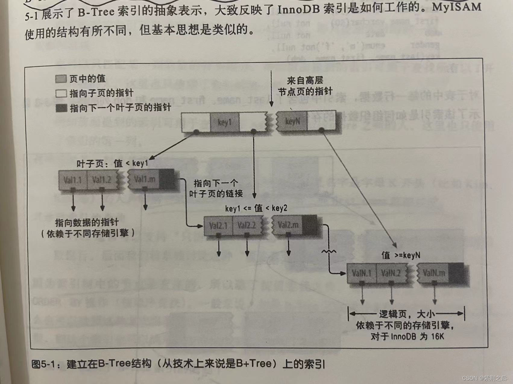

# 第5章 创建高性能的索引

## 索引基础

如果索引包含多个列，那么列的顺序也十分重要，因为MySQL只能高效地使用索引的最左前缀列。创建一个包含两个列的索引，和创建两个之包含一列的索引是大不相同的。

### 索引的类型

在MySQl中，索引是在存储引擎层面二不是服务器层实现的。所以，并没有统一的索引标准：不同存储引擎的索引的工作方式并不一样，也不是所有的存储引擎都支持所有类型的索引。即使多个存储引擎支持同一种类型的索引，其底层的实现也可能不同。

#### B-Tree索引

底层的存储引擎也可能使用不同的存储结构，例如，NDB集群存储引擎内部实际上使用了T-Tree结构存储这种索引，即使其名字是BTREE；InnoDB则使用的是B+Tree。

B-Tree通常意味着所有的值都是按顺序存储的，并且每一个叶子到根的距离相同。



B-Tree对索引列是顺序组织存储的，所以很适合查找范围数据。

索引对多个值进行排序的一局是CREATE TABLE语文中定义索引时列的顺序。B-Tree索引适用于全键值、键值范围或键前缀查找。其中键前缀查找只适用于根据最左前缀的查找。索引对如下类型的查询有效：1.全值匹配；2.匹配最左前缀；3.匹配范围值；4.精确匹配某一列并范围匹配另外一列；5.只访问索引的查询（覆盖索引）。

因为索引树中的节点是有序的，所以除了按值查找之外，索引还可以用于查询中的ORDER BY操作。所以，如果ORDER BY子句满足前面列出的几种查询类型，则这个索引也可以满足对应的排序需求。

下面是一些关于B-Tree索引的限制：

- 如果不是按照索引的最左列开始查找，则无法使用索引。

- 不能跳过索引的列。

- 如果查询中有某个列的范围查询，则其右边所有列都无法使用索引优化查找。例如有查询WHERE last_name = 'Smith' AND first_name  LIKE 'J%' AND dob = '1976-12-23'

#### 哈希索引

在MySQL中，只有Memory引擎显示支持哈希索引。

#### 全文索引

全文索引它查找的是文本中的关键词，而不是直接比较索引中的值。在相同的列上同时创建全文索引和基于值的B-Tree索引不会有冲突，全文索引适用于MATCH AGINST操作，而不是普通的WHERE条件操作。

## 索引的优点

索引有如下三个有点：

- 索引大大减少了服务器需要扫描的数据量；

- 索引可以帮助服务器避免排序和临时表；

- 索引可以将随机I/O变为顺序I/O

当索引帮助存储引擎快速查找到记录带来的好处大于其带来的额外工作时，索引才是有效的。

## 高性能的索引策略

### 独立的列

“独立的列”是指索引列不能是表达式的一部分，也不能是函数的参数。如这个查询无法使用actor_id列的索引：SELECT actor_id FROM sakila.actor WHERE actor_id + 1 = 5;

### 前缀索引和索引选择性

索引的选择性是指，不重复的索引值（也成为基数，cardinality）和数据表的记录总数（#T）的比值。索引的选择性越高则查询效率越高，因为选择性高的索引可以让MySQL在查询时过滤掉更多的行。唯一索引的选择性是1，这是最好的索引选择性，性能也是最好的。

一般情况下某个列前缀的选择性也是足够高的，足以满足查询性能。对于BLOB、TEXT或者很长的VARCHAR类型的列，必须使用前缀索引，因为MySQL不允许索引这些列的完整长度。

为了决定前缀的合适长度，需要找到最常见的值的列表，然后和最常见的前缀列表进行比较。

计算合适的前缀长度的另外一个办法就是计算完整的列的选择性，并使用前缀的选择性接近于完整列的选择性。

```sql
SELECT COUNT(DISTINCT city)/COUNT(*) FROM sakila.city_demo;
```

这个例子中如果前缀的选择性能够接近0.031，基本上就可用了。

平均选择性会让你认为前缀长度为4或5的索引已经足够足够了，但如果数据不均匀，可能就会有陷阱。例如在真实的城市名上建一个长度为4的前缀索引，对于以“San”和“New”开头的城市的选择性就会非常糟糕，因为很多城市都以这两个词开头。如何创建前缀索引：ALTER TABLE sakila.city_demo ADD KEY (city(7));

前缀索引是一种能使索引更小、更快的有效办法，但另一方面也有其缺点：MySQL无法使用前缀索引做ORDER BY和GROUP BY，也无法使用前缀索引做覆盖扫描。一个常见的场景是针对很长的十六进制唯一ID使用前缀索引。

### 多列索引

在多个列上建立独立的单列索引大部分情况下并不能提高MySQL的查询性能。例如，表film_actor在字段film_id和actor_id上各有一个索引，但对于下面这个查询WHERE条件，这两个单列索引都不是好的选择：SELECT film_id, actor_id FROM sakila.film_actor WHERE actor_id = 1 OR film_id = 1;除非修改为SELECT film_id, actor FROM sakila.film_actor WHERE actor_id = 1 UNION ALL SELECT film_id, actor FROM sakila.film_actor WHERE actor_id = 1 AND actor_id <> 1;在MySQL5.0和更新的版本中，查询能够同时使用这两个单列索引进行扫描，并将结果进行合并。这种算法有三个变种：OR条件的联合（union），AND条件的相交（intersection），组合前两种情况的联合及相交。

### 选择合适的索引列顺序

正确的顺序依赖于使用该索引的查询，并且同时需要考虑如何更好地满足排序和分组的需要。在一个多列B-Tree索引中，索引列的顺序意味着索引首先按照最左列进行排序，其次是第二列，等等。所以，索引可以按照升序或者降序进行扫描，以满足精确符合列顺序的ORDER BY、GROUP BY和DISTINCT等字句的查询要求。

将选择性最高的列放到索引最前列。但通常不如避免随机IO和排序那么重要。然而，性能不只是依赖于所有索引列的选择性（整体基数），也和查询条件的具体值有关，也就是和值的分布有关。

```sql
SELECT COUNT(DISTINCT staff_id)/COUNT(*) AS staff_id_selectivity, COUNT(DISTINCT customer_id)/COUNT(*) AS customer_id_selectivity, COUNT(*) FROM payment;
```

