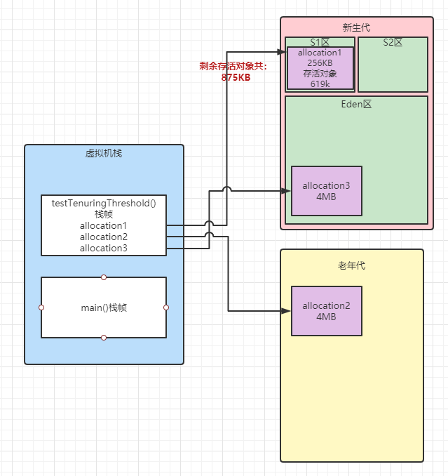

# 第一章 走进Java
- JDK是用于支持Java程序开发的最小环境
- JRE是支持Java程序运行的标准环境
- JDK7是可以支持Windows XP操作系统的最后一个版本
- Oracle再迫使商业用户要么不断升级JDK的版本，要么就去购买商业支持
# 第二章 内存区域与内存溢出异常

## 程序计数器
<p>程序计数器（Program Counter Register）是一块较小的内存空间，它可以看作是当前线程所执行的字节码的行号指示器。分支、循环、跳转、异常处理、线程恢复等基础功能都需要依赖这个计数器来完成。</p>

<p>在任何一个确定的时刻，一个处理器（对于多核处理器来说是一个内核）都只会执行一条线程中的指令。因此，为了线程切换后能恢复到正确的执行位置，每条线程都需要一个独立的程序计数器，各条线程之间的计数器互不影响，独立存储，我们称这类内存区域为“线程私有”的内存。</p>

## Java虚拟机栈
<p>Java虚拟机栈（Java Vitrual Machine Stack）也是私有的，它的生命周期与线程相同。虚拟机栈描述的是Java方法执行的内存模型：每个方法被执行的时候，Java虚拟机同步创建一个栈帧（Stack Frame）用于存储局部变量表、操作数栈、动态连接、方法出口等信息。每一个方法被调用直至执行完毕的过程，就对应一个栈帧在虚拟机栈中从入栈道出栈的过程。</p>
<p>虚拟机栈中的局部变量表存放了编译期可知的各种Java虚拟机基本数据类型（boolean、byte、char、short、int、float、long、double）、对象引用（reference类型，它并不等同于对象本身，可能是一个指向对象起始地址的引用指针，也可能是指向一个代表对象的句柄会这其他与此对象相关的位置）和returnAddress类型（指向了一条字节码指令地址）。</p>
<p>这些数据类型在局部变量表中的存储空间以局部变量槽（Slot）来表示，其中64位长度的long和double类型的数据会占用两个变量槽，其余的数据类型只占用一个。局部变量表所需的内存空间在编译期间完成分配。在方法运行期间不会改变局部变量表的大小。</p>
<p>如果线程请求的栈深度大于虚拟机所允许的深度，将抛出StackOverflowError异常；如果Java虚拟机栈容量可以动态扩展，当栈扩展时无法申请到足够的内存会抛出OutOfMemoryError</p>

## 本地方法栈
<p>本地方法栈是为虚拟机使用到的本地（Native）方法服务</p>
<p>本地方法栈也会在栈深度溢出或栈扩展失败是分别抛出StackOverError和OutOfMemoryError</p>

## Java堆
<p>Java堆是被所有线程共享的一块内存区域</p>
<p>Java堆是垃圾收集器管理的内存区域，因此一些资料中它也被称作“GC堆”</p>
<p>Java堆可以处于物理上不连续的内存空间中，但它逻辑上应该被视为是连续的</p>
<p>Java堆中没有内存完成实力分配，并且堆也无法再扩展时，Java虚拟机将会抛出OutOfMemoryError</p>

## 方法区
<p>方法区（Method Area）是各个线程共享的内存区域，它用于存储已被虚拟机加载的类型信息、常量、静态变量、即使编译器编译后的代码缓存等数据</p>
<p>原则上如何实现方法区属于虚拟机实现细节，不受《Java虚拟机规范》管束，并不要求统一</p>
<p>根据Java虚拟机规范的规定，如果方法区无法满足新的内存分配需求时，将抛出OutOfMemoryError异常</p>

## 运行时常量池
<p>运行时常量池（Runtime Constant Pool）是方法区的一部分。Class文件中除了有类的版本、字段、方法、接口等描述信息外，还有一项信息是常量池表（Constant Pool Table），用于存放编译器生成的各种字面量与符号引用，这部分内容将在类加载后存放到方法区的运行时常量池中。既然运行时常量池是方法区的一部分，自然受到方法区内存的限制，当常量池无法再申请到内存时会抛出OutOfMemoryError异常<p>
## 直接内存
<p>一般配置虚拟机参数时，会根据实际内存去设置-Xmx等参数信息，但经常忽略掉直接内存，使得各个内存区域的总和大于物理内存限制（包括物理的和操作系统级的限制），从而导致动态扩展时出现OutOfMemoryError异常</p>

## 对象的创建
<p>当Java虚拟机遇到一条字节码new指令时，首先将去检查这个指令的参数是否能在常量池中定位到一个类的符号引用，并且检查这个符号引用代表的类是否被加载、解析和初始化过。如果没有，那必须先执行相应的类加载过程</p>
<p>在类加载检查通过后，接下来虚拟机将为新生对象分配内存。对象所需内存的大小在类加载完成后便可完全确定，为对象分配空间的任务实际上便等同于把一块确定大小的内存块从Java堆中划分出来</p>
<p>对象创建在虚拟机中是非常频繁的行为，即使仅仅修改一个指针所指向的位置，在并发情况下也并不是线程安全的。解决这个问题有两种可选方案：一种是对分配内存空间的动作进行同步处理——实际虚拟机是采用CAS配上失败重试的方法保证更新操作的原子性；另一种是把内存分配的动作按照线程划分在不同的空间之中进行，即每个线程在Java堆中预先分配一小块内存，称为本地线程分配缓冲（Thread Local Allocation Buffer，TLAB），哪个线程要分配内存，就在哪个线程的本地缓冲区中分配，只有本地缓冲区用完了，分配新的缓存区时才需要同步锁定。虚拟机是否使用TLAB，可以通过-XX:/-UseTLAB参数来设定。</p>
<p>内存分配完成之后，虚拟机必须将分配到的内存空间（但不包括对象头）都初始化为了零值。接下来，Java虚拟机还要对对象进行必要的设置。</p>

## 对象的内存布局
<p>在HotSpot虚拟机里，对象在堆内存中的存储布局可以划分为三个部分，对象头（Header），实例数据（Instance Data）和对象填充（Padding）。</p>
<p>HotSpot虚拟机对象的对象头部分包括两类信息。第一类是用于存储对象自身的运行时数据，如哈希吗（HashCode）、GC分代年龄、锁状态标志、线程持有的锁、偏向线程ID、偏向时间戳等，这部分数据的长度在32位和64位的虚拟机（未开启压缩指针）中分别为32个比特和64个比特，官方称它为“Mark Word”</p>


<p>对象头的另一部分是类型指针，即对象指向它的类型元素数据的指针，Java虚拟机通过这个指针来确定该对象是哪个类型的实力。</p>
<p>实例数据部分是对象真正存储的有效信息。类字段的存储顺序会受到虚拟机分配策略参数（-XX:FieldsAllocationStyle参数）和字段在Java源码中定义顺序的影响。HotSpot虚拟机默认的分配顺序为longs/doubles、ints、shorts、chars、bytes/booleans、oops（Ordinary Object Pointers，OOPs）。在默认情况下，父类中定义的变量会出现在子类之前。如果HotSpot虚拟机的+XX:CompactFields参数值为true（默认就为true），那子类之中较窄的变量也允许插入父类变量的空隙之中，以节省出一点点空间。</p>
<p>对象的第三部分是对齐填充，它仅仅起着占位符的作用。由于HotSpot虚拟机的内存管理系统要求对象起始地址必须是8字节的整数倍，换句话说就是任何对象的大小都必须是8字节的整数倍。对象头部分已经被精心设计成正好是8字节的倍数（1倍或者2倍），因此，如果对象实例数据部分没有对齐的话，就需要通过对齐填充来补全。</p>

## 对象的访问定位
<p>对象访问方式也是由虚拟机实现而定的，主流的访问方式主要有使用句柄和直接指针两种。</p>
<p>使用具柄来访问的最大好处就是reference中存储的是稳定的句柄地址，在对象被移动（垃圾收集时移动对象是非常普遍的行为）时只会改变句柄中的实例数据指针，而reference本身不需要被修改。</p>
<p>使用直接指针来访问的最大好处就是速度快，它节省了一次指针定位的时间开销。</p>

## Java堆溢出

略

## Java栈溢出

略

## 方法区和运行时常量池溢出

在JDK6或更早之前的HotSpot虚拟机中，常量池都是分配在永久代中，我们可以通过-XX:PermSize和-XX:MaxPermSize限制永久代的大小。JDK7继续使用-XX:MaxPermSize限制方法区大小，JDK1.8使用-XX:MaxMetaspaceSize。但是自JDK1.7开始，原本存放在永久代的字符串常量池被移至Java堆中。

在经常运行时生成大量动态代理类的应用场景里，就应该特别注意这些类的回收情况。这类场景除了CGLib字节码增加和动态语言外，常见的还有：大量JSP或动态产生JSP文件的应用、基于OSGi的应用等(下面代码片段会出现java.lang.OutOfMemoryError: PerGen space(JDK1.7版本))。

```java
import net.sf.cglib.proxy.Enhancer;
import net.sf.cglib.proxy.MethodInterceptor;
import net.sf.cglib.proxy.MethodProxy;
import java.lang.reflect.Method;

/**
 * VM Args: -XX:PermSize=10M -XX:MaxPermSize=10M
 */
public class JavaMethodHodAreaOOM{
    public static void main(String[] args){
        while(true){
            Enhancer enhancer = new Enhancer();
            enhancer.setSuperclass(OOMObject.class);
            enhancer.setUseCache(false);
            enhancer.setCallback(new MethodInterceptor() {
                @Override
                public Object intercept(Object o, Method method, Object[] objects, MethodProxy methodProxy) throws Throwable {
                    return methodProxy.invokeSuper(o, objects);
                }
            });
        }
    }
    static class OOMObject{

    }
}
```

JDK1.8之后，永久代完全被元空间替代，JVM参数如下：

- -XX:MaxMetaspaceSize：设置元空间最大值，默认-1，即不限制或者说收本地内存大小限制
- -XX:MaxspaceSize：元空间的初始值，单位字节。会根据垃圾收集的类型卸载情况自动调节这个值（不超过最大设置值）
- -XX:MinMetaspaceFreeRatio：垃圾收集之后控制最小元空间的百分比
- -XX:MaxMetaspaceFreeRatio：垃圾收集之后控制最大元空间的百分比

## 本机直接内存溢出

直接内存（Direct Memory）的容量大小可通过-XX:MaxDirectMemorySize参数来指定，如果不去指定，则默认与Java堆最大值（-Xmx指定）一致。

直接内存导致的内存溢出，一个明显的特征书在Heap Dump文件中不会看见有什么明显的异常情况，如果读者发现内存溢出之后产生的Dump文件很小，而程序中有直接或者间接用了DirectMemory（如NIO），那就可以考虑重点检查一下直接内存方面的原因了。

# 第三章 垃圾收集器与内存分配策略

## 可达性分析算法

可达性分析（Reachability Analysis）算法的基本思路就是通过一系列成为“GC Roots”的根对象作为起始节点集，从这些节点开始，根据引用关系向下搜索，搜索过程所走过的路径成为“应用链”（Reference Chain），如果某个对象到GC Roots间没有任何引用链相连，或者用图论的话来说就是从GC Roots到这个对象是不可达时，则证明此对象是不可能再被使用的。


<p></p>

## 再谈引用

JDK1.2版本之前，Java里面的引用是很传统的定义：如果reference类型的数据中存储的数值代表的是另外一块内存的起始地址，就称该refercence数据是代表某块内存、某个对象的引用。

在JDK1.2版本之后，Java对应用的概念进行了扩充，将引用分为强秦勇（Strongly Reference）、软引用（Soft Reference）、弱引用（Weak Refercence）和虚引用（Phantom Reference）4种。

- 强引用是最传统的“引用”定义，如“Object obj = new Object()”这种引用关系。只要强引用关系还存在，垃圾收集器就永远不会回收掉引用的对象。
- 软引用是用来描述一些还有用，但非必要的对象。只被软引用关联着的对象，在系统将要发生内存溢出异常前，会把这些对象列进回收范围之中进行第二次回收。在JDK1.2版本之后提供了SoftReference类来实现软引用。如缓存类型的数据，可以使用软引用进行定义，在内存不足的时候进行回收，再合适的升级再重新load。

```java
import java.lang.ref.SoftReference;
import java.lang.reflect.Method;
import java.util.HashMap;
import java.util.Map;

public class SoftReferenceMap{
    public static void main(String[] args){
        SoftReference<Map<String, String>> softReference = new SoftReference<Map<String, String>>(new HashMap<String, String>());
        Map<String, String> map = softReference.get();
        if (map == null) {
            softReference = new SoftReference<Map<String, String>>(
                    map = new HashMap<String, String>());
        }
    }
}
```

- 弱引用也是用来描述哪些非必要的对象，但是它的强度比软引用更弱一些，被软引用关联的对象只能生存到下一次垃圾收集发生为止。当垃圾收集器开始工作，无论当前内存是否足够，都会回收掉被弱应用关联的对象。在JDK1.2之后提供了WeakReference类来实现弱引用。

- 虚引用是最弱的一种引用关系。无法通过虚引用获取一个对象的实例。为一个对象设置虚引用关系的唯一目的是为了能在这个对象被收集器回收时收到一个系统通知。在JDK1.2版本之后提供了PhantomReference类实现虚引用。虚引用必须配合ReferenceQueue使用，当垃圾回收器决定对PhantomReference对象进行回收时，会将其插入ReferenceQueue中。在NIO直接内存回收时，会使用到虚引用

## 对象存活判定

1. 可达性分析算法判断对象为不可达的，对对象进行第一次标记
2. 此兑现是否有必要执行finalize()方法，如果没有覆盖finalize()方法或者已被虚拟机执行，则判定为“没必要执行”
3. 如果有必要执行finalize()方法，那么该对象会被放到一个名为F-Queue的队列中，稍后由一个低优先级的Finalizer线程去执行他们的finalize()方法。但虚拟机并不保证他们能够执行完成，防止finalize()方法执行缓慢或死循环而导致F-Queue队列中的其他对象长时间或永久处于等待状态
4. 稍后收集器将对F-Queue中的对象进行第二次小规模的标记。在finalize()方法中只要对象重新与引用链是哪个的任何一个对象建立关联它就可以继续存活（不建议使用finalize()方法）

## 回收方法区

方法区的垃圾收集的“性价比”通畅比较低。方法区的垃圾收集主要回收两部分内容：废弃的常量和不再使用的类型。

废弃的常量：如“java”曾进入常量池中，但是当前系统又没有任何一个字符串对象值是“java”，也就是说没有任何字符串对象引用常量池中的“java”常量。如果此时发生内存回收，并且收集器判断有必要的话，“java”会被系统清理出常量池。

类型不再使用的条件：

- 该类的所有实例都已经被回收
- 加载该类的类加载器已经被回收，这个条件很难达成
- 该类对应的java.lang.Class对象没有在任何地方被引用

只有满足上面三个条件，在被允许回收，而不是必然被回收。关于是否要对类型进行回收，HotSpot虚拟机提供了-Xnoclassgc参数进行控制，还可以使用-verbose:class以及-XX:+TraceClassLoading、-XX:+TraceClassUnLoading查看类加载和卸载信息。

## 分代收集理论

1）弱分代加锁（Weak Generational Hypothesis）：绝大多数对象都是朝生夕灭的

2）强分代加锁（Strong Generation Hypothesis）：熬过越多次垃圾收集过程的对象就越难以消亡

这两个分代加锁共同奠定了多款常用的垃圾收集器的一致的设计原色：收集器应该讲Java堆划分出不同的区域，然后将回收对象依据其年龄（年龄即对象熬过垃圾收集过程的次数）分配到不同的区域之中存储。

分代收集理论会把Java堆划分为新生代（Young Generation）和老年代（Old Generation）两个区域。在新生代中，每次垃圾收集时都发现有大批对象死去，而每次回收后存货的少量对象，将会逐步晋升到老年代中存放。

值得注意的是，新生代对象完全有可能被老年代所引用，反过来同样如此。这就引出第三假说：

3）跨代应用假说（Intergenerational Reference Hypothesis）：跨代引用相对于同代引用来说仅占极少数。也就是说存在互相引用关系的两个对象，是应该倾向于同事生存或同事消亡的。

所以为了解决跨代引用，只需在新生代上建立一个全局的数据结构（该结构被称为“记忆集”，Remembered Set），这个结果把老年代划分成若干小块，标识出老年代那一块内存会存在跨代引用。此后当发生Minor GC时，只有包含了跨代引用的小块内存的对象才会被加入到GC Roots进行扫描。

```html
部分收集Partial GC：指目标不是完整收集整个Java堆的垃圾收集，其中有包括：
	新生代收集Minor GC/Young GC：目标是新生代的垃圾收集
	老年代收集Major GC/Old GC：目标是老年代的垃圾收集。目前只有CMS收集器会有单独收集老年代的行为
	混合收集Mixed GC：目标是收集整个新生代以及部分来年代的垃圾收集
整堆收集Full GC：收集整个Java堆和方法区的垃圾收集
```

## 标记-清除算法

标记-清除（Mark-Sweep）算法分为“标记”和“清除”两个阶段：首先标记处所有需要回收的对象，在标记完成后，统一回收掉所有被标记的对象，也可以反过来，标记存活的对象，统一回收所有未被标记的对象。标记过程就是对象是否属于垃圾的判定过程。

它的主要缺点有两个：第一是执行效率不稳定，如果Java对中包含大量对象，而且其中大部分是需要被回收的，这时需要进行大量标记和清除的动作，导致标记和清除两个过程的执行效率都随对象数量增长而减低；第二个是内存空间的碎片化问题，标记、清除之后会产生大量不连续的内存碎片，空间碎片太多可能会导致当以后在程序运行过程中需要分配较大对象时无法找到足够的连续内存而不得不提前出发另一次垃圾收集动作。


## 标记-复制算法

标记-复制算法常被称为复制算法。它将可用内存按容量划分为大小相等的两块，每次只使用其中的一块。当这一块的内存用完了，就讲还存货的对象复制到另外一块上面，然后再把已使用过的内存空间一次清理掉。

它的优点是实现简单，运行高效。缺点是将可用内存缩小为原来的一半。

由于对象是朝生夕灭的，所以提出另一种更为优化的复制算法，成为Appel式回收。

具体做法是把新生代分为一块较大的Eden空间和两块较小的Survivor空间，每次分配内存只使用Eden和其中一块Survivor。发生垃圾收集时，将Eden和Survivor中仍然存活的对象一次性复制到另外一块Survivor空间上，然后直接清理掉Eden和已用过的那块Survivor空间。HotSpot虚拟机默认Eden和Suvivor的大小比例是8：1，也即每次新生代中可用内存空间为整个新生代容量的90%（Eden的80%加上一个Survivor的10%），只有一个Survivor空间，即10%的新生代是会被“浪费”的。

## 标记-整理算法

“标记-整理”（Mark-Compact）算法，其中的标记过程仍然与“标记-清除”算法一样，但后续步骤不是直接对可回收对象进行清理，而是让所有存活的对象都向内存空间的一端移动，然后直接清理掉边界以外的内存。

如果移动存活对象，尤其是在老年代这种每次回收都有大量对象存活的区域，移动存活对象并更新所有引用这些对象的地方将会是一种极为负重的操作，而且这种对象移动操作必须全程暂停用户应用程序才能进行

## 根节点枚举

略

## 安全点

略

## 安全区域 

略

## 记忆集与卡表

略

## 写屏障

略

## 并发的可达性分析

可达性分析算法理论上要求全过程都基于一个能保障一致性的快照中才能够分析，这意味着必须全程冻结用户线程的运行。

“标记”阶段是所有追踪式垃圾收集算法的共同特征。如何更有效率的进行标记呢？这里需引入是三色标记（Tri-color Marking）法

- 白色：表示对象尚未被垃圾收集器访问过。显然在可达性分析刚刚开始的阶段，所有的对象都是 白色的，若在分析结束的阶段，仍然是白色的对象，即代表不可达。
- 黑色：表示对象已经被垃圾收集器访问过，且这个对象的所有引用都已经扫描过。黑色的对象代 表已经扫描过，它是安全存活的，如果有其他对象引用指向了黑色对象，无须重新扫描一遍。黑色对 象不可能直接（不经过灰色对象）指向某个白色对象。
- 灰色：表示对象已经被垃圾收集器访问过，但这个对象上至少存在一个引用还没有被扫描过。

如果标记和用户线程并发，可能出现两种后果：

- 一种是把原来消亡的对象错误的标记为存活
- 一种是把原本存活的对象错误标记为消亡，会导致对象消失。这种是不能接受的。如下图所示


针对“对象消失”问题，即原本应该是黑色的对象被误标为白色的问题，wilson在1994年理论证明了只有如下两个条件同时满足时才会出现。所以我们只要破坏以下两个条件中的任意一个即可，它们是：

- 赋值器插入了一条或多条从黑色对象到白色对象的新引用
- 赋值器删除了全部从灰色对象到该白色对象的直接或间接引用

于是为了破坏这两个条件，又出现了一下两种解决方案：

- 增量更新（Incremental Update）：它要破坏的是第一个条件。黑色对象一单新插入了指向白色对象的引用后，他就变回灰色了。这部分对象需要记录下来重新进行扫描
- 原始快照（Snapshot At The Beginning, SATB）：它破坏的是第二个条件。当要删除灰色到白色的引用时，需要记录下来以灰色对象为根重新进行一次扫描。也就是说无论引用关系删除与否，都会按照刚刚开始扫描的那一刻的对象图快照来进行搜索。

引用关系记录的插入还是删除，都是通过写屏障实现的。

## 经典的垃圾收集器


### Serial收集器

Serial收集器是一个单线程工作的收集器。它进行垃圾回收时，必须暂停其他所有工作线程，直到它收集结束。虽然Serial收集器出现的最早，但它依然是HotSpot虚拟机运行在客户端模式下的默认新生代收集器。

### ParNew收集器

ParNew收集器实际上是Serial收集器的多线程并行版本，包括Serial收集器可用的所有控制参数、收集算法、Stop The World、对象分配规则、回收策略等等都与Serial收集器完全一致。除了Serial收集器外，目前只有它能与CMS收集器配合工作。

自JDK9开始，ParNew加CMS收集器的组合就不再是官方推荐的服务端模式下的收集器解决方案了。

可以使用-XX:ParallelGCThreads参数来限制垃圾收集器的线程数。

```html
tips：
并行（Parallel）：表示多个垃圾收集器线程之间的关系，强调同一时间多条这样的线程可以协同工作
并发（Concurrent）：它描述的是垃圾收集器和用户线程之间的关系，说明同一时间垃圾收集线程和用户线程都在运行
```

### Paraller Scavenge收集器

它是一款新生代收集器，同样是基于标记-复制算法实现的。他的目标是达到一个可控的吞吐量（Throughput）。所谓吞吐量就是处理器用于运行用户代码的时间与处理器总消耗的时间的比值，即：吞吐量 = 运行用户代码时间 / 运行用户代码时间 + 运行垃圾收集时间。

停顿时间越短就越适合需要与用户交互或需要保证服务响应质量的程序，良好的响应速度能提升用户体验；而高吞吐量则可以最高效率地利用处理器资源，尽快完成程序的运算任务，主要适合在后台运算而不需要太多交互的分析任务。

Paraller Scavenge收集器提供了两个参数用于精准控制吞吐量，分别是控制最大垃圾收集停顿时间的-XX:MaxGcPauseMills参数以及直接设置吞吐量大小的-XX:GCTimeRatio参数。

XX:MaxGcPauseMills是一个允许大于0的毫秒数，垃圾收集的停顿时间缩短是以新生吞吐量和新生代空间为代价获取的。

-XX:MaxGcPauseMills参数则是应当大于0小于100的整数，也就是垃圾收集时间占总时间的比率，相当于吞吐量的倒数。

Paraller Scavenge收集器还有一个参数是-XX:UseAdaptiveSizePolicy，这是一个开关参数，当这个参数被激活后，就不需要人工指定新生代的大小、Eden与Survivor区的比例、晋升老年代对象大小等细节参数了，虚拟机会根据当前系统的运行情况收集性能监控信息，动态调整这些参数以提供最合适的停顿时间或最大吞吐量

### Serial Old收集器

Serial Old收集器是Serial收集器的老年代版本，他同样是一个单线程收集器，使用 标记-整理算法。这个收集器的主要意义也是供客户端模式下的HotSpot虚拟机使用。在服务端模式下有两种用途：1中是在JDK1.5以前版本中与Paraller Scavenge收集器搭配使用，另一种是作为CMS收集器发生失败时的后备预案。

### Parallel Old收集器

他是Parallel Scavenge收集器的老年代版本，支持多线程并发收集，基于标记-整理算法实现。

### CMS收集器

CMS（Concurrent Mark Sweep）收集器是一种以获取最短回收停顿时间为目标的收集器。CMS收集器是基于标记-清除算法实现的，整个过程分为四个步骤：

1）初始标记（CMS initial mark）

2）并发标记（CMS concurrent mark）

3）重新标记（CMS remark）

4）并发清除（CMS concurrent sweep）

其中初始标记、重新标记这两个步骤仍然需要“Stop The World”。初始标记仅仅只是标记一下GC Roots能直接关联到的对象，速度很快；并发标记阶段就是从GC Roots的直接关联对象开始遍历整个对象图的过程，这个过程耗时较长但是不需要停顿用户线程；而重新标记阶段则是为了修成并发标记期间，因用户程序继续运作而导致标记产生变动的那一部分对象的标记记录，这个阶段的停顿时间通会比初始标记阶段稍长一些；最后是并发清除阶段，清理删除掉标记阶段判断的已经死亡的对象，由于不需要移动存活对象，所以这个阶段也是可以与用户线程同时并发的。CMS收集器至少有一下三个明显的缺点：

1）CMS收集器对处理器资源非常敏感。CMS默认启动的回收线程数是（处理器核心数量+3）/4。当处理器核心数量越多时，对用户线程影响越小。比如当处理器核心数量为1时，CMS回收线程数也是1；当处理器核心数量为8时，回收线程数不足3。

2）由于CMS收集器无法处理“浮动垃圾”（Floating Garbage），有可能出现“Concurrent Mode Failure”失败进而导致另一次完全“Stop The World”的Full GC的产生。在CMS的并发标记和并发清理阶段，用户线程是还在继续运行的，伴随有新的垃圾对象不断产生，但这一部分对象是出现在标记过程结束以后，CMS无法在当次收集中处理掉他们，这一部分垃圾就称为“浮动垃圾”。因此CMS收集器不能像其他收集器那样等待老年代几乎完全被填满了在进行收集，必须预留一部分空间供并发收集时的程序运作使用。CMS收集器当老年代使用68%或92%（分别是JDK1.5和1.6）的空间后就会被激活，使用参数-XX:CMSInitiatingOccu-pancyFraction的值来提高CMS的触发百分比，降低内存回收频率。要是CMS运行期间预留的内存无法满足程序分配新对象的需要，就会出现一次“并发失败”（Concurrent Mode Failure），这时虚拟机将不得不启动后备预案：冻结用户线程的执行，临时启动Serial Old收集器来重新进行老年代的垃圾收集，但这样停顿时间就很长了。

3）CMS是一款基于“标记-清除”算法实现的收集器，这意味着收集结束时会有大量空间碎片产生。CMS收集器提供了一个-XX:UseCMSCompactAtFullCollection（默认开启，JDK9开始废弃）开关参数，用于在CMS收集器不得不进行Full GC时开启内存碎片的合并整理过程。-XX:CMSFullGCsBeforeCompaction（JDK9开始废弃）要求CMS收集器在执行过若干次不整理空间的Full GC之后，下一次进入Full GC前会先进行随便整理（默认值为0，表示每次都会整理）

### Garbage First

简称G1收集器。G1是一款主要面向服务端应用的垃圾收集器。G1可以面向堆内任何部分来组成回收集（Collection Set，一般简称CSet）进行回收，衡量标准不再是它属于哪个分代，而是哪块内存中存放的垃圾数量最多，回收收益最大，这就是G1收集器的Mixed GC模式。

G1不再坚持固定大小以及固定数量的分代区域划分，而是把连续的Java堆划分为多个大小相等的独立区域（Region），每一个Region都可以根据需要，扮演新生代的Eden空间、Survivor空间，或者老年代空间。收集器能够对扮演不同角色的Region采用不同的策略去处理，这样无论是新创建的对象还是已经存活了一段时间、熬过多次收集器的旧对象都能够获得很好的收集效果。

Region还有一类特殊的Humongous区域，专门用来存储大对象。G1认为只要大小超过了一个Region容量一半的对象即可判定为大对象。每个Region的大小可以通过参数-XX:G1HeapRegionSize设定，取值范围为1MB~32MB，且应为2的N次幂。G1的大多数行为都吧Humongous作为老年代的一部分进行看待。

G1收集器去跟踪各个Region里面的垃圾堆积的“价值”大小，价值即回收所获得的空间大小以及回收所需时间的经验值，然后在后台维护一个优先级列表，每次根据用户设定允许的收集停顿时间（使用参数-XX:MaxGCPauseMillis指定，默认值是200毫秒），优先处理回收价值收益最大的那些Region，这也就是“Garbage First”名字的由来。

G1收集器至少有以下这些关键的细节问题需要妥善处理：

1）Region里面存在跨Region引用对象问题。Region也是使用记忆集避免全堆作为GC Roots扫描，但是G1收集器的记忆集要复杂的多。总结来说，G1至少要耗费大约相当于Java堆容量10%至20%的额外内存来维持收集器工作。

2）CMS收集器采用增量更新算法实现，而G1收集器则是通过原始快照（SATB）算法实现。与CMS中的“Concurrent Mode Failure”失败会导致Full GC类似，如果内存回收的速度赶不上内存分配的速度，G1收集器也要被迫冻结用户线程执行，导致Full GC而产生长时间“Stop The World”。

G1收集器的运作过程大概可划分为以下四个步骤：

1）初始标记（Initial Marking）：这个阶段需要停顿线程，但耗时很短

2）并发标记（Concurrent Marking）：从GC Root开始对堆中对象进行可达性分析，找出要回收的对象，这阶段耗时较长，但可与用户程序并发执行。

3）最终标记（Final Marking）：对用户线程做另一个短暂的暂停。

4）筛选回收（Live Data Counting and Evacuation）：这里的操作涉及存活对象的移动，是必须暂停用户线程，由多条收集器线程并行完成的。

G1从整体来看是基于“标记-整理”算法实现的收集器，但从局部（两个Region之间）上看又是基于“标记-复制”算法实现，两种算法都意味着G1运作期间不会产生内存空间碎片。

在用户程序运行过程中，G1无论是为了垃圾收集产生的内存占用（Footprint）还是程序运行是的额外执行负载（Overload）都要比CMS要高。


## 低延迟垃圾收集器

### Shenandoah

Shenandoah更像是G1的下一代继承者，它也是使用基于Region的堆内存布局。Shenandoah（目前）默认不使用分代收集。Shenandoah摒弃了在G1中大量内存和计算资源去维护的记忆集，改用名为“连接矩阵”（Connection Matrix）的全局数据结构来记录夸Region的引用关系。

### ZGC收集器

ZGC收集器是一款基于Region内存布局的，（暂时）不设分代的，使用了读屏障、染色指针和内存多重映射等技术来实现可并发的标记-整理算法的，以低延迟为首要目标的一款垃圾收集器。

## 收集器的权衡

1）如果是数据分析、可选计算类的任务，目标是尽快算出结果，那吞吐量就是主要关注点；如果是SLA应用，那停顿时间直接影响服务质量，严重的甚至会导致事物超时，这样延迟就是主要关注点；而如果是客户端应用或嵌入式应用，那垃圾收集的内存占用则是不可忽视的。

2）运行应用的基础设置如何

3）使用JDK的发行商是什么；版本号是多少。

## 实战：内存分配与回收策略

### 对象优先在Eden分配

经测试，jdk1.7会将allocation1~3移动到老年代，allocation4分配到伊甸区。jdk1.8是直接将allocation4分配到老年代，本例子使用的是jdk1.8

```java
package com.jolan.jvm.example;

public class JVM3_8_1 {
    private static final int _1MB = 1024 * 1024;

    /**
     * VM参数：-verbose:gc -Xms20M -Xmx20M -Xmn10M -XX:+PrintGCDetails -XX:SurvivorRatio=8
     * 其中-verbose:gc表示在控制台输出gc日志
     *     -XX:+PrintGCDetails表示查看GC日志详情
     *     -XX:SurvivorRatio=8表示新生代中的Eden区与一个Survivor区的空间比例是8:1
     *
     *      
     */
    public static void testAllocation(){
        byte[] allocation1, allocation2, allocation3, allocation4;
        allocation1 = new byte[2 * _1MB];
        allocation2 = new byte[2 * _1MB];
        allocation3 = new byte[2 * _1MB];
        System.out.println("-----------------------");
        allocation4 = new byte[4 * _1MB]; //出现一次Minor GC
    }

    public static void main(String[] args) {
        testAllocation();
    }
}

/**
 [GC (Allocation Failure) [DefNew: 6259K->664K(9216K), 0.0045862 secs] 6259K->4760K(19456K), 0.0046347 secs] [Times: user=0.02 sys=0.00, real=0.00 secs] 
 -----------------------
 Heap
 def new generation   total 9216K, used 7045K [0x00000006c2400000, 0x00000006c2e00000, 0x00000006c2e00000)
 eden space 8192K,  77% used [0x00000006c2400000, 0x00000006c2a3b618, 0x00000006c2c00000)
 from space 1024K,  64% used [0x00000006c2d00000, 0x00000006c2da6148, 0x00000006c2e00000)
 to   space 1024K,   0% used [0x00000006c2c00000, 0x00000006c2c00000, 0x00000006c2d00000)
 tenured generation   total 10240K, used 4096K [0x00000006c2e00000, 0x00000006c3800000, 0x00000007c0000000)
 the space 10240K,  40% used [0x00000006c2e00000, 0x00000006c3200020, 0x00000006c3200200, 0x00000006c3800000)
 Metaspace       used 3473K, capacity 4496K, committed 4864K, reserved 1056768K
 class space    used 381K, capacity 388K, committed 512K, reserved 1048576K
 */
```

### 大对象直接进入老年代

```java
package com.jolan.jvm.example;

public class JVM3_8_2 {
    private static final int _1MB = 1024 * 1024;

    /**
     * VM参数：-verbose:gc -Xms20M -Xmx20M -Xmn10M -XX:+PrintGCDetails -XX:SurvivorRatio=8 -XX:PretenureSizeThreshold=3145728 -XX:+UseSerialGC
     *      
     */
    public static void tetsPretenureSizeThreshold(){
        byte[] allocation;
        allocation = new byte[4 * _1MB]; //直接分配到老年代
    }

    public static void main(String[] args) {
        tetsPretenureSizeThreshold();
    }
}

/**
 Heap
 def new generation   total 9216K, used 2327K [0x00000000fec00000, 0x00000000ff600000, 0x00000000ff600000)
 eden space 8192K,  28% used [0x00000000fec00000, 0x00000000fee45dd8, 0x00000000ff400000)
 from space 1024K,   0% used [0x00000000ff400000, 0x00000000ff400000, 0x00000000ff500000)
 to   space 1024K,   0% used [0x00000000ff500000, 0x00000000ff500000, 0x00000000ff600000)
 tenured generation   total 10240K, used 4096K [0x00000000ff600000, 0x0000000100000000, 0x0000000100000000)
 the space 10240K,  40% used [0x00000000ff600000, 0x00000000ffa00010, 0x00000000ffa00200, 0x0000000100000000)
 Metaspace       used 3470K, capacity 4496K, committed 4864K, reserved 1056768K
 class space    used 381K, capacity 388K, committed 512K, reserved 1048576K

 */
```

### 长期存活的对象将进入老年代

HotSpot虚拟机中多数收集器都采用了分代收集来管理堆内存， 那内存回收时就必须能决策哪些存活对象应当放在新生代， 哪些存活对象放在老年代中。 为做到这点， 虚拟机给每个对象定义了一个对象年龄（Age） 计数器， 存储在对象头中 。 对象通常在Eden区里诞生， 如果经过第一次Minor GC后仍然存活， 并且能被Survivor容纳的话， 该对象会被移动到Survivor空间中， 并且将其对象年龄设为1岁。 对象在Survivor区中每熬过一次Minor GC， 年龄就增加1岁， 当它的年龄增加到一定程度（默认为15） ， 就会被晋升到老年代中。 对象晋升老年代的年龄阈值， 可以通过参数**-XX：MaxTenuringThreshold**设置

```java
package com.jolan.jvm.example;

public class JVM3_8_3 {
    private static final int _1MB = 1024 * 1024;

    /**
     * VM参数：-verbose:gc -Xms20M -Xmx20M -Xmn10M -XX:+PrintGCDetails -XX:SurvivorRatio=8 -XX:MaxTenuringThreshold=1 -XX:+PrintTenuringDistribution -XX:+UseSerialGC
     *      
     */
    public static void testTunuringThreshold(){
        byte[] allocation1, allocation2, allocation3;
        allocation1 = new byte[_1MB / 4]; //什么时候进入老年代决定于XX:MaxTenuringThreshold的设置
        allocation2 = new byte[4 * _1MB];
        allocation3 = new byte[4 * _1MB];
        allocation3 = null;
        allocation3 = new byte[4 * _1MB];
    }

    public static void main(String[] args) {
        testTunuringThreshold();
    }
}

/**
当MaxTenuringThreshold = 1 时
[GC (Allocation Failure) [DefNew
Desired survivor size 524288 bytes, new threshold 1 (max 1)
- age   1:     914896 bytes,     914896 total
: 6515K->893K(9216K), 0.0038951 secs] 6515K->4989K(19456K), 0.0039487 secs] [Times: user=0.00 sys=0.00, real=0.00 secs] 
[GC (Allocation Failure) [DefNew
Desired survivor size 524288 bytes, new threshold 1 (max 1)
- age   1:        872 bytes,        872 total
: 5073K->0K(9216K), 0.0017636 secs] 9169K->4986K(19456K), 0.0017966 secs] [Times: user=0.00 sys=0.00, real=0.00 secs] 
Heap
 def new generation   total 9216K, used 4234K [0x00000000fec00000, 0x00000000ff600000, 0x00000000ff600000)
  eden space 8192K,  51% used [0x00000000fec00000, 0x00000000ff0227c8, 0x00000000ff400000)
  from space 1024K,   0% used [0x00000000ff400000, 0x00000000ff400368, 0x00000000ff500000)
  to   space 1024K,   0% used [0x00000000ff500000, 0x00000000ff500000, 0x00000000ff600000)
 tenured generation   total 10240K, used 4985K [0x00000000ff600000, 0x0000000100000000, 0x0000000100000000)
   the space 10240K,  48% used [0x00000000ff600000, 0x00000000ffade5b0, 0x00000000ffade600, 0x0000000100000000)
 Metaspace       used 3454K, capacity 4496K, committed 4864K, reserved 1056768K
  class space    used 379K, capacity 388K, committed 512K, reserved 1048576K
  
  
当MaxTenuringThreshold = 15 时
[GC (Allocation Failure) [DefNew
Desired survivor size 524288 bytes, new threshold 1 (max 15)
- age   1:     942416 bytes,     942416 total
: 6515K->920K(9216K), 0.0055743 secs] 6515K->5016K(19456K), 0.0057039 secs] [Times: user=0.00 sys=0.02, real=0.01 secs] 
[GC (Allocation Failure) [DefNew
Desired survivor size 524288 bytes, new threshold 15 (max 15)
: 5016K->0K(9216K), 0.0015704 secs] 9112K->5012K(19456K), 0.0015994 secs] [Times: user=0.00 sys=0.00, real=0.00 secs] 
Heap
 def new generation   total 9216K, used 4178K [0x00000000fec00000, 0x00000000ff600000, 0x00000000ff600000)
  eden space 8192K,  51% used [0x00000000fec00000, 0x00000000ff014930, 0x00000000ff400000)
  from space 1024K,   0% used [0x00000000ff400000, 0x00000000ff400000, 0x00000000ff500000)
  to   space 1024K,   0% used [0x00000000ff500000, 0x00000000ff500000, 0x00000000ff600000)
 tenured generation   total 10240K, used 5012K [0x00000000ff600000, 0x0000000100000000, 0x0000000100000000)
   the space 10240K,  48% used [0x00000000ff600000, 0x00000000ffae5168, 0x00000000ffae5200, 0x0000000100000000)
 Metaspace       used 3471K, capacity 4496K, committed 4864K, reserved 1056768K
  class space    used 381K, capacity 388K, committed 512K, reserved 1048576K
 */
```


1）Eden区大小为8192K

2）allocation1占用空间为256K

3）allocation2占用空间为4096K

4）allocation3占用空间也为4096K

5）三个变量总共需占用空间8448K

6）所以在第一次执行allocation3 = new byte[4 * _1MB]时Eden空间不足，需要进行一次垃圾回收

: 6515K->893K(9216K), 0.0038951 secs] 6515K->4989K(19456K), 0.0039487 secs] [Times: user=0.00 sys=0.00, real=0.00 secs] 

GC： 代表发生了一次垃圾回收，前面没有Full修饰，表明这时一次Minor GC；

Allocation Failure：表明本次引起GC的原因是因为在年轻代中没有足够的空间能够存储新的数据了。

6515K->893K(9216K) 三个参数分别为：GC前该内存区域(这里是年轻代)使用容量，GC后该内存区域使用容量，该内存区域总容量。

6515K->4989K(19456K) 三个参数分别为：堆区垃圾回收前的大小，堆区垃圾回收后的大小，堆区总大小。

0.0039487 secs:代表本次新生代GC耗时

那么我们本次日志得出的结论：

该次GC新生代减少了 6515K- 893K= 5622K
Heap区总共减少了 6515K- 4989K= 1526K
5622K- 1526K= 4096K 代表一共有 4096KB对象从年轻代转移到了老年代



allocation1对象和allocation2对象都是强引用不会被回收，所以肯定会直接放入幸存者区域，allocation1对象可以放入，但是allocation2对象太大是无法放入S1区的，因此根据垃圾收集器的默认担保机制，allocation2对象会直接进入到我们的老年代进行存放。 这也解释了为什么最终有4096K（4MB）大小的对象进入了老年代

当第一次GC完后Eden区就有足够的空间存放 allocation3对象了。

7）当执行最后一行时，Eden区域空间不足，需要再次触发Minor GC

: 5073K->0K(9216K), 0.0017636 secs] 9169K->4986K(19456K), 0.0017966 secs] [Times: user=0.00 sys=0.00, real=0.00 secs] 

新生代减少了5073K - 0K = 5073K

Heap区总共减少了 9169K - 4986K= 4183K

5073K - 4183KB = 890 K。代表一共有 890 KB对象从年轻代转移到了老年代。这890KB的存活对象和第一次垃圾收集后新生代存活对象的大小基本相同（图片和文字描述数据略有差距）


### 动态对象年龄判断

动态对象年龄判定,是根据Survivor空间中相同年龄所有对象大小的总和大于Survivor空间的一半，年龄大于或等于该年龄的对象就可以直接进入老年代，无须等到-XX：MaxTenuringThreshold要求的年龄

在上面的例子中，当设置-XX：MaxTenuringThreshold等于15时，第二次垃圾收集后的结果仍然将新生代空间清空了，原因就是第一次垃圾收集后的剩余对象综合已经大于1024K的一半也就是512K，并且他们是同年龄的。