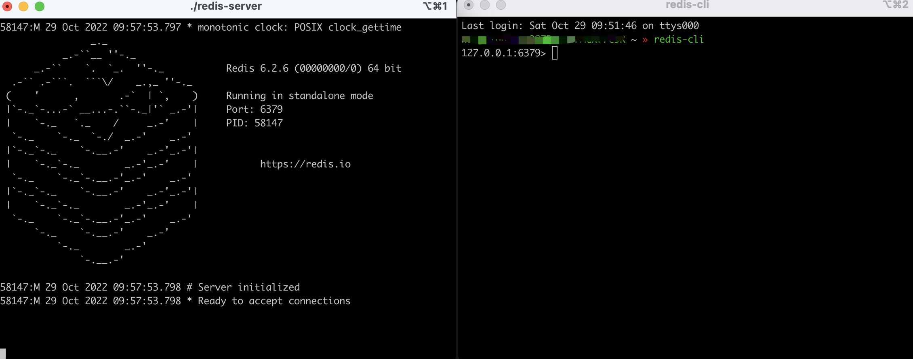
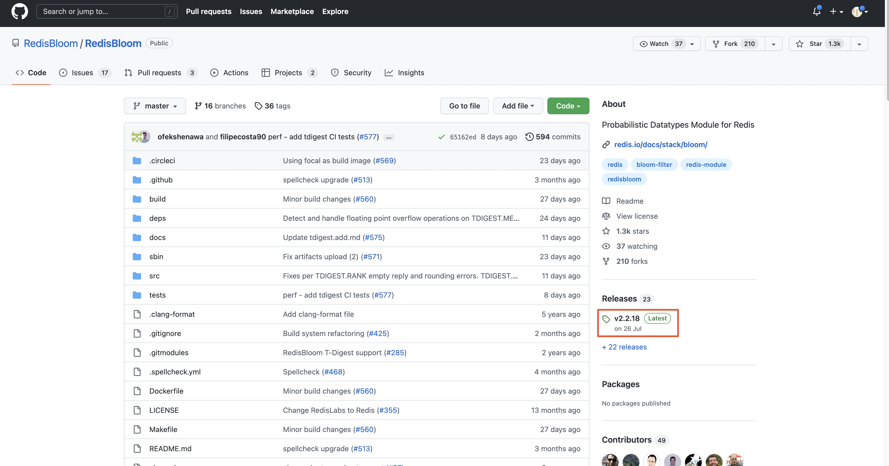
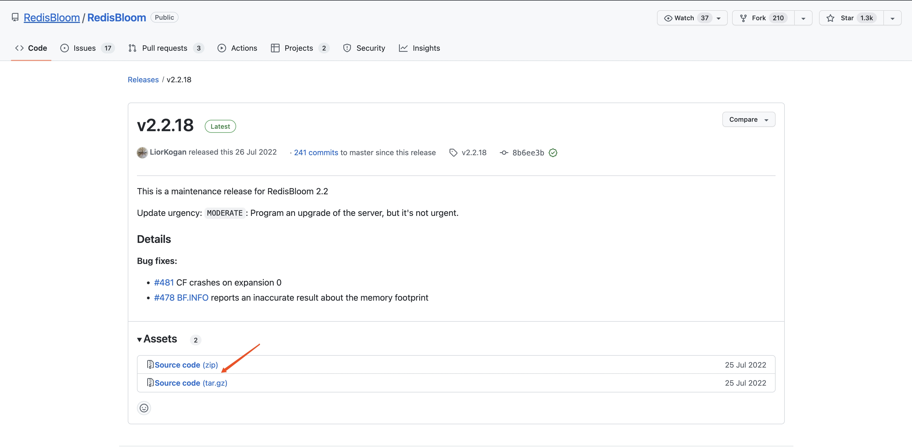
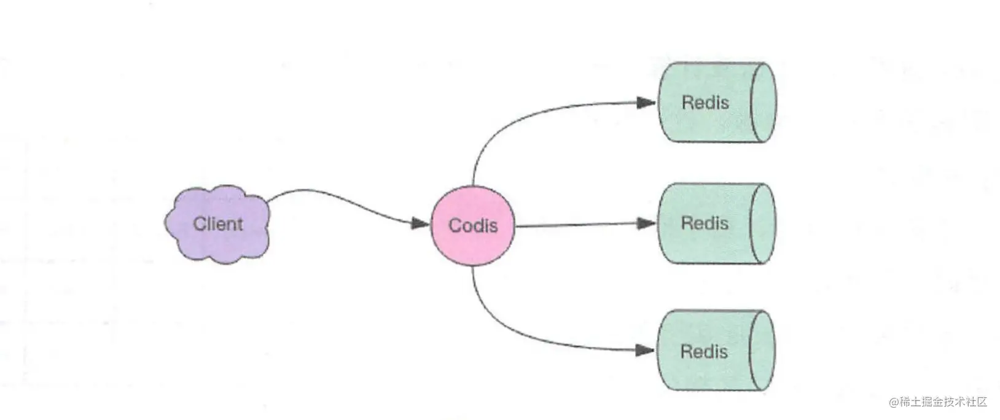
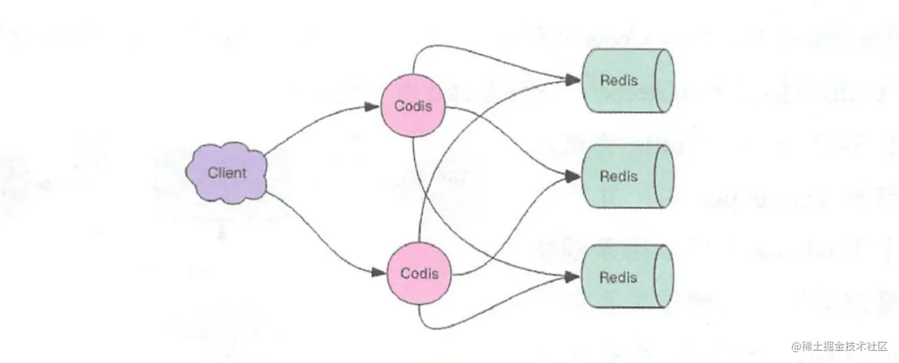

# 写在前面

Redis官网：https://redis.io/

Redis源码：https://github.com/redis/redis

Redis在线测试：http://try.redis.io/

Redis命令参考：http://doc.redisfans.com/

Reids教程：https://www.runoob.com/redis/redis-tutorial.html

# 第1篇 基础和应用篇

## Redis的安装

- 使用Docker安装

- 通过GitHub源码编译

- 直接安装apt-get install(Ubuntu)、yum install(RedHat)或者brew install（Mac）。

### 直接安装方式（Mac）

```
brew install redis
./redis-server
redis-cli
```



### Redis版本查看

redis-server --version或redis-server -v

```shell
admin ~ » redis-server --version                    1 ↵
Redis server v=6.2.6 sha=00000000:0 malloc=libc bits=64 build=c6f3693d1aced7d9
admin ~ » redis-server -v
Redis server v=6.2.6 sha=00000000:0 malloc=libc bits=64 build=c6f3693d1aced7d9
```


## 5种基础数据结构

Redis有5种基础数据结构，分别为：string（字符串）、list（列表）、hash（字典）、set（集合）和zset（有序集合）。

### string（字符串）

Redis所有的数据结构都以唯一的字符串作为key，然后通过这个唯一的key值来获取相应的value数据。不同类型的数据结构的差异就在于value的结构不一样。

Redis的字符串是动态字符串，是可以修改的字符串，内部结构的实现类似于Java的ArrayList，采用预分配冗余空间的方式来减少内存的频繁分配。当字符串长度小于1MB时，扩容都是加倍现有的空间。如果字符串长度超过1MB，扩容时只会多扩1MB的空间。需要注意的是字符串最大长度为512MB。

- 设置一个string：set key value [EX seconds|PX milliseconds|EXAT timestamp|PXAT mi

- 判断string是否存在：exists key [key ...]

- 删除一个key：del key [key ...]

- 获取key：get key

#### 键值对

相当于字典的key和value。

```shell
127.0.0.1:6379> set name jolan
OK
127.0.0.1:6379> get name
"jolan"
127.0.0.1:6379> exists name
(integer) 1
127.0.0.1:6379> del name
(integer) 1
127.0.0.1:6379> get name
(nil)
```

#### 批量键值对

- 批量获取string：mget key [key ...]

- 批量设置string：mset key value [key value ...]

```shell
127.0.0.1:6379> set name1 jolan
OK
127.0.0.1:6379> set name2 joy
OK
127.0.0.1:6379> mget name1 name2 name3
1) "jolan"
2) "joy"
3) (nil)
127.0.0.1:6379> mset name1 boy name2 girl name3 unknown
OK
127.0.0.1:6379> mget name1 name2 name3
1) "boy"
2) "girl"
3) "unknown"
```

#### 过期和set命令扩展

- 为key设置超时时间：expire key seconds

- 如果不存在则设置value：setnx key value

- 设置的时同时设置超时时间：setex key seconds value

可以对key设置过期时间，到时间会被自动删除。

```shell
127.0.0.1:6379> set name jolan
OK
127.0.0.1:6379> get name
"jolan"
127.0.0.1:6379> expire name 5  #5s后过期
(integer) 1
127.0.0.1:6379> get name  #5s后执行
(nil)
127.0.0.1:6379> setex name 5 jolan  #5s后过期，等价于set+expire
OK
127.0.0.1:6379> get name  #5s后执行
(nil)
127.0.0.1:6379> setnx name jolan  #如果name不存在就执行set创建
(integer) 1
127.0.0.1:6379> setnx name jolan  #因为name已存在所以set创建不成功
(integer) 0
127.0.0.1:6379>
```

#### 计数

如果value值是一个整数，还可以对它进行自增操作。自增是有范围的，他的范围在signed long的最大值和最小值之间，超出这个范围，Redis会报错。

- 数值加1：incr key

- 数值加指定的值：incrby key increment


```shell
127.0.0.1:6379> set age 30
OK
127.0.0.1:6379> incr age
(integer) 31
127.0.0.1:6379> incrby age 5
(integer) 36
127.0.0.1:6379> incrby age -5
(integer) 31
127.0.0.1:6379> set errorcode 9223372036854775807  #Long.Max
OK
127.0.0.1:6379> incr errorcode
(error) ERR increment or decrement would overflow
```

### list(列表)

Redis的列表相当于Java语言里面的LinkedList，注意他是链表而不是数组。所以list的插入和删除很快，但是索引定位很慢，时间复杂度分贝是O(1)和O(n)。

Redis的列表结构常用来做异步队列使用。将需要延后处理的任务结构体序列化成字符串，塞进Redis列表，另外一个线程从这个列表中轮询数据进行处理。

#### 队列

利用Redis的list数据结构可以实现队列的效果。从一个方向添加元素，再从另一个方向上获取元素，就可以实现队列。比如下面这个右进左出的list。

- 左侧添加元素：lpush key element [element ...]

- 左侧弹出元素：lpop key [count]

```shell
127.0.0.1:6379> rpush books python java golang
(integer) 3
127.0.0.1:6379> llen books
(integer) 3
127.0.0.1:6379> lpop books
"python"
127.0.0.1:6379> lpop books
"java"
127.0.0.1:6379> lpop books
"golang"
127.0.0.1:6379> lpop books
(nil)
```

#### 栈

和队列的原理类似，使用Redis的list数据结构在同一个方向上添加和获取元素，就可以实现栈这样的数据结构了。

```shell
127.0.0.1:6379> rpush books python java golang
(integer) 3
127.0.0.1:6379> rpop books
"golang"
127.0.0.1:6379> rpop books
"java"
127.0.0.1:6379> rpop books
"python"
127.0.0.1:6379> rpop books
(nil)
```

#### list的其他操作

- lindex：相当于Java链表的get(int index)方法，他需要对链表进行遍历，性能随着参数index增大而变差。lindex key index

- ltrim：ltrim的两个参数start_index和end_index定义了一个区间，在这个区间内的值保留，区间之外的则统统砍掉。可以通过ltrim来实现一个定长的链表。ltrim key start stop

- lrange：获取start_index和end_index区间的所有值。这三个函数的index都可以为-1，-1表示最后一个元素的位置。lrange key start stop

```shell
127.0.0.1:6379> rpush books python java golang
(integer) 3
127.0.0.1:6379> lindex books 1  #效率为O(n)，慎用
"java"
127.0.0.1:6379> lrange books 0 -1  #获取所有元素，慎用
1) "python"
2) "java"
3) "golang"
127.0.0.1:6379> ltrim books 1 -1
OK
127.0.0.1:6379> lrange books 0 -1
1) "java"
2) "golang"
127.0.0.1:6379> ltrim books 1 0  #这实际清空了整个列表， 因为区间范围长度为负
OK
127.0.0.1:6379> llen books
(integer) 0
```

### hash(字典)

Redis的字典相当于Java语言里面的HashMap，它是无序的，实现结构上是“数组+链表”的二位结构。

Redis的字典值只能是字符串。Redis的rehash是采用的是渐进式rehash策略。渐进式rehash会在rehash的同时，保留新旧两个hash结构，然后在后续的定时任务以及hash操作指令中，循序渐进低将旧hash的内容一点点地迁移到新的hash结构中。当搬迁完成了，就会使用心得hash结构取而代之。

hash结构的存储消耗要高于单个的字符串。

- 设置hash：hset key field value [field value ...]

- 获取hash：hget key field

- 获取hash中的所有：hgetall key

- 批量设置hash：hmset key field value [field value ...]

- 批量获取hash：hmget key field [field ...]

- 删除hash中键：hdel key field [field ...]


```shell
127.0.0.1:6379> hset books java "think in java"  #命令行的字符串如果包含空格，要用引号扩起来
(integer) 1
127.0.0.1:6379> hset books golang "concurrency in go"
(integer) 1
127.0.0.1:6379> hset books python "python cookbook"
(integer) 1
127.0.0.1:6379> hgetall books  #entries()，key和value间隔出现
1) "java"
2) "think in java"
3) "golang"
4) "concurrency in go"
5) "python"
6) "python cookbook"
127.0.0.1:6379> hlen books
(integer) 3
127.0.0.1:6379> hget books java
"think in java"
127.0.0.1:6379> hset books golang "learning go prpgramming"
(integer) 0
127.0.0.1:6379> hget books golang
"learning go prpgramming"
127.0.0.1:6379> hmset books java "effective java" python "learning python" golang "modern gplang programming"
OK
127.0.0.1:6379> hdel books java
(integer) 1
127.0.0.1:6379> hdel books python
(integer) 1
127.0.0.1:6379> hdel books golang
(integer) 1
127.0.0.1:6379> hgetall books
(empty array)
```

同字符串一样，hash结构中的单个子key也可以进行计数，它对应的指令是hincrby。比如给用户的年龄加1。

```shell
127.0.0.1:6379> hset user-jolan age 29
(integer) 1
127.0.0.1:6379> hincrby user-jolan age 1
(integer) 30
```

#### set（集合）

Redis的集合相当于Java语言中的HashSet，它内部的键值对是无序的、唯一的。

- 向集合中增加元素：sadd key member [member ...]

- 获取set中所有元素：smembers key

- 判断是否集合中的元素：sismember key member

- 元素的个数：scard key

- 弹出一个元素：spop key [count]

- 删除指定value的元素：srem key member [member ...]


```shell
127.0.0.1:6379> sadd books python
(integer) 1
127.0.0.1:6379> sadd books python
(integer) 0
127.0.0.1:6379> sadd books java golang
(integer) 2
127.0.0.1:6379> smembers books  #和插入顺序不一样
1) "java"
2) "golang"
3) "python"
127.0.0.1:6379> sismember books java  #查询某个value是否存在
(integer) 1
127.0.0.1:6379> sismember books rust
(integer) 0
127.0.0.1:6379> scard books  #获取长度
(integer) 3
127.0.0.1:6379> spop books  #弹出一个元素
"python"
127.0.0.1:6379> scard books
(integer) 2
127.0.0.1:6379> srem books golang  #删除value位golang的元素
(integer) 1
127.0.0.1:6379> smembers books
1) "java"
127.0.0.1:6379> del books  #删除set
(integer) 1
127.0.0.1:6379> scard books
(integer) 0
127.0.0.1:6379> smembers books
(empty array)
```

#### zset（有序列表）

zset一方面是一个set，保证了内部value的唯一性，另一方面它可以给每个value赋予一个score，代表这个value的排序权重。

- 列表中增加元素：zadd key [NX|XX] [GT|LT] [CH] [INCR] score member [score member

- 按score排序列出：zrange key min max [BYSCORE|BYLEX] [REV] [LIMIT offset count] [W

- 按score的逆序列出：zrevrange key start stop [WITHSCORES] 

- 获取列表长度：zcard key

- 获取指定value的score：zscore key member

- 获取指定元素的排名：zrank key member

- 根据分值区间遍历zset：zrangebyscore key min max [WITHSCORES] [LIMIT offset count]

- 删除指定value的元素：zrem key member [member ...]

```shell
zadd books 9.0 "think in java"
(integer) 1
127.0.0.1:6379> zadd books 8.9 "java concurrency"
(integer) 1
127.0.0.1:6379> zadd books 8.6 "java cookbook"
(integer) 1
127.0.0.1:6379> zrange books 0 -1  #按score排序列出，参数区间为排名范围
1) "java cookbook"
2) "java concurrency"
3) "think in java"
127.0.0.1:6379> zrevrange books 0 -1  #按score逆序列出
1) "think in java"
2) "java concurrency"
3) "java cookbook"
127.0.0.1:6379> zcard books
(integer) 3
127.0.0.1:6379> zscore books "java concurrency"  #获取指定value的score，内部score使用double类型进行存储，所以存在小数点精度问题
"8.9000000000000004"
127.0.0.1:6379> zrank books "java concurrency"  #指定value的排名
(integer) 1
127.0.0.1:6379> zrangebyscore books 0 8.91  #根据分值区间遍历zset
1) "java cookbook"
2) "java concurrency"
127.0.0.1:6379> zrangebyscore books -inf 8.91 withscores  #根据分支区间遍历set，同时返回分数。其中-inf表示负无穷
1) "java cookbook"
2) "8.5999999999999996"
3) "java concurrency"
4) "8.9000000000000004"
127.0.0.1:6379> zrem books "java concurrency"  #删除指定value
(integer) 1
127.0.0.1:6379> zrange books 0 -1
1) "java cookbook"
2) "think in java"
```

zset使用跳跃链表的数据结构。

### 容器型数据结构的通用规则

list、set、hash、zset这四种数据结构是容器型数据结构，它们共享下面两条通用规则。

- create if not exists:如果容器不存在则先创建容器，再进行操作。

- drop if no elements：如果容器里已没有元素，那么立即删除容器，释放内存。如list在lpop操作到最后一个元素，列表就消失了。

### 过期时间

Redis所有的数据结构都可以设置过期时间，时间一到，Redis会自动删除相应的对象。需要注意的是，过期是以对象为单位的，而不是以其中某个子元素为单位的。

还有一个需要特别注意的地方，如果一个字符串已经设置了过期时间，然后调用set方法修改了它，它的过期时间会消失。

```shell
127.0.0.1:6379> set name yoyo
OK
127.0.0.1:6379> expire name 600
(integer) 1
127.0.0.1:6379> ttl name
(integer) 598
127.0.0.1:6379> set name yoyo
OK
127.0.0.1:6379> ttl name
(integer) -1
```

## 分布式锁

我们常常使用Redis的setnx命令来判断是否可以获取到分布式锁，为了防止线程出现异常无法释放锁，还会使用expire命令给锁加一个时间。但是setnx和expire是两个命令，无法保证原子性。如果在两个命令中间线程出错了，仍然会造成无法释放锁的情况。

为了解决这个问题，在Redis2.8版本中，作者加入了set指令的扩展参数，使setnx和expire指令可以一起执行，彻底解决了这个问题。

```shell
127.0.0.1:6379> set lock_name true ex 10 nx
OK
127.0.0.1:6379> ttl lock_name
(integer) 8
127.0.0.1:6379> ttl lock_name
(integer) 6
127.0.0.1:6379> del lock_name
(integer) 1
127.0.0.1:6379> get lock_name
(nil)
```

## 延时队列

### 异步消息队列

并非传统的队列不好用，这里只是探讨使用Redis实现消息队列的一种方案或可能性。聪明的你可能已经想到了，使用Redis的list数据结构就能实现一个队列，这种方案我们前面已经探讨了。使用Redis实现消息队列，它的有优点是速度快、构建方便，缺点是没有传统队列的那些高级特性，没有ack保证，做技术选型时一定要慎重。

### 队列空了怎么办

和传统的消息队列不同，使用Redis实现的消息队列，消费者需要pop操作来获取消息，可是如果一旦Redis的队列是空的，消费者就会陷入pop的死循环。空的轮询不但拉高了消费者所在服务器的CPU，Redis的QPS也会被拉高。这样的消费者如果有几十个，Redis慢查询可能会显著增多。通常，当消费者获取不到新的数据时，让消费者线程适当睡眠来解决这个问题。如Thread.sleep(1)。

### 阻塞读

通过线程睡眠可以解决队列为空的问题了，但是这会引入一个新的问题，那就是睡眠会导致消费者的延迟增大。

针对这个问题，我们可以使用阻塞读来解决。阻塞读在队列没有数据的时候，会立即进入休眠状态，一旦数据到来，则立刻醒过来。消息的延迟几乎为零。阻塞读对应Redis中的命令是blpop/brpop，其中b代表blocking，也就是阻塞的意思。

- brpop key [key ...] timeout

```shell
#client1
127.0.0.1:6379> brpop blocking_key 60 
1) "blocking_key"
2) "message"
(35.60s)

#client2
lpush blocking_key message
(integer) 1
```

### 空闲连接自动断开

如果线程一直阻塞在那里，Redis的连接就成了闲置连接，闲置时间过久，Redis一般会主动断开连接，减少闲置资源的占用。这个时候blpop和brpop会抛出异常。所以针对上面的解决方案，消费者断需要注意捕获这个异常并重试。

### 延时队列的实现

延时队列可以使用Redis的zset来实现。我们将消息序列号成一个字符串作为zset的value，这个消息的到期处理时间作为score。然后多个线程轮询zset获取到期的任务进行处理。zrem方法是多进程争抢任务的关键，它的返回值决定了当前实例有没有抢到任务。

```java

//塞入延时队列，5s后消费
jedis.zadd(queueKey, System.currentTimeMills() + 5000, s);


while(true){
    //获取一条任务
    Set<String> values = jedis.zrangeByScore(queueKey, 0, System.currentTimeMills(), 0, 1);

    String s = values.iterator().next();
    //判断是否抢到任务
    if(jedis.zrem(queueKey, s) > 0){

    }

}


```

## 位图

位图并非特殊的数据结构，它的内容其实就是普通的字符串。可以使用普通的get/set直接获取和设置整个位图的内容，也可以使用位图操作getbit/setbit等将byte数组看成“位数组”来处理。

### 基本用法

Redis的位数组是自动扩展的，如果设置了某个偏移位置超出了现有的内容范围，就会自动将位数组进行零扩充。接下来我们使用位操作将字符串设置为hello。首先需要得到hello的ASCII码。可在线查询或使用python命令行查询。hello去重后共四个字母，从前到后他们ASCII码的二进制分别是1101000，1100101，1101100，1101111。

接下来设置第一个字符，也就是位数组的前8位。我们只需要设置值为1的位，其中h只有1、2、4位需要设置，e字符只有9、10、13、15位需要设置。

- 获取指定位：getbit key offset

- 设置指定位的值：setbit key offset value

```shell
setbit s 1 1
0
setbit s 2 1
0
setbit s 4 1
0
setbit s 9 1
0
setbit s 10 1
0
setbit s 13 1
0
setbit s 15 1
0
get s
"he"
setbit s 16 x
(error) ERR bit is not an integer or out of range
```

上面这个例子可以理解为“零存整取”，同样也可以“零村零取”或者“整存零取”。

### 另存零取

使用单个位操作设置位值，使用单个位操作获取具体位值。

```shell
setbit w 1 1
0
setbit w 2 1
0
setbit w 4 1
0
getbit w 1
1
getbit w 2
1
getbit w 4
1
getbit w 5
0
```

### 整存零取

```shell
127.0.0.1:6379> set w h
OK
127.0.0.1:6379> getbit w 1
(integer) 1
127.0.0.1:6379> getbit w 2
(integer) 1
127.0.0.1:6379> getbit w 4
(integer) 1
127.0.0.1:6379> getbit w 5
(integer) 0
127.0.0.1:6379> setbit x 0 1
(integer) 0
127.0.0.1:6379> setbit x 1 1
(integer) 0
127.0.0.1:6379> get x  # 如果对应位的字节是不可打印字符，redis-cli会显示该字符的十六进制形式
"\xc0"
```

### 位图的统计和查找

Redis提供了位图统计指令bitcount和位图查找指令bitpos。bitcount用来统计指定位置范围内1的个数，bitpos用来查找指定范围内出现的第一个0或1。比如我们可以用bitcount统计用户一共签到了多少天，通过bitpos指令查找用户从哪天开始第一次签到。如果指定了范围参数[start,end]，就可以统计再某个时间范围内用户签到了多少天，用户自某天以后的哪天开始签到。需要注意的是，start和end参数是字节索引，也就是说指定的范围必须是8的倍数。

- 统计指定范围内1的个数：bitcount key [start end]

- 统计指定范围内的第一个0或1的位置：bitpos key bit [start] [end]

```shell
127.0.0.1:6379> set w hello
OK
127.0.0.1:6379> bitcount w
(integer) 21
127.0.0.1:6379> bitcount w 0 0  # 第一个字符中1的位数（第一个0表示起始位是0， 第二个0表示截止位是0）
(integer) 3
127.0.0.1:6379> bitcount w 0 1  # 前两个字符中1的位数
(integer) 7
127.0.0.1:6379> bitpos w 0  # 第一个0位
(integer) 0
127.0.0.1:6379> bitpos w 1 # 第一个1位
(integer) 1
127.0.0.1:6379> bitpos w 1 1 1  # 从第二个字符算起，第一个1位（下标从0开始）
(integer) 9
127.0.0.1:6379> bitpos w 1 2 2  # 从第三个字符算起，第一个1位
(integer) 17
```

### 魔术指令bitfield

Redis在在3.2版本以后新增了一个功能强大的指令bitfield，有了这条指令，可以一次进行多个位操作。

bitfield有三个子指令，分别是get、set、incrby。它们都可以对指定位片段进行读写，但是最多只能处理64个连续的位。

- bitfield key [GET type offset] [SET type offset value] [INCRBY type offset increment] [OVERFLOW WRAP|SAT|FAIL]

```shell
127.0.0.1:6379> set w hello
OK
127.0.0.1:6379> bitfield w get u4 0  # 从第一位开始取4个位，结果是无符号数。其中u代表无符号数
1) (integer) 6
127.0.0.1:6379> bitfield w get u3 2  # 从第三位开始取3个位，结果是无符号数。其中u代表无符号数
1) (integer) 5
127.0.0.1:6379> bitfield w get i4 0  # 从第一位开始取4个位，结果是有符号数。其中i代表有符号数
1) (integer) 6
127.0.0.1:6379> bitfield w get i3 2  # 从第三位开始取3个位，结果是有符号数。其中i代表有符号数
1) (integer) -3
127.0.0.1:6379> bitfield w get u64 2
(error) ERR Invalid bitfield type. Use something like i16 u8. Note that u64 is not supported but i64 is.
127.0.0.1:6379> bitfield w get i64 2
1) (integer) -6803336285151821824
```

所谓有符号数是指获取位数组中第一个位是符号位，剩下的才是值。如果第一位是1，那就是负数。无符号数表示非负数，没有符号位，获取的位数组全部都是值。有符号数最多可以获取64位，无符号数只能获取63位。

```shell
127.0.0.1:6379> bitfield w get u4 0 get u3 2 get i4 0 get i3 2  # 一次执行多个指令
1) (integer) 6
2) (integer) 5
3) (integer) 6
4) (integer) -3

127.0.0.1:6379> bitfield w set u8 8 97  # 使用set指令将第二个字符e改成a，a的ASCII码是97
1) (integer) 101
127.0.0.1:6379> get w
"hallo"
```

incrby用来对指定范围的位进行自增操作。既然是自增，就可能出现溢出。增加正数会出现上溢出，负数会出现下溢出。Redis默认的处理是折返，即如果出现溢出，就将溢出的符号位丢弃。比如8位无符号数255，加一后就会溢出全部变为0。再比如8位有符号数127，加1就会溢出变成-128。

- bitfield的incrby子指令，对位进行自增操作：bitfield w incrby [GET type offset] [SET type offset value] [INCRBY type offset increment] [OVERFLOW WRAP|SAT|FAIL]

```shell
127.0.0.1:6379> set w hello
OK
127.0.0.1:6379> bitfield w incrby u4 2 1  # 从第三个位开始，对接下来的4位无符号数+1
1) (integer) 11
127.0.0.1:6379> bitfield w incrby u4 2 1
1) (integer) 12
127.0.0.1:6379> bitfield w incrby u4 2 1
1) (integer) 13
127.0.0.1:6379> bitfield w incrby u4 2 1
1) (integer) 14
127.0.0.1:6379> bitfield w incrby u4 2 1
1) (integer) 15
127.0.0.1:6379> bitfield w incrby u4 2 1  # 折返溢出
1) (integer) 0
```

bitfield指令提供了溢出策略子指令overflow，用户可以选择溢出行为，默认是折返（wrap），还可以选择失败（fail）——报错不执行，以及饱和截断（sat）——超过了范围就停留在最大或最小值。overflow指令只影响接下来的第一条指令，这条指令执行完后溢出策略会变成默认值折返（wrap）。

```shell
127.0.0.1:6379> set w hello
OK
127.0.0.1:6379> bitfield w overflow sat incrby u4 2 1
1) (integer) 11
127.0.0.1:6379> bitfield w overflow sat incrby u4 2 1
1) (integer) 12
127.0.0.1:6379> bitfield w overflow sat incrby u4 2 1
1) (integer) 13
127.0.0.1:6379> bitfield w overflow sat incrby u4 2 1
1) (integer) 14
127.0.0.1:6379> bitfield w overflow sat incrby u4 2 1
1) (integer) 15
127.0.0.1:6379> bitfield w overflow sat incrby u4 2 1  # 保持最大值
1) (integer) 15

127.0.0.1:6379> set w hello
OK
127.0.0.1:6379> bitfield w overflow fail incrby u4 2 1
1) (integer) 11
127.0.0.1:6379> bitfield w overflow fail incrby u4 2 1
1) (integer) 12
127.0.0.1:6379> bitfield w overflow fail incrby u4 2 1
1) (integer) 13
127.0.0.1:6379> bitfield w overflow fail incrby u4 2 1
1) (integer) 14
127.0.0.1:6379> bitfield w overflow fail incrby u4 2 1
1) (integer) 15
127.0.0.1:6379> bitfield w overflow fail incrby u4 2 1  # 不执行
1) (nil)
```

## HyperLogLog

HyperLogLog是Redis的高级数据结构，它提供不精确的去重计数方案，虽然不精确，但是也不是非常离谱，标准误差是0.81%。

HyperLogLog占用的空间大小是12KB

- 加入一个元素：pfadd key element [element ...]

- 计算元素个数：pfcount key [key ...]

- 合并两个HyperLogLog：pfmerge destkey sourcekey [sourcekey ...]

```shell
127.0.0.1:6379> pfadd hll user1
(integer) 1
127.0.0.1:6379> pfcount hll
(integer) 1
127.0.0.1:6379> pfadd hll user2
(integer) 1
127.0.0.1:6379> pfcount hll
(integer) 2
127.0.0.1:6379> pfadd hygg user3
(integer) 1
127.0.0.1:6379> pfadd hygg user4
(integer) 1
127.0.0.1:6379> pfadd hygg user5
(integer) 1
127.0.0.1:6379> pfmerge hll hygg
OK
127.0.0.1:6379> pfcount hygg
(integer) 3
127.0.0.1:6379> pfcount hll
(integer) 5
```

## 布隆过滤器

布隆过滤器（Bloom Filter）也是Redis的高级数据结构。它主要是解决去重问题，虽然不是特别精确，但是在空间上能节省90%以上。

可以把布隆过滤器理解为一个不怎么精确的set结构，当使用它的contains方法判断某个对象是否存在时，它可能会误判。但是布隆过滤器也并非特别不精准，相对来说它有小小的误判概率。当布隆过滤器说某个值存在时，这个值可能不存在；当它说某个值不存在时，这个值肯定不存在。

Redis4.0后官方才以插件的功能提供了布隆过滤器。

### 下载（Mac）

找到下载地址：https://github.com/RedisBloom/RedisBloom（也可以到Redis官网https://redis.io/下载），然后找到发行版本，如下图所示。



根据需要的格式进行下载



将文件放到需要的目录进行解压，然后进入目录，执行make命令。执行完成后，在目录下会多一个redisbloom.so文件。

最后使用挂在方式重启redis(或者修改配置文件：loadmodule /xxx/redisbloom.so)。

```shell
redis-server  --loadmodule xxx路径/redisbloom.so 
```

### 布隆过滤器的基本用法

Redis的布隆过滤器有两个基本指令，bf.add和bf.exists。bf.add添加元素，bf.exists查询元素是否存在。他们的用法和set集合的sadd和sismember差不多。bf.add只能一次添加一个元素，bf.madd可以一次添加多个元素。同样的，如果需要一次查询多个元素是否存在，就需要使用bf.mexists指令。

- 向布隆过滤器中添加元素：bf.add key ...options...

- 判断布隆过滤器中是否存在元素：bf.exists key ...options..

```shell
127.0.0.1:6379> bf.add rb user1
(integer) 1
127.0.0.1:6379> bf.add rb user2
(integer) 1
127.0.0.1:6379> bf.add rb user3
(integer) 1
127.0.0.1:6379> bf.exists rb user1
(integer) 1
127.0.0.1:6379> bf.exists rb user2
(integer) 1
127.0.0.1:6379> bf.exists rb user3
(integer) 1
127.0.0.1:6379> bf.exists rb user4
(integer) 0
127.0.0.1:6379> bf.madd rb user4 user5 user6
1) (integer) 1
2) (integer) 1
3) (integer) 1
127.0.0.1:6379> bf.mexists rb user4 user5 user6 user7
1) (integer) 1
2) (integer) 1
3) (integer) 1
4) (integer) 0
```

Redis其实还提供了自定义参数的布隆过滤器，需要我们在add之前使用bf.reserve指令创建。如果对应key已经存在，bf
.reserve会报错。bf.reserve有三个参数，分别是key、error_rate（错误率）和initial_size。

- error_rate越低，需要的空间越大。

- initial_size表示预计放入的元素数量，当实际数量超出这个数值时，误判率会上升，所以需要提前设置一个较大的数值避免超出导致误判率升高.

- 如果不使用bf.reserve，默认的error_rate是0.01，默认的initial_size是100。

- 指令格式：bf.reserve key ...options..

#### 布隆过滤器的原理

每个布隆过滤器对应到Redis的数据结构里面就是一个大型的位数组和几个不一样的无偏hash函数（能够把元素的hash值计算的比较均匀的hash函数）。向布隆过滤器中添加key时，会使用多个hash杉树对key进行hash，酸的一个整数索引值，然后对位数组长度进行取模运算，每个hash函数都会计算一个不同的位置。再把位数组的这几个位置都置为1，就完成了add操作。判断元素是否在布隆过滤器中的原理和add操作类似。

### 空间占用估计

我们使用n表示预计元素的数量，f表示错误率，k表示hash函数的最佳数量，表示实际元素和预计元素的倍数。

k = 0.7 * (1 / n)  # 约等于
f = 0.6185^(1 / n) # ^表示次方计算
f = (1 - 0.5^t)^k  # 极限接近。当t越大，错误率越大

## 令牌桶限流Redis-cell

Redis4.0提供了限流Redis模块，它叫Redis-Cell。该模块只有一条指令cl.throttle。https://blog.csdn.net/yzf279533105/article/details/111310685

## GeoHash

Redis再3.2版本以后增加了地理位置geo模块。https://blog.csdn.net/usher_ou/article/details/122716877

## scan

Redis提供了简单粗暴的指令keys用来列出所有满足特定正则字符串规则的key。

```shell
127.0.0.1:6379> set demo1 a
OK
127.0.0.1:6379> set demo2 b
OK
127.0.0.1:6379> set demo3 c
OK
127.0.0.1:6379> set demo4 a
OK
127.0.0.1:6379> set demo5 b
OK
127.0.0.1:6379> set demo6 c
OK
127.0.0.1:6379> keys demo*
1) "demo1"
2) "demo4"
3) "demo3"
4) "demo2"
5) "demo5"
6) "demo6"
127.0.0.1:6379> keys d*mo
(empty array)
127.0.0.1:6379> keys d*mo1
1) "demo1"
```

但是keys命令有两个很明显的缺点：

- 没有offset、limit参数，当key比较多时，输出结果太大，无法查看

- keys是遍历算法，时间复杂度是o(n)。因为redis是单线程，会阻塞其他请求，导致Redis卡顿。

为了解决这个问题，在2.8版本中加入了scan指令。相较于keys，它有如下几个特点：

- 虽然时间复杂度也是o(n)，但是通过游标分步进行，不会阻塞线程。

- 提供limit参数。

- 返回的结果可能会有重复，客户端需要去重。

- 遍历的过程中如果有数据修改，改动后的数据能不能遍历到是不确定的。

- 单次返回的结果是空并不意味着遍历结束，而要看返回的游标值是否为零。

### scan的基本用法

scan提供了三个参数，第一个是cursor参数，第二个是key的正则模式，第三个是遍历的limit hint。第一次遍历时，cursor值为0，然后将返回结果中第一个整数值作为下一次遍历的cursor，一直遍历到返回的cursor值为0时结束。

- scan cursor [MATCH pattern] [COUNT count] [TYPE type]

```shell
scan 0 match key99* count 1000
```

# 第2篇 原理篇

## 线程IO模型

### 非阻塞IO

略

### 事件轮轮询（多路复用）

略

### 指令队列

Redis会将每个客户端套接字都关联一个指令队列。客户端的指令通过队列来排队进行顺序处理，先到先服务。

### 响应队列

Redis服务器通过响应队列来将指令的返回结果回复给客户端。

### 定时任务

Redis的定时任务会记录在一个被称为“最小堆”的数据结构中。在这个堆中，最快要执行的任务排在堆的最上方。每次执行完一个任务，Redis将定时任务的执行时间记录下来，这个时间作为接下来select系统调用的timeout参数。

## 通信协议

RESP是Redis序列化协议（Redis Serialization Protocol）的简写。

## 持久化

Redis的持久化机制有两种，第一种是快照，第二种是AOF日志。快照是一次全量备份，AOF日志是连续增量备份。快照是内存数据的二进制序列化形式，在存储上非常紧凑，而AOF日志记录的是内存数据修改的指令记录文本。AOF日志在长期的运行过程中会变得无比庞大，重启时需要加载AOF日志进行指令重放，这个过程耗时很长。

### 快照原理

Redis使用操作系统的多进程COW（Copy On Write）机制来实现快照持久化。

### fork（多进程）

Redis在持久化时会调用glibc的函数fork产生一个子进程，快照持久化完全交给子进程来处理，父进程继续处理客户端请求。子进程刚刚产生时，它和父进程共享内存里面的代码段和数据段。

子进程做数据持久化，不会修改现有内存数据结构，它只是对数据结构进行遍历读取，然后序列化到磁盘中。但是父进程不一样，它必须持续服务客户端请求，然后对内存数据结构进行不间断的修改。

这个时候就会使用操作系统的COW机制进行数据段页面的分离。当父进程对其中一个页面的数据进行修改时，会将被共享的页面复制一份分离出来，然后对这个复制的页面进行修改。这时子进程相应的页面是没有变化的，还是进程产生时那一瞬间的数据。

子进程因为数据没有变化，它能看到的内存里的数据在进程产生的一瞬间就确定了，再也不会改变，这也是为什么Redis的持久化叫“快照”的原因。

### AOF原理

AOF日志存储的是Redis服务器的顺序指令序列，AOF日志只记录对内存进行修改的指令记录。Redis是先执行指令，再将日志存盘。

### AOF重写

Redis提供了bgrewriteaof指令用于对AOF日志进行瘦身。

### fsync

如果及其突然宕机，AOF日志内容可能还没有来得及完全刷新到磁盘中，这个时候就会出现日志丢失。Linux的glibc提供了fsync(int fd)的函数可以将指定文件的内容强制从内核缓存刷新到磁盘。只要Redis进行实时调用fsync函数就可以保证AOF日志不丢失。但是fsync是一个磁盘IO操作，速度很慢。所以在生产环境的服务器中，Redis通常是每隔1s左右执行一次fsync操作，这个1s的周期是可以配置的。

### 运维

通常Redis的主节点不会进行持久化操作，持久化操作主要在从节点进行。从节点是备份节点，没有来自客户端请求的压力，它的操作系统资源往往比较充沛。

但是如果出现网络分区，从节点长期连不上主节点，就会出现数据不一致的问题。所以在生产环境下要做好实时监控工作，保证网络通常或者能快速修复。

### Redis 4.0混合持久化

重启Redis时，使用rdb恢复内存会丢失大量数据，使用AOF恢复内存会话费很长时间。Redis 4.0为了解决这个问题，带来了一个新的持久化选项——混合持久化。

将rdb文件的内容和增量的AOF日志文件存在一起。这里的AOF日志不再是权量日志，而是自持久化开始到持久化结束这段时间发生的增量AOF日志，通常这部分AOF日志很小。

于是在Redis重启时，可以先加载rdb的内容，然后再重放增量AOF日志。

## 管道

Redis管道（pipeline）本身并不是Redis服务器直接提供的技术，这个技术本质上是由客户端提供的。

### Redis的消息交互

下面两个图是两个普通指令和使用了管道之后的区别。它可以合并操作来减少响应时间。


### Jedis的管道使用示例

这是jedis使用管道的代码示例：

```java
public class PipelineExample {
    public static void main(String[] args) {
        Jedis jedis = new Jedis("127.0.0.1", 6379);
        // 记录执行开始时间
        long beginTime = System.currentTimeMillis();
        // 获取 Pipeline 对象
        Pipeline pipe = jedis.pipelined();
        // 设置多个 Redis 命令
        for (int i = 0; i < 100; i++) {
            pipe.set("key" + i, "val" + i);
            pipe.del("key"+i);
        }
        // 执行命令
        pipe.sync();
        // 记录执行结束时间
        long endTime = System.currentTimeMillis();
        System.out.println("执行耗时：" + (endTime - beginTime) + "毫秒");
    }
}
```

如果需要接受所有命令的返回值，可以使用syncAndReturnAll()方法：

```java
public class PipelineExample {
    public static void main(String[] args) {
        Jedis jedis = new Jedis("127.0.0.1", 6379);
        // 获取 Pipeline 对象
        Pipeline pipe = jedis.pipelined();
        // 设置多个 Redis 命令
        for (int i = 0; i < 100; i++) {
            pipe.set("key" + i, "val" + i);
        }
        // 执行命令并返回结果
        List<Object> res = pipe.syncAndReturnAll();
        for (Object obj : res) {
            // 打印结果
            System.out.println(obj);
        }
    }
}
```

## 事物

Redis的事物模型很不严格，这要求我们不能像使用关系型数据库的事物一样来使用Redis事物。

### Redis事物的基本用法

Redis的事物指令分别是multi、exec、discard。multi指示事物的开始，exec指示事物的执行，discard指示事物的丢弃。

```shell
127.0.0.1:6379> multi
OK
127.0.0.1:6379(TX)> incr books
QUEUED
127.0.0.1:6379(TX)> incr books
QUEUED
127.0.0.1:6379(TX)> exec
1) (integer) 1
2) (integer) 2
127.0.0.1:6379>
```

### 原子性

```shell
127.0.0.1:6379> multi
OK
127.0.0.1:6379(TX)> set books iamastring
QUEUED
127.0.0.1:6379(TX)> incr books
QUEUED
127.0.0.1:6379(TX)> set poorman iamdesperate
QUEUED
127.0.0.1:6379(TX)> exec
1) OK
2) (error) ERR value is not an integer or out of range
3) OK
127.0.0.1:6379> get books
"iamastring"
127.0.0.1:6379> get poorman
"iamdesperate"
127.0.0.1:6379>
```

上面的例子是事物执行到中间时遇到失败了，因为我们不能对一个字符串进行数学运算。事物在遇到指令执行失败后，后面的指令还会继续执行。所以说Redis的事物根本不具备“原子性”，而仅仅是满足了事物的“隔离性”中的串行化——当前执行的事物有着不被其他事物打断的权利。

### discard（丢弃）

Redis为事物提供了一个discard指令，用于丢弃事物缓存队列中的所有指令，在exec执行之前。

```shell
127.0.0.1:6379> get books
(nil)
127.0.0.1:6379> multi
OK
127.0.0.1:6379(TX)> incr books
QUEUED
127.0.0.1:6379(TX)> incr books
QUEUED
127.0.0.1:6379(TX)> discard
OK
127.0.0.1:6379> get books
(nil)
```

### 事物执行优化

通常Redis的客户端在执行事务时都会结合pipeline一起使用，这样可以将多次IO操作压缩为单次IO操作。

### watch

Redis提供一种watch机制，watch就是一种乐观锁。watch会在事物开始之前盯住一个或多个关键变量，当事物执行时，也就是服务器收到了exec指令时，Redis会检查关键变量自watch之后是否被修改了。如果关键变量被修改过，exec指令就会返回null回复客户端，意思是执行失败。此时客户端可以选择重试。

```shell
127.0.0.1:6379> watch books
OK
127.0.0.1:6379> incr books
(integer) 1
127.0.0.1:6379> multi
OK
127.0.0.1:6379(TX)> incr books
QUEUED
127.0.0.1:6379(TX)> exec
(nil)
```

Redis禁止在multi和exec之间执行watch指令，而必须在multi之前盯住关键变量，否则会出错。

```shell
127.0.0.1:6379> multi
OK
127.0.0.1:6379(TX)> watch books
(error) ERR WATCH inside MULTI is not allowed
```

## PubSub

### 消息多播

消息多播允许生产者只生产一次消息，由中间件负责将消息复制到多个消息队列，每个消息队列由相应 的消费组进行消费。

### PubSub模块

为了支持消息多播，Redis不能再依赖于那5种基本数据类型了，它单独使用了一个模块来支持消息多播，这个歌模块的名字叫做PubSub，也就是PublisherSubscriber（发布者/订阅者模式）。

```shell
127.0.0.1:6379> subscribe t_channel1 t_channel2
Reading messages... (press Ctrl-C to quit)
1) "subscribe"
2) "t_channel1"
3) (integer) 1
1) "subscribe"
2) "t_channel2"
3) (integer) 2
1) "message"  # 在client2发布消息后打印
2) "t_channel1"  
3) "java coming"
1) "message"  # 在client2发布消息后打印
2) "t_channel2"
3) "java coming"
```

一下是client2的命令

```shell
127.0.0.1:6379> pubsub channels  # 查看所有频道
1) "t_channel2"
2) "t_channel1"
127.0.0.1:6379> publish t_channel1 "java coming"
(integer) 1
127.0.0.1:6379> publish t_channel2 "java coming"
(integer) 1
```

Redis PubSub的生产者和消费者是不同的连接，也就是上面的例子实际上使用了两个Redis连接。这是必须的，因为Redis不允连接在subscribe等待消息时还要进行其他操作。

必须先启动消费者，然后在执行生产者。消费者我们可以启动多个，PubSub会保证它们收到的是相同的消息序列。

python实现的消费者：

```python
# -*- coding: utf-8 -*-
import time
import redis

client = redis.StrictRedis()
p = client.pubsub()
p.subscribe(codehole)
for msg in p.listen():
    print msg
```

python实现的生产者：

```python
# -*- coding: utf-8 -*-
import redis

client = redis.StrictRedis()
client.publish("codehole", "python comes")
client.publish("codehole", "java comes")
client.publish("codehole", "golang comes")
```

### 模式订阅

为了简化订阅的繁琐，Redis提供了模式订阅功能Pattern Subscribe，这样就可以一次订阅多个主题，即使生产者新增加了同模式的主题，消费者也可以立即收到消息。

```shell
127.0.0.1:6379> psubscribe lan.*
Reading messages... (press Ctrl-C to quit)
1) "psubscribe"
2) "lan.*"
3) (integer) 1
```

### PubSub的缺点

- 如果生产者生产了一个消息，但是此时没有消费者，那么消息会被直接丢弃。

- 如果在多个消费者中间突然有一个宕机了，当它再重新连接上来后也无法消费宕机过程中生产者生产的消息

- 如果Redis停机重启，PubSub的消息是不会持久化的

正式因为PubSub的这些缺点，在消息队列的领域它几乎找不到合适的应用场景。在2018年6月，Redis5.0新增了Stream数据结构，这个功能给Redis带来了持久化消息队列。

# 第3篇 集群篇

### CAP理论

- C：Consistent，一致性

- A：Availability，可用性

- P：Partition tolerance，分区容错性

分布式系统的节点往往都是分布在不同的机器上进行网络隔离开的，这意味着必然会有网络断开的风险，这个网络断开的场景的专业词汇叫做网络分区。

在网络分区发生时，两个分布式节点之间无法进行通信，我们对一个节点进行的修改将无法同步到另外的一个节点，所以数据的一致性将无法满足，因为两个分布式节点的数据不再保持一致。除非我们牺牲可用性，也就是暂停分布式节点服务，在网络分区发生时，不再提供修改数据的功能，直到网络状况完全恢复正常再继续对外提供服务。

当网络分区发生时，一致性可可用性两难全。

### 最终一致

Redis的主从数据是异步同步的，所以分布式的Redis系统并不满足一致性要求。当客户端在Redis的主节点修改了数据后，立即返回，即使在主从网络断开的情况下，主节点依旧可以正常对外提供修改服务，所以Redis满足可用性。

Redis保证最终一致性，从节点会努力追赶主节点，最终从节点的状态和主节点的状态保持一致。

### 增量同步

Redis同步的是指令流，主节点会将那些对自己的状态产生修改性影响的指令记录在本地的内存buffer中，然后异步将buffer中的指令同步到从节点，从节点一边执行同步的指令流来达到和主节点一样的状态，一边向主节点反馈自己同步到哪里了。

因为内存的buffer是有限的，所以Redis主节点不能将所有的指令都记录在内存buffer中。如果以为网络状况不好，从节点在短时间内无法和主节点进行同步，那么当网络状况恢复时，Redis的主节点中那些没有同步的指令在buffer中可能已经被后续的指令覆盖了。

### 快照同步

快照同步是一个非常耗资源的操作，它首先需要在主节点上进行一次bgsave，将当前内存的数据全部快照到磁盘文件中，然后再将快照文件的内容全部传送到从节点。从节点将快照文件接受完毕后，立即执行一次全量加载，加载之前先要将当前内存的数据清空，加载完毕后通知主节点继续进行增量同步。

### 增加从节点

当从节点刚刚加入到集群时，它必须先进行一次快照同步，同步完成后再继续进行增量同步。

### 无盘复制

Redis2.8.18版本开始，支持无盘复制。所谓无盘复制是指主服务器直接通过套接字将快照内容发送到从节点，生成快照是一个遍历的过程，主节点会一边遍历内存，一边将序列化的内容发送到从节点。从节点将接收到的内容存储到磁盘文件中，再进行一次性加载。

### wait指令

Redis的复制是异步进行的，wait指令可以让异步复制变为同步复制，确保系统的强一致性（不严格）。wait指令是Redis3.0版本以后才出现的。

wait提供两个参数，第一个参数是从节点的数量N，第二个参数是时间t，以毫秒为单位。两个参数的含义是：等待wait指令之前的所有写操作同步到N个从节点，最多等待时间t。如果t等于0，表示无限等待直到N个从节点同步完成。

注意当t=0时，在同步完成前，Redis服务将不可用。

## Sentinel

Sentinel负责持续监控主从节点的健康，当主节点挂掉时，自动选择一个最优的从节点切换成为主节点。客户端来连接集群时，会首先连接Sentinel，通过Sentinel来查询主节点的地址，然后再连接主节点进行数据交互。当主节点发生故障时，客户端会重新向Sentinel要地址，Sentinel会将最新的主节点地址告诉客户端。

### 消息丢失

Redis主从采用异步复制，意味着当主节点宕机时，从节点可能没有收到全部的同步消息，这部分为同步的消息就丢失了。如果主从延迟特别大，那么丢失的数据就可能会特别多。Sentinel无法保证消息完全不丢失，但是也能尽量保证消息少丢失。它有两个可选项可以限制主从延迟过大。

```
min-slaves-to-write 1
min-slaves-max-lag 10
```

第一个参数表示主节点必须至少有一个从节点在进行正常复制，否则就停止对外写服务，丧失可用性。何为正常复制，何为异常复制呢？这是由第二个参数控制的，它的单位是妙（s），表示如果在10s内没有收到从节点的反馈，就意味着从节点同步不正常，要么是网络断开了，要么是一只没有反馈。

### Sentinel基本用法

https://www.cnblogs.com/zhoujinyi/p/5569462.html

## Codis

单个Redis的内存不宜过大，内存太大会导致rdb文件过大，进一步导致主从同步时全量同步时间过长，在实例重启恢复时也会消耗很长的数据加载时间，特别是在云环境下，单个实力内存大小往往都是受限的。

Codis上挂接的所有Redis实例构成一个Redis集群，当集群空间不足时，可以通过动态增加Redis实例来实现扩容需求。

客户端操纵Codis与操纵Redis几乎没有区别，还可以使用相同的客户端SDK，不需要任何变化。

因为Codis是无状态的，它只是一个转发代理中间件，这意味着我们可以启动多个Codis实例，供客户端使用，每个Codis节点都是对等的。





### Codis分片原理


Codis默认将所有key划分为1024个槽位（slot），它先对客户端的key进行crsc32运算计算hash值，再将hash后的整数值对1024这个整数进行取模得到一个余数，这个余数就是对应key的槽位。

### 不同Codis实例之间槽位关系如何同步

Codis还需要一个分布式配置存储数据库专门用来除久化槽位关系。Codis开始用zookeeper，后来连etcd也一块支持了。

### 扩容

刚开始Codis后段只有一个Redis实例，1024个槽位全部指向同一个Redis。然后一个Redis实例内存不够了，所以又加了一个Redis实例。这时候需要对槽位关系进行调整，将一半的槽位划分到新的节点。这意味着需要对这一半的槽位对应的所有key进行迁移，迁移到新的Redis实例。

Codis对Redis进行了改造，增加了SLOTSSCAN指令，可以遍历指定slot下所有的key。Codis通过SLOTSSCAN扫描出待迁移槽位的所有key，然后挨个前一每个key到新的Redis节点。单个key被迁移一次后，在旧实例中它就被彻底删除了，也就不可能会被再次扫描出来。

### 自动均衡

Codis提供了自动均衡功能。自动均衡会在系统比较空闲的时候观察每个Redis实例对应的slot数量，如果不平均，就会自动进行迁移。

### Codis的代价

- Codis所有的key分散在不同的Redis实例中，所以就不能再支持事物了。同样rename操作也很危险。

- 为了支持扩容，单个key对应的value不宜过大，因为集群迁移的最小单位是key，如果value过大，可能会带来迁移卡顿。

- Codis因为增加了Proxy作为中转层，所以在网络开销上要比单个Redis大。

### mget指令的操作过程

如果在使用了Codis的情况下使用mget指令，Codis会将key按照所分配的实例打散分组，然后一次对每个实例调用meget方法，最后将结果汇总为一个，再返回给客户端。

## Cluster

Cluster是Redis官方提供的集群化方案。与Codis有所不同，Redis Cluster是去中心化的。Cluster集群由多个Redis节点组成，每个节点负责整体集群的一部分数据，每个节点负责的数据多少可能不一样。这些节点相互连接组成一个对等的集群，它们之间通过一种特殊的二进制协议交互集群信息。

Redis Cluster将所有数据划分为16384个槽位，每个节点负责其中一部分槽位。槽位的信息存储与每个节点中，不需要另外的分布式存储空间来存储节点槽位信息。

当Redis Cluster的客户端来连接集群时，也会得到一份集群的槽位配置信息。这样当客户端要查找某个key时，可以直接定位到目标节点。

客户端为了可以直接定位某个具体的key所在的节点，需要缓存槽位相关信息，这样才可以准确快速地定位到相应的节点。因为客户端与服务器存储槽位的信息可能出现不一致的情况，还需要纠正机制来实现槽位信息的校验调整。

### 槽位定位算法

Redis Cluster默认会对key值使用crc16算法进行hash，得到一个整数值，然后用这个整数值对16384进行取模得到具体槽位。同时还允许用户强制把某个key挂在特定槽位上。

### 跳转

当客户端想一个错误的节点发出指令后，该节点会发现指令的key所在的槽位并不归自己管理，这时它会向客户端发送一个特殊的跳转指令携带目标操作的节点地址，告诉客户端去连接这个节点以获取数据。

```shell
GET x
-MOVED 3999 127.0.0.1:6381
```

客户端再收到MOVED指令后，要立即纠正本地槽位映射表。后续所有key将使用新的槽位映射表。

# 第4篇

Redis5.0提出了新的数据结构Stream，它是一个新的强大的支持多播的可持久化消息队列。

每个Stream都有唯一的名称，他就是Redis的key，在首次使用xadd指令追加消息时自动创建。


每个Stream下有多个消费组（Customer Group），每个消费组下有多个消费者。每个消费组会有个游标last_delivered_id在Stream数组之上往前移动，表示当前消费组已经消费到哪条消息了。每个Stream数据结构内部的消费组名称是唯一的，消费组不会自动创建，他需要单独的指令xgroup create进行创建。

每个消费组的状态都是独立的，相互不受影响，也就是说同一份Stream内部消息会被每个消费组都消费到。

消费组中的多个消费者是竞争关系，任意一个消费者读取了消息都会使游标last_delivered_id往前移动。每个消费者都有组内唯一的名称。

### 消息ID

消息ID的形式是timestampInMills-sequence。消息ID可以由服务器自动生成，也可以由客户端自己指定，但是形式必须是整数-整数，而且后面加入的消息ID必须大于前面的。

### 消息内容

消息内容就是键值对

### 增删改查

- xadd：向Stream追加消息。

- xdel：从Stream中删除消息，这里的删除仅仅是设置标志位，不影响消息从长度。

- xrang：获取Stream中的消息列表，会自动过滤已经删除的消息。

- xlen：获取Stream消息长度。

- del：删除整个Stream消息列表中的所有消息。

### 独立消费

我们可以在不定义消费组的情况下进行Stream消息的独立消费。Redis设计了一个单独消费指令xread，可以将Stream当成普通的消息队列（list）来使用。

### 创建消费组

通过xgroup create指令创建消费组。

### 消费

Stream提供了xreadgroup指令可以进行消费组的组内消费，需要提供消费组名称、消费者名称和起始消息ID。

## Info

- Server：服务器运行环境参数。

- Clients：客户端相关信息。

- Memory：服务器运行内训统计数据。

- Persistence：持久化信息。

- Stats：通用统计数据。

- Replication：主从复制相关信息。

- CPU：CPU使用情况。

- Cluster：集群信息。

- KeySpace：键值对统计数量信息。

info可以一次性获取所有信息，也可以按块获取信息。如info memory。

### Redis连接了多少客户端

```shell
127.0.0.1:6379> info clients
# Clients
connected_clients:1  # 正在连接的客户端数量
cluster_connections:0
maxclients:10000
client_recent_max_input_buffer:32
client_recent_max_output_buffer:0
blocked_clients:0
tracking_clients:0
clients_in_timeout_table:0
```

### 复制积压缓冲区多大

```shell
127.0.0.1:6379> info replication
# Replication
role:master
connected_slaves:0
master_failover_state:no-failover
master_replid:54d8bf95b50f908015be0eab0dfb5b1809b20b78
master_replid2:0000000000000000000000000000000000000000
master_repl_offset:0
second_repl_offset:-1
repl_backlog_active:0
repl_backlog_size:1048576  # 这个就是积压缓冲区大小
repl_backlog_first_byte_offset:0
repl_backlog_histlen:0
```

复制积压缓冲区大小非常重要，它严重影响主从复制的效率。

```shell
127.0.0.1:6379> info stats
# Stats
total_connections_received:2
total_commands_processed:15
instantaneous_ops_per_sec:0
total_net_input_bytes:529
total_net_output_bytes:51767
instantaneous_input_kbps:0.00
instantaneous_output_kbps:0.00
rejected_connections:0
sync_full:0
sync_partial_ok:0
sync_partial_err:0  # 半同步失败次数
expired_keys:0
expired_stale_perc:0.00
expired_time_cap_reached_count:0
expire_cycle_cpu_milliseconds:21
evicted_keys:0
keyspace_hits:0
keyspace_misses:0
pubsub_channels:0
pubsub_patterns:0
latest_fork_usec:0
total_forks:0
migrate_cached_sockets:0
slave_expires_tracked_keys:0
active_defrag_hits:0
active_defrag_misses:0
active_defrag_key_hits:0
active_defrag_key_misses:0
tracking_total_keys:0
tracking_total_items:0
tracking_total_prefixes:0
unexpected_error_replies:0
total_error_replies:6
dump_payload_sanitizations:0
total_reads_processed:17
total_writes_processed:15
io_threaded_reads_processed:0
io_threaded_writes_processed:0
```

## 再谈分布式锁

再Sentinel集群中，当主节点挂掉时，从节点会取而代之，但客户端上却并没有明显感知。比如，第一个客户端再主节点中成功的申请了一把锁，但是这把锁还没有来得及同步到从节点，主节点突然挂掉了，然后从节点变成了新的主节点，这个新的主节点并没有这个锁，所以当另一个客户端再次申请加索时，也会申请成功。这样就导致系统中同一把锁被两个客户端同时持有。

### Redlock算法

为了解决这个问题，发明了Redlock算法，它的流程比较复杂，不过已经有很多开源library做了良好的封装。

为了使用Redlock，需要提供多个Redis实例，Redlock使用“大多数机制”。

加锁时，它会向过半节点发送set（key，value，nx=True，ex=xxx）指令，只要过半节点set成功，就认为加锁成功。释放锁时，需要向所有节点发送del指令。使用Redlock相比单实例Redis的性能会下降一些。

## 过期策略

### 过期的key集合

Redis会将每个设置了过期时间的key放入一个独立的字典中，以后会定时遍历这个字典来删除到期的key。除此之外，它会回使用惰性策略来删除过期的key。所谓惰性策略就是在客户端访问这个key的时候，Redis对key的过期时间进行检查，如果过期了就立刻删除。如果说定时删除是集中处理，那么惰性删除就是零散处理。

### 定时扫描策略

1）从过期字典中随机选出20个key

2）删除这20个key中已经过期的

3）如果过期的key比例超过1/4，那就重复步骤1

同时，为了保证过期扫描不会出现循环过度，导致线程卡死的现象，算法还增加了扫描时间的上限，默认不会超过25ms。

开发人员一定要注意过期时间，如果有大批量的key过期，要给过期时间设置一个随机范围，而不能全部在同一时间过期。

## 淘汰策略

当Redis内存超出物理内存限制时，内存的数据会开始和磁盘产生频繁的交换。交换会让Redis的性能急剧下降。

为了限制最大内存的使用，Redis提供了配置maxmemory来限制内存超出期望大小。当实际内存超过这个值，Redis提供了几种可选策略（maxmemory-policy）来让用户自己决定该如何腾出新的空间以继续提供读写服务。

- noeviction：不会继续提供写请求服务（del可以），读请求可以继续。这个默认淘汰策略。

- volatile-lru：尝试淘汰设置了过期时间的key，最少使用的key优先被淘汰。

- volatile-ttl：跟上面几乎一样，不过淘汰策略不是LRU，而是比较key的剩余寿命，ttl越小越优先被淘汰。

- volatile-random：淘汰随机的key集合

- allkeys-lru：按LRU算法淘汰所有的key，不只是设置了过期时间的key

- allkeys-random：随机淘汰所有的key

## 懒惰删除

Redis内部实际上并不是只有一个主线程，它还有几个异步线程专门用来处理一些耗时的操作。

### Redis为什么使用懒惰删除

删除指令del会直接释放对象的内存，大部分情况下，这个指令非常快，没有明显延迟。不过如果被删除的key是一个非常大的对象，比如一个包含了上千万元素的hash，那么删除操作就会导致单线程卡顿。

Redis为了解决这个卡顿问题，在4.0版本里引入了unlink指令，它能对删除操作进行懒处理，丢给后台线程来异步回收内存。

```shell
127.0.0.1:6379> set key_ul 123
OK
127.0.0.1:6379> unlink key_ul
(integer) 1
127.0.0.1:6379> get key_ul
(nil)
```

### flush

Redis提供了flushdb和flushall指令，用来清空数据库，这也是及其缓慢的操作。Redis4.0同样给这两个指令带来了异步化，在指令后面增加async参数即可。

```shell
127.0.0.1:6379> set key_fa 123
OK
127.0.0.1:6379> flushall async
OK
127.0.0.1:6379> get key_fa
(nil)
```

## 优雅地使用Jedis

Jedis是Java用户最常用的Redis开源客户端。它非常小巧，实现原理也很简单，最重要的是很稳定，而且使用的方法、参数名称和官方的文档匹配度非常高。

Java程序由于是多线程的，一般要使用Jedis的连接池JedisPool。同时因为Jedis对象不是线程安全的，当我们使用Jedis对象时，需要从连接池中拿出一个Jedis对象独占，使用完毕后再将这个对象还给连接迟。

```java
import redis.clients.jedis.Jedis;

public interface CallWithJedis {
    void call(Jedis jedis);
}
```

```java
public class Holder<T> {
    private T value;

    public Holder(){}

    public Holder(T value){
        this.value = value;
    }

    public void value(T value){
        this.value = value;
    }

    public T value(){
        return value;
    }
}
```

```java
import redis.clients.jedis.Jedis;
import redis.clients.jedis.JedisPool;
import redis.clients.jedis.exceptions.JedisConnectionException;

public class RedisPool {
    private JedisPool pool;

    public RedisPool(){
        this.pool = new JedisPool();
    }

    public void execute(CallWithJedis caller){
        Jedis jedis = pool.getResource();
        try{
            caller.call(jedis);
        }catch(JedisConnectionException e){
            caller.call(jedis);
        }finally{
            jedis.close();
        }
    }
}
```

```java
public class JedisTest {
    public static void main(String[] args) {
        RedisPool redis = new RedisPool();
        Holder<Long> countHolder = new Holder<Long>();
        redis.execute(jedis -> {
            long count = jedis.zcard("jolan");
            countHolder.value(count);
        });
        System.out.println(countHolder.value());
    }

}
```

## 保护Redis

### 指令安全

Redis有一些非常危险的指令，这些指令会对Redis的稳定以及数据安全造成非常严重的影响，比如keys指令。

Redis在配置文件中提供了rename-command指令用于将某些危险的指令修改成特别的名称，用来避免误操作。比如在配置文件的security块中增加如下内容。

```
rename-command keys abckeysabc
```

这样一来，如果还想执行keys指令，那就不能直接使用keys了，而需要使用abckeysabc。如果想完全封杀某条指令，可以将指令rename成空串，就无法通过任何字符串来执行这条指令了。

```
rename-command flushall ""
```

### 端口安全

Redis可以指定监听的ip地址，只有被Reids所监听的客户端才能访问Redis。如果Redis要求只能本地访问，可以将ip配置为127.0.0.1

```
bind 10.100.20.13
```

另外，还可以增加Redis的密码访问限制

```
requirepass yoursecurepasswordhereplease
```

密码控制也会影响到从节点复制，从节点必须在配置文件里面使用masterauth指令配置响应的密码才可以进行复制操作。

### Lua脚本安全

开发者必须禁止Lua脚本由用户输入的内容生成（类似于SQL注入），这可能会被其他人利用，通过植入恶意的攻击代码来得到Redis的主机权限。

同时，我们应该让Redis以普通用户的身份启动，这样即使存在恶意代码，也无法拿到root权限。

## Redis安全通信

Redis本身并不支持SSL安全链接，不过可以使用SSL代理软件，通过代理我们可以让通信数据得到加密。spiped就是这样的一款SSL代理软件，它也是Redis官方推荐的代理软件。

spiped会在客户端和服务端各启动一个spiped进程。客户端的进程负责接受来自Redis Client发过来的请求数据，加密后传送到服务端的spiped进程。服务端的spiped进程将接收到的数据解密后传递到Redis Server。

### spiped使用入门

略 

